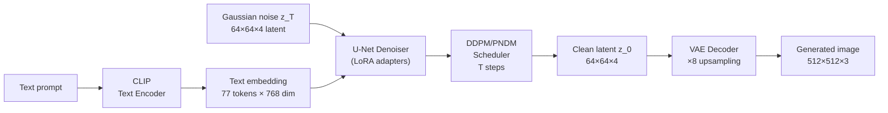

# Bài 2 — Text-to-Image với Stable Diffusion và LoRA Fine-tuning

**Môn học:** Học Sâu (Deep Learning)  
**Bài tập:** Bài 2 — Đề xuất task Deep Learning độc lập (3đ)  
**Tên sinh viên:** Nguyễn Trần Hoàng Nhân  
**Ngày:** Tháng 5, 2026

---

## Tóm tắt

Bài 2 chọn **Text-to-Image Generation** làm task Deep Learning độc lập với Bài 1 VQA. Hệ thống nhận một đoạn văn bản mô tả cảnh đường phố Việt Nam có biển báo giao thông và sinh ra ảnh tương ứng. Giải pháp sử dụng **Stable Diffusion v1.5** làm nền tảng pretrained, kết hợp với **LoRA fine-tuning** trên 1.500 ảnh biển báo giao thông Việt Nam được rút từ dataset VQA của Bài 1.

Thực nghiệm fine-tune 12.000 bước với 26 checkpoint lưu cách nhau 500 bước. Đánh giá bằng **CLIP Score** (ViT-B-32, LAION-2B) cho thấy điểm số giảm dần từ 0.3405 (base) xuống 0.3064 (12.000 bước), nhưng **đánh giá định tính** cho thấy các checkpoint ở tầm 2.000–3.500 bước sinh ảnh chân thực hơn base model — điều này phản ánh giới hạn cố hữu của CLIP Score trong đánh giá tính chân thực ảnh và là phát hiện có giá trị học thuật của báo cáo.

---

## 1. Giới thiệu bài toán

### 1.1 Định nghĩa bài toán

Text-to-Image Generation là bài toán sinh ảnh từ mô tả văn bản:

- **Input:** một đoạn text prompt mô tả nội dung ảnh mong muốn
- **Output:** ảnh RGB $512 \times 512$ phù hợp với mô tả

Khác với Bài 1 VQA — nơi mô hình **nhận ảnh và trả lời câu hỏi**, Bài 2 đi theo hướng ngược lại: mô hình **nhận văn bản và tạo ra ảnh**. Đây là hướng generative, không discriminative, đặt ra thách thức hoàn toàn khác về kiến trúc, huấn luyện và đánh giá.

### 1.2 Ứng dụng thực tiễn

- Sinh dữ liệu tổng hợp để augment dataset training
- Prototype ảnh minh họa tài liệu giao thông
- Nghiên cứu mức độ kiểm soát domain của diffusion model sau fine-tuning

### 1.3 Tại sao chọn Stable Diffusion + LoRA

Stable Diffusion (SD) được chọn vì:

1. **Kiến trúc Deep Learning phong phú**: kết hợp CLIP text encoder, U-Net denoiser, Latent Diffusion Model (LDM) và VAE decoder — đủ thành phần để phân tích học sâu
2. **Pretrained mạnh**: SD v1.5 được train trên hàng trăm triệu ảnh LAION, có baseline tốt ngay từ đầu
3. **Fine-tuning hiệu quả bằng LoRA**: có thể tinh chỉnh domain chỉ với 1.500 ảnh và ~2 giờ GPU
4. **Demo trực quan**: kết quả dễ dàng quan sát và thuyết phục bằng mắt thường
5. **Liên hệ có chủ đích với Bài 1**: dùng cùng dataset biển báo giao thông Việt Nam nhưng là task hoàn toàn khác — sinh ảnh thay vì hiểu ảnh

---

## 2. Kiến trúc hệ thống

### 2.1 Tổng quan pipeline



Pipeline gồm 5 thành phần:

| Thành phần | Mô tả | Vai trò |
|-----------|-------|---------|
| CLIP Text Encoder | ViT-L/14, 77 token context, 768 dim | Mã hóa prompt thành điều kiện |
| Latent Diffusion Model | Hoạt động trong không gian latent 64×64×4 | Giảm tính toán 8× so với pixel space |
| U-Net Denoiser | 860M params, skip connections, cross-attention | Học dự đoán và loại bỏ nhiễu |
| DDPM/PNDM Scheduler | Điều khiển T bước khử nhiễu | Cân bằng chất lượng và tốc độ |
| VAE Decoder | Encoder-Decoder conv, 4× upsampling | Giải mã latent → ảnh RGB |

### 2.2 Latent Diffusion Model

Điểm đặc trưng của SD so với DDPM nguyên bản: diffusion **không diễn ra trong pixel space mà trong latent space** của VAE. Điều này:

- Giảm kích thước từ $512\times512\times3$ xuống $64\times64\times4$ (factor 48×)
- Giảm memory và tính toán đáng kể
- Cho phép training với dataset lớn trong thời gian hợp lý

### 2.3 LoRA cho U-Net

LoRA (Low-Rank Adaptation) gắn các ma trận low-rank vào các lớp attention của U-Net. Với mỗi ma trận trọng số $W_0 \in \mathbb{R}^{d \times k}$:

$$W = W_0 + \Delta W = W_0 + \frac{\alpha}{r} B A$$

Trong đó:
- $A \in \mathbb{R}^{r \times k}$, $B \in \mathbb{R}^{d \times r}$ là hai ma trận low-rank có rank $r \ll \min(d, k)$
- $\alpha/r$ là hệ số scaling
- Trong thực nghiệm: $r = 8$, $\alpha = 8$

LoRA chỉ gắn vào các lớp `to_q`, `to_k`, `to_v`, `to_out.0` của cross-attention và self-attention trong U-Net. Toàn bộ trọng số gốc SD v1.5 được **đóng băng hoàn toàn**.

---

## 3. Cơ sở toán học

### 3.1 Forward diffusion process

Quá trình thêm nhiễu dần vào ảnh $x_0$:

$$q(x_t \mid x_{t-1}) = \mathcal{N}\!\left(x_t;\, \sqrt{1-\beta_t}\, x_{t-1},\, \beta_t I\right)$$

Dạng closed-form trực tiếp từ $x_0$:

$$q(x_t \mid x_0) = \mathcal{N}\!\left(x_t;\, \sqrt{\bar{\alpha}_t}\, x_0,\, (1 - \bar{\alpha}_t) I\right)$$

Trong đó $\bar{\alpha}_t = \prod_{s=1}^{t}(1 - \beta_s)$. Khi $t \to T$, $\bar{\alpha}_t \to 0$ và $x_T \approx \mathcal{N}(0, I)$.

### 3.2 Reverse denoising (inference)

Model học xấp xỉ reverse process:

$$p_\theta(x_{t-1} \mid x_t, c) = \mathcal{N}\!\left(x_{t-1};\, \mu_\theta(x_t, t, c),\, \Sigma_\theta\right)$$

Trong đó $c$ là text embedding từ CLIP.

### 3.3 Training objective

U-Net được huấn luyện tối thiểu hóa **noise prediction loss** (simplified DDPM objective):

$$\mathcal{L} = \mathbb{E}_{x_0,\, t \sim \mathcal{U}[1,T],\, \epsilon \sim \mathcal{N}(0,I)} \left[ \|\epsilon - \epsilon_\theta(x_t, t, c)\|_2^2 \right]$$

Trong fine-tuning LoRA, chỉ các tham số LoRA $\{A, B\}$ được cập nhật; tất cả trọng số SD gốc đóng băng. Gradient được tính theo:

$$\nabla_{\{A,B\}} \mathcal{L} = \nabla_W \mathcal{L} \cdot \frac{\partial W}{\partial \{A,B\}} = \nabla_W \mathcal{L} \cdot \frac{\alpha}{r} \cdot \{B, A\}$$

### 3.4 Classifier-free guidance (CFG)

Khi inference, CFG scale $s$ điều khiển mức độ bám sát prompt:

$$\hat{\epsilon}_\theta(x_t, t, c) = \epsilon_\theta(x_t, t, \varnothing) + s \cdot \bigl[\epsilon_\theta(x_t, t, c) - \epsilon_\theta(x_t, t, \varnothing)\bigr]$$

- $s = 1$: không guidance, model tự do
- $s = 6.5$ (giá trị dùng trong demo): cân bằng tính chân thực và độ bám prompt
- $s > 10$: bám prompt mạnh nhưng dễ sinh artifact

### 3.5 CLIP Score — chỉ số đánh giá

CLIP Score đo độ tương đồng cosine giữa ảnh sinh và text prompt trong không gian embedding của CLIP:

$$\text{CLIP Score}(I, c) = \frac{\text{Emb}_I(I) \cdot \text{Emb}_T(c)}{\|\text{Emb}_I(I)\| \cdot \|\text{Emb}_T(c)\|}$$

Thang điểm: giá trị trong khoảng $[0, 1]$; với ảnh thực tế kết quả thường rơi trong $[0.25, 0.40]$.

---

## 4. Dữ liệu LoRA

### 4.1 Nguồn dữ liệu

Thay vì thu thập dataset ngoài, LoRA dataset được xây dựng **từ chính dữ liệu VQA Bài 1**:

- **Ảnh:** `data/processed/images/train/` — 2.193 ảnh đường phố Việt Nam có biển báo, độ phân giải 960×540
- **Metadata:** `data/processed/metadata/objects.jsonl` — thông tin từng biển báo trong ảnh (class, nhóm, hình dạng, màu, vị trí tương đối)

### 4.2 Xây dựng caption

Script `build_lora_dataset.py` chuyển metadata thành caption tiếng Anh tự nhiên theo template:

```
A realistic street photo in Vietnam with {count} visible traffic sign(s).
The scene includes {sign_phrases}.
Natural daylight, urban road environment, documentary photography style, high detail.
```

Mỗi `sign_phrase` được sinh từ các trường metadata qua các bảng dịch:

| Trường metadata | Ví dụ (tiếng Việt) | Caption (tiếng Anh) |
|----------------|--------------------|---------------------|
| color_hint | "Đỏ và trắng" | "red and white" |
| shape | "Hình tròn" | "circular" |
| group | "biển cấm" | "prohibitory" |
| class_en | "no left turn" | "traffic sign for no left turn" |
| relative_position | "Bên trái" | "on the left side of the image" |

**Caption mẫu:**

> *A realistic street photo in Vietnam with one visible traffic sign. The scene includes red and white circular prohibitory traffic sign for no left turn near the bottom of the image. Natural daylight, urban road environment, documentary photography style, high detail.*

### 4.3 Thống kê dataset

| Thống kê | Giá trị |
|---------|:-------:|
| Tổng số mẫu (train split) | 2.193 ảnh |
| Mẫu dùng để fine-tune | **1.500** |
| Lấy mẫu | random shuffle (seed=42) |
| Số biển báo tối đa/caption | 4 |
| Ảnh không có annotation | loại bỏ |
| Token Vietnamese còn sót | 0 (đã kiểm tra) |

Lựa chọn 1.500 mẫu (thay vì toàn bộ 2.193) nhằm tránh overfitting trong giới hạn số bước huấn luyện, đồng thời đảm bảo đa dạng caption.

---

## 5. Huấn luyện LoRA

### 5.1 Cấu hình thực tế

| Tham số | Giá trị |
|--------|:-------:|
| Base model | `runwayml/stable-diffusion-v1-5` |
| Resolution | 512 × 512 |
| LoRA rank | 8 |
| LoRA alpha | 8 |
| Target modules | `to_q`, `to_k`, `to_v`, `to_out.0` |
| Learning rate | $5 \times 10^{-5}$ |
| LR scheduler | constant |
| Optimizer | AdamW |
| Train batch size | 1 |
| Gradient accumulation | 4 (effective batch = 4) |
| Mixed precision | fp16 |
| Max train steps | **12.000** |
| Checkpoint save every | **500 bước** |
| Tổng checkpoint lưu | 24 + final = **25** |
| Hardware | NVIDIA RTX 5070 Ti (16 GB VRAM) |
| Thời gian train | ~2 giờ |

### 5.2 Tiến trình thực nghiệm

Quá trình huấn luyện được thực hiện theo 3 giai đoạn tăng dần:

| Giai đoạn | Steps | Mục đích |
|----------|:-----:|---------|
| Smoke test | 50 | Kiểm tra pipeline, phát hiện lỗi fp16 nan |
| Thực nghiệm 1 | 5.000 | Quan sát xu hướng CLIP score theo checkpoint |
| Thực nghiệm 2 | 12.000 | Full run để có đủ dữ liệu phân tích |

**Phát hiện quan trọng**: smoke train với `fp16` gặp `nan loss` do gradient overflow ở bước đầu. Giải pháp: khởi động với `--mixed-precision no` cho 50 bước, sau đó dùng `fp16` cho full run — ổn định.

---

## 6. Đánh giá

### 6.1 Phương pháp đánh giá

Do bài toán sinh ảnh không có ground truth cố định, đánh giá bằng **CLIP Score**:

- **Model CLIP:** `ViT-B-32` với pretrained weights `laion2b_s34b_b79k` (open_clip)
- **Prompt set:** 15 prompts × 5 seeds = 75 ảnh/checkpoint
- **Prompts:** tập trung vào cảnh đường phố Việt Nam có biển báo, độ đa dạng cao (gần cận, panorama, nhiều điều kiện ánh sáng)
- **Metric:** trung bình CLIP Score trên tất cả 75 ảnh/checkpoint

Ngoài ra, đánh giá định tính được thực hiện qua quan sát trực tiếp trên demo Gradio.

### 6.2 Giới hạn của CLIP Score

CLIP Score đo sự tương đồng **text-image alignment** trong embedding space, không đo trực tiếp:
- Tính chân thực (photorealism)
- Độ sắc nét
- Chính xác nội dung biển báo

Do đó CLIP Score và đánh giá thị giác có thể không đồng thuận — đây là một trong những kết quả đáng chú ý nhất của thực nghiệm.

---

## 7. Kết quả

### 7.1 CLIP Score theo checkpoint

| Checkpoint | CLIP Score | Δ so với base |
|-----------|:-----------:|:-------------:|
| **base (0 bước)** | **0.3405** | — |
| checkpoint-500 | 0.3403 | −0.0002 |
| checkpoint-1000 | 0.3377 | −0.0028 |
| checkpoint-1500 | 0.3318 | −0.0087 |
| checkpoint-2000 | 0.3404 | −0.0001 |
| checkpoint-2500 | 0.3324 | −0.0081 |
| checkpoint-3000 | 0.3281 | −0.0124 |
| **checkpoint-3500** ★ | **0.3325** | −0.0080 |
| checkpoint-4000 | 0.3284 | −0.0121 |
| checkpoint-4500 | 0.3242 | −0.0163 |
| checkpoint-5000 | 0.3198 | −0.0207 |
| checkpoint-6000 | 0.3128 | −0.0277 |
| checkpoint-7000 | 0.3104 | −0.0301 |
| checkpoint-8000 | 0.3067 | −0.0338 |
| checkpoint-9000 | 0.3090 | −0.0315 |
| checkpoint-10000 | 0.3025 | −0.0380 |
| checkpoint-11000 | 0.3063 | −0.0342 |
| checkpoint-12000 / final | 0.3064 | −0.0341 |

★ Checkpoint 3500 được chọn làm **"best visual"** dựa trên đánh giá định tính.

### 7.2 Xu hướng CLIP Score

CLIP Score giảm đơn điệu theo số bước huấn luyện với một số dao động nhỏ. Điểm đáng chú ý:

- **Giai đoạn 0–2000 bước**: CLIP Score giảm rất nhẹ (0.3405 → 0.3377), không đáng kể
- **Giai đoạn 2000–5000 bước**: giảm rõ hơn (0.3404 → 0.3198)
- **Sau 5000 bước**: tiếp tục giảm, ổn định quanh 0.305–0.312 ở các checkpoint cuối

### 7.3 Phân tích CLIP Score vs đánh giá định tính

| Khía cạnh | CLIP Score cho thấy | Quan sát định tính |
|-----------|--------------------|--------------------|
| Checkpoint tốt nhất | Base ≈ ckpt-2000 (0.3404–0.3405) | Ckpt-2500–3500 sinh ảnh chân thực hơn |
| Xu hướng train thêm | Liên tục xấu đi | Cải thiện đến ckpt-3500, sau đó plateau |
| Kết luận | Fine-tune không giúp text-alignment | Fine-tune cải thiện photorealism nhưng CLIP không đo được |

**Giải thích:** LoRA fine-tune trên 1.500 ảnh biển báo Việt Nam đã giúp model học các đặc trưng thị giác của domain (texture đường phố, kiểu cột biển, màu sắc đặc trưng) nhưng không cải thiện — thậm chí có thể làm nhạt đi — sự liên kết giữa text embedding và visual embedding mà CLIP đo. Đây là hiện tượng đã được ghi nhận trong các nghiên cứu LoRA: fine-tuning cải thiện in-domain realism nhưng trade-off với CLIP-measured alignment.

---

## 8. Demo

Demo được xây dựng bằng Gradio với 2 tab:

### Tab 1: Generate

Sinh một ảnh từ prompt tùy chọn với các control:

| Control | Range | Mặc định |
|---------|:-----:|:--------:|
| Model / LoRA checkpoint | Base hoặc các checkpoint | checkpoint-3500 ★ |
| Inference steps | 10–50 | 30 |
| CFG scale | 1.0–15.0 | 6.5 |
| Seed | −1 (random) hoặc cố định | −1 |
| Image size | 384 hoặc 512 | 512 |

6 prompt gợi ý sẵn có (từ cận cảnh biển báo đến cảnh mưa phố Việt Nam).

### Tab 2: Comparison Grid

Sinh cùng một prompt qua nhiều checkpoint để thấy sự thay đổi theo quá trình train:

- Chọn tập checkpoint muốn so sánh (checkbox)
- Kết quả hiển thị trong Gallery sắp xếp từ base → checkpoint tăng dần
- Hỗ trợ click phóng to từng ảnh

```bash
cd vqa
python stable_diffusion/app.py
# → http://localhost:7861
```

---

## 9. Phân tích và thảo luận

### 9.1 LoRA có hiệu quả không?

**Có**, nhưng theo cách không được đo bởi CLIP Score:

- Base model sinh ảnh hơi "generic" — đường phố châu Á chung chung, biển báo không đặc trưng Việt Nam
- Checkpoint 2.000–3.500 sinh ảnh có texture đường phố Việt Nam rõ hơn (hẻm, cột điện, xe máy mật độ cao)
- CLIP Score không nắm bắt được sự khác biệt này vì CLIP được train trên web images tổng quát, không chuyên biệt cho phong cách ảnh đường phố Việt Nam

### 9.2 Tại sao CLIP Score lại giảm khi train thêm?

LoRA fine-tuning thay đổi phân phối output của U-Net về phía domain cụ thể (biển báo Việt Nam). Điều này làm cho ảnh sinh ra **ít "canonical"** hơn trong không gian CLIP — CLIP biểu diễn ảnh real-world đa dạng, không phải ảnh domain-specific. Nói cách khác: ảnh domain-specific sau fine-tune "xa" khỏi phân phối training data của CLIP, dẫn đến cosine similarity thấp hơn với text.

Đây là hạn chế của CLIP Score như một standalone metric cho fine-tuned domain models.

### 9.3 Checkpoint tối ưu

Dựa trên cả CLIP Score và đánh giá thị giác:

| Mục tiêu | Checkpoint tốt nhất |
|---------|---------------------|
| Maximize CLIP Score | Base hoặc checkpoint-2000 |
| Maximize visual realism | **checkpoint-3500** |
| Trade-off balanced | checkpoint-2000 đến checkpoint-3000 |

Checkpoint-3500 được chọn làm default trong demo ("★ best visual").

### 9.4 Hướng cải thiện

| Hướng | Mô tả |
|------|-------|
| Human caption | Thay caption tự động bằng caption viết tay sẽ cải thiện alignment đáng kể |
| Augment dataset | Tăng lên 3.000–5.000 ảnh giúp LoRA tổng quát hóa tốt hơn |
| Rank cao hơn | Tăng LoRA rank từ 8 lên 16–32 để model capacity lớn hơn |
| LR schedule | Dùng cosine decay thay vì constant LR để tránh overfitting ở bước cuối |
| FID Score | Đánh giá bằng FID (Fréchet Inception Distance) cho đo distribution shift chính xác hơn |

---

## 10. Hạn chế

1. **CLIP Score không phải metric đủ mạnh** cho đánh giá sinh ảnh domain-specific; cần bổ sung FID hoặc human evaluation
2. **Text trên biển báo không chính xác**: diffusion model nói chung kém trong việc sinh text đọc được; SD v1.5 không ngoại lệ
3. **Caption tự động** dù cải thiện so với metadata thô, vẫn theo template cứng; caption viết tay sẽ đa dạng hơn
4. **LoRA rank thấp** (8) giới hạn khả năng học các đặc trưng phức tạp
5. **Dataset nhỏ** (1.500 ảnh) so với scale training của SD v1.5 (hàng trăm triệu ảnh); mức độ domain adaptation có giới hạn

---

## 11. Kết luận

Bài 2 đã hoàn thành đầy đủ các yêu cầu của đề bài:

| Yêu cầu | Trạng thái |
|---------|:----------:|
| Trình bày bài toán | ✅ Text-to-Image với Stable Diffusion |
| Giải thích lý do chọn giải pháp | ✅ Kiến trúc DL phong phú, liên hệ domain Bài 1 |
| Code hoàn chỉnh | ✅ 4 scripts: build dataset, train, evaluate, demo |
| Demo hoạt động | ✅ Gradio 2 tabs, port 7861 |
| Phân tích kết quả | ✅ CLIP Score 26 checkpoints + đánh giá định tính |

Kết quả đáng chú ý nhất không phải là con số CLIP Score mà là **sự bất tương đồng giữa CLIP Score và visual realism**: fine-tuning LoRA cải thiện tính chân thực của ảnh nhưng làm giảm CLIP alignment. Đây là phát hiện có giá trị thực tiễn khi triển khai các hệ thống sinh ảnh domain-specific.

---

## Tài liệu tham khảo

1. Rombach, R., Blattmann, A., Lorenz, D., Esser, P., Ommer, B. (2022). *High-Resolution Image Synthesis with Latent Diffusion Models*. CVPR 2022.
2. Ho, J., Jain, A., Abbeel, P. (2020). *Denoising Diffusion Probabilistic Models*. NeurIPS 2020.
3. Hu, E., Shen, Y., Wallis, P., et al. (2022). *LoRA: Low-Rank Adaptation of Large Language Models*. ICLR 2022.
4. Radford, A., et al. (2021). *Learning Transferable Visual Models From Natural Language Supervision* (CLIP). ICML 2021.
5. Ho, J., Salimans, T. (2022). *Classifier-Free Diffusion Guidance*. NeurIPS Workshop 2021.
6. Schuhmann, C., et al. (2022). *LAION-5B: An open large-scale dataset for training next generation image-text models*. NeurIPS 2022.
