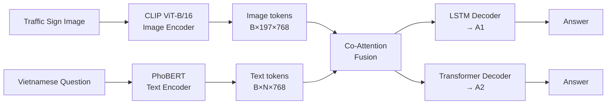
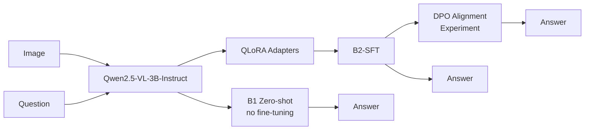
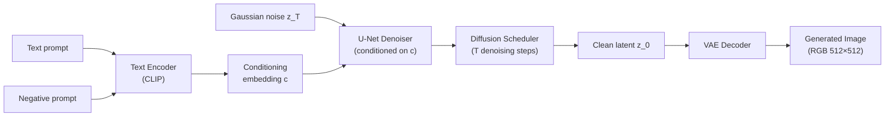

# Slide Deck — Deep Learning Final Project
## Task 1: Vietnamese Traffic Sign VQA · Task 2: Stable Diffusion Text-to-Image

> **Quy ước file:**
> - Hình VQA dùng đường dẫn `docs/figures/<tên>.png` (từ thư mục `vqa/`)
> - Hình Stable Diffusion dùng `stable_diffusion/outputs/<tên>.png`
> - Mỗi slide có phần **[SLIDE CONTENT]** (tiếng Anh, đưa vào slide) và **[THUYẾT TRÌNH]** (tiếng Việt, lời nói của người trình bày)

---

## Slide 1 — Cover

### [SLIDE CONTENT]

# Vietnamese Traffic Sign Understanding
## Task 1: Visual Question Answering (VQA)
## Task 2: Text-to-Image Generation with Stable Diffusion

**Deep Learning Course · Final Project · 2026**

---

### [THUYẾT TRÌNH]
> "Chào thầy cô và các bạn. Hôm nay nhóm tôi trình bày đồ án cuối kỳ môn Học Sâu gồm hai bài độc lập. Bài 1 là Visual Question Answering — trả lời câu hỏi tiếng Việt về ảnh biển báo giao thông Việt Nam. Bài 2 là task sinh ảnh từ văn bản bằng Stable Diffusion, kết hợp fine-tune LoRA trên domain biển báo. Tôi sẽ bắt đầu với Bài 1."

---

## Slide 2 — Agenda

### [SLIDE CONTENT]

**Task 1 — Visual Question Answering**
1. Problem Definition & Dataset
2. Architecture: Route A (Custom) & Route B (VLM)
3. Training: SFT Loss & DPO Alignment
4. Results, Per-type Analysis & Human Evaluation
5. DPO Deep Dive: What Works and What Doesn't

**Task 2 — Text-to-Image Generation**
6. Problem Definition & Stable Diffusion Architecture
7. Diffusion Math & LoRA Fine-tuning
8. Results: Base vs LoRA Sample Outputs

---

### [THUYẾT TRÌNH]
> "Cấu trúc bài trình bày: phần 1 về VQA bao gồm bài toán, dữ liệu, 4 kiến trúc mô hình, huấn luyện SFT và DPO, kết quả toàn diện gồm cả human evaluation và phân tích sâu DPO. Phần 2 về Stable Diffusion trình bày kiến trúc, toán học diffusion, fine-tune LoRA và so sánh kết quả base model với adapter đã tinh chỉnh."

---

---
# PART 1: VISUAL QUESTION ANSWERING
---

## Slide 3 — Problem Definition

### [SLIDE CONTENT]

**Task: Given image + Vietnamese question → generate short Vietnamese answer**

$$x = (I,\; q), \qquad y = \text{answer}$$

| Image | Question | Answer |
|---|---|---|
| 🖼 Street scene | "Trong ảnh có biển giới hạn tốc độ không?" | "Có" |
| 🖼 Street scene | "Biển báo phía trên bên phải là gì?" | "Giới hạn tốc độ 50 km/h" |
| 🖼 Street scene | "Có bao nhiêu biển cấm trong ảnh?" | "2" |

**5 core challenges:**
1. Understand image + localize traffic signs
2. Parse Vietnamese question correctly
3. Ground question to the right object in image
4. Generate short, canonical answer
5. 12 question types: `yes_no`, `count`, `sign_type`, `color`, `shape`, `location`, `attribute`, `negative`, `spatial_rel`, `count_total`, `multi_object`, `context`

---

### [THUYẾT TRÌNH]
> "Bài toán VQA nhận cặp ảnh và câu hỏi tiếng Việt, đầu ra là câu trả lời ngắn. Điểm khó không chỉ ở nhận diện biển báo — mô hình phải hiểu câu hỏi, định vị đúng đối tượng được hỏi, và sinh đáp án canonical đúng format như 'Có', 'Không', số đếm, hoặc tên biển. Dataset có 12 loại câu hỏi bao phủ đa dạng góc độ về biển báo giao thông."

---

## Slide 4 — Dataset: Overview

### [SLIDE CONTENT]

**Vietnamese Traffic Sign VQA v8**
Built from Kaggle VNTS (CC BY-SA 4.0) via automated 7-step pipeline.

| Split | Images | QA Pairs | QA / Image |
|---|---:|---:|---:|
| Train | 2,193 | 104,146 | 47.5 |
| Val | 272 | 12,944 | 47.6 |
| Test | 271 | 12,966 | 47.8 |
| **Total** | **2,736** | **130,056** | **47.5** |

**No-leakage split by `image_id`:**
$$\{I_{\text{train}}\} \cap \{I_{\text{val}}\} \cap \{I_{\text{test}}\} = \varnothing$$


---

### [THUYẾT TRÌNH]
> "Dataset xây dựng từ dữ liệu detection biển báo Việt Nam trên Kaggle, chuyển đổi sang 130 nghìn cặp câu hỏi-đáp trên 2736 ảnh. Điều quan trọng là chúng tôi split theo image_id chứ không split theo từng QA row — cùng một ảnh sẽ không xuất hiện ở cả train lẫn test, tránh data leakage. Biểu đồ bên phải cho thấy phân bổ số ảnh và số QA theo từng split."

---

## Slide 5 — Dataset: Question Type Distribution & Balance

### [SLIDE CONTENT]

**12 question types — near-balanced across all splits (~12.5% each)**


**Answer type breakdown (test set):**
- Binary (Có / Không from `yes_no` + `negative`): **25.2%**
- Numeric (count answers): **12.6%**
- Open-ended (sign names, colors, shapes, positions, attributes): **62.2%**


---

### [THUYẾT TRÌNH]
> "Biểu đồ trên cho thấy phân phối 12 loại câu hỏi trong test set gần cân bằng. Quan trọng là heatmap bên dưới xác nhận sự cân bằng này được duy trì qua cả ba split — train, val và test đều có khoảng 12.5% mỗi loại. Điều này đảm bảo metric tổng thể không bị chi phối bởi một loại câu hỏi nào. Về loại đáp án, 62% là open-ended — nhóm đa dạng nhất bao gồm tên biển, màu sắc, hình dạng, vị trí và thuộc tính."

---

## Slide 6 — Data Pipeline: 7 Steps

### [SLIDE CONTENT]

```
[Kaggle VNTS Detection Dataset]
         │
         ▼ Step 1: Filter quality (bbox ≥ 30px) → 2,736 images
         │
         ▼ Step 2: Extract object metadata per image → objects.jsonl
         │          (class_en/vi, group, shape, color, relative_position, area_ratio)
         │
         ▼ Step 3: Rule-based template QA generation
         │          8 question types × 3 surface variants → ~130K QA pairs
         │
         ▼ Step 4: Answer normalization (canonical)
         │          "Có"/"Không", Arabic numerals, shorten color/shape ≤ 2 words
         │
         ▼ Step 5: Deduplication (Jaccard similarity filter on question signatures)
         │
         ▼ Step 6: Build final train/val/test JSONL (split by image_id)
         │
         ▼ Step 7: Automated validation
                    ✓ No cross-split image leakage
                    ✓ All image files exist on disk
                    ✓ All answers ≤ 10 words
                    ✓ Each image_id has ≥ 3 distinct questions
                    ✓ Question type distribution balanced across splits
```

---

### [THUYẾT TRÌNH]
> "Pipeline xây dựng dataset gồm 7 bước. Từ dữ liệu detection, chúng tôi trích xuất metadata ngữ nghĩa của từng biển trong ảnh như tên, nhóm, hình dạng, màu và vị trí tương đối. Bước 3 dùng rule-based template để sinh câu hỏi — mỗi loại có 3 biến thể bề mặt khác nhau để tránh dataset đơn điệu. Đáp án được chuẩn hóa canonical ở bước 4 vì evaluation dùng exact-match. Bước 7 kiểm tra tự động xác nhận toàn bộ điều kiện chất lượng trước khi dùng dataset."

---

## Slide 7 — Architecture Overview: 4 Configurations

### [SLIDE CONTENT]

| Config | Model | Approach |
|---|---|---|
| **A1** | CLIP ViT-B/16 + PhoBERT + Co-Attention + **LSTM** decoder | Custom, trained from scratch |
| **A2** | CLIP ViT-B/16 + PhoBERT + Co-Attention + **Transformer** decoder | Custom, trained from scratch |
| **B1** | Qwen2.5-VL-3B-Instruct **zero-shot** | Pretrained VLM, no fine-tuning |
| **B2** | Qwen2.5-VL-3B-Instruct + **QLoRA** SFT | Pretrained VLM + supervised fine-tuning |





---

### [THUYẾT TRÌNH]
> "Chúng tôi so sánh 4 cấu hình trên cùng dataset. Route A là mô hình tự thiết kế: CLIP encode ảnh thành 197 token đặc trưng, PhoBERT encode câu hỏi tiếng Việt, co-attention tổng hợp thông tin từ hai nguồn, sau đó LSTM decoder cho A1 hoặc Transformer decoder cho A2 sinh đáp án. Route B dùng Qwen2.5-VL 3B — một VLM pretrained lớn — B1 chạy zero-shot, B2 fine-tune bằng QLoRA, và DPO là thí nghiệm alignment bổ sung."

---

## Slide 8 — Route A: Architecture Detail & Tensor Shapes

### [SLIDE CONTENT]

**Route A: CLIP + PhoBERT + Co-Attention**


**Tensor transformation at each stage:**

| Stage | Component | Input Shape | Output Shape |
|---|---|---|---|
| Image encode | CLIP ViT-B/16 | `[B, 3, 224, 224]` | `[B, 197, 768]` (196 patches + 1 CLS) |
| Text encode | PhoBERT-base | `[B, N]` token IDs | `[B, N, 768]` contextual embeddings |
| Co-Attention | Bidirectional cross-attn | `[B,197,768]` + `[B,N,768]` | fused context `[B, 768]` |
| Decode A1 | LSTM + projection | context + prev token | `[B, T, vocab_size]` → argmax |
| Decode A2 | Transformer + projection | context + prefix | `[B, T, vocab_size]` → argmax |

**Co-Attention formula:**
$$\text{Attn}(Q,V,V) = \text{softmax}\!\left(\frac{QW_q\,(VW_k)^\top}{\sqrt{d_k}}\right)VW_v$$

*CLIP ViT-B/16 divides 224×224 image into 14×14 grid of 16×16 patches → 196 patch tokens + 1 CLS = 197 tokens*

---

### [THUYẾT TRÌNH]
> "Kiến trúc Route A rõ ràng qua bảng tensor shape. CLIP chia ảnh 224x224 thành lưới 14x14, mỗi ô là patch 16x16 pixel, tạo 196 patch token cộng 1 CLS token — tổng 197 token, mỗi token 768 chiều. PhoBERT tạo contextual embedding 768 chiều cho từng token câu hỏi. Co-attention là lớp cross-attention 2 chiều: text attend vào image và image attend vào text, tạo ra vector fused memory 768 chiều điều kiện hóa cho decoder."

---

## Slide 9 — Route A: LSTM vs Transformer Decoder

### [SLIDE CONTENT]

**Why A1 (LSTM) beats A2 (Transformer) on exact-match — but not on semantics**

| | LSTM Decoder (A1) | Transformer Decoder (A2) |
|---|---|---|
| **Recurrence formula** | $h_t = \text{LSTM}(e(y_{t-1}), h_{t-1}, m)$ | $H^{(l+1)} = \text{CrossAttn}(\text{SelfAttn}(H^{(l)}), M, M)$ |
| **Inductive bias** | Strong sequential, memorizes short patterns | Flexible, attends full prefix |
| **Risk in this domain** | Under-generates variety | May paraphrase away from canonical |
| **Best metric** | Exact-match, BLEU-4, ROUGE-L, METEOR | **BERTScore (semantic)** |

**Per question-type breakdown:**

| Question type | A1 (LSTM) | A2 (Transformer) | Winner |
|---|---:|---:|---|
| `location` | **0.796** | 0.749 | A1 +4.7% |
| `sign_type` | **0.939** | 0.918 | A1 +2.1% |
| `count_total` | **0.846** | 0.810 | A1 +3.6% |
| `yes_no` | 1.000 | 0.998 | ≈ tie |
| `color` | 0.975 | **0.982** | A2 +0.6% |
| `shape` | 0.974 | **0.983** | A2 +0.9% |

> **Conclusion:** A1 optimal for exact-match; A2 optimal for semantic similarity. Neither is universally superior.

---

### [THUYẾT TRÌNH]
> "Sự khác biệt A1 và A2 nằm ở decoder. LSTM có inductive bias mạnh về thứ tự tuần tự: với dataset có câu trả lời ngắn và canonical như 'Có', 'Không', số đếm, LSTM ít có xu hướng paraphrase ra ngoài format chuẩn hơn Transformer. A2 linh hoạt hơn nhưng đôi khi sinh biến thể ngữ nghĩa đúng mà không khớp exact-match. Vì vậy A1 thắng exact-match còn A2 dẫn đầu BERTScore. Kết luận quan trọng: LSTM không luôn tốt hơn Transformer — kết quả này chỉ đúng trong điều kiện domain hẹp, answer ngắn và metric exact-match."

---

## Slide 10 — Route B: QLoRA

### [SLIDE CONTENT]

**Route B: Qwen2.5-VL-3B-Instruct + QLoRA**


**QLoRA memory savings:**

| Config | Base precision | Bytes/param | VRAM (~3B model) |
|---|---|---:|---:|
| Full fine-tune | fp16 | 2.0 | ~12 GB |
| LoRA (fp16 base) | fp16 | 2.0 | ~10 GB |
| **QLoRA (NF4 base)** | **4-bit NF4** | **≈ 0.5** | **~4–5 GB** |

**LoRA weight update formula:**
$$W_{\text{eff}} = W_0 + \Delta W = W_0 + \frac{\alpha}{r}BA$$
- $A \in \mathbb{R}^{r \times k}$: Gaussian init · $B \in \mathbb{R}^{d \times r}$: **zero init** → $\Delta W = 0$ at step 0
- $r = 8,\; \alpha = 8$ → **trainable params ≈ 0.39% per matrix** (~10M / 3B total)

**Adapted modules:** `q_proj, k_proj, v_proj, o_proj, gate_proj, up_proj, down_proj`

**Forward pass:** $h = \text{dequant}(W_0)\,x + \frac{\alpha}{r}BAx$ ← gradient flows through $A,B$ only

---

### [THUYẾT TRÌNH]
> "Route B dùng QLoRA: base Qwen2.5-VL 3B được giữ ở dạng 4-bit NF4 — chỉ tốn khoảng 0.5 byte mỗi tham số thay vì 2 byte ở fp16 — giảm VRAM từ 12GB xuống 4-5GB. Chỉ các adapter matrix nhỏ A và B được train ở dạng bf16. Với rank=8, mỗi ma trận trọng số chỉ cần cập nhật 0.39% tham số. Tổng trainable params khoảng 10 triệu trong số 3 tỷ. Trong forward pass, base model được dequantize tạm thời để tính toán nhưng không lưu ở fp16, giữ VRAM thấp."

---

## Slide 11 — Training Dynamics

### [SLIDE CONTENT]

**Route A training — Loss curves**


**Training setup:**
- Phase 1: CLIP + PhoBERT **frozen**, train only Co-Attention + Decoder
- Phase 2 (unfreezing): **disabled** — caused instability in earlier runs
- Rationale: CLIP and PhoBERT already provide strong features; the bottleneck is fusion and decoder formatting

**SFT loss (cross-entropy on answer tokens):**
$$\mathcal{L}_{CE}(\theta) = -\frac{1}{N}\sum_{i=1}^{N}\sum_{t=1}^{T_i} \log P_\theta(y_{i,t} \mid y_{i,<t},\, x_i)$$

**Teacher forcing:** at step $t$, model receives gold token $y_{i,t-1}$ — not its own prediction. Gap is small because answers average 1–6 tokens.

---

### [THUYẾT TRÌNH]
> "Quá trình training Route A dùng hai pha. Pha 1: đóng băng CLIP và PhoBERT, chỉ train co-attention và decoder — CLIP và PhoBERT đã cung cấp feature đủ mạnh, phần cần học là fusion và format đáp án. Pha 2 là mở đóng băng encoder, nhưng chúng tôi đã tắt vì gây instability trong các thử nghiệm trước. Loss curve cho thấy cả A1 và A2 hội tụ ổn định. SFT dùng teacher forcing — ở mỗi bước sinh, model nhận token đúng làm input, giúp training ổn định hơn."

---

## Slide 12 — Main Results

### [SLIDE CONTENT]

**Full Test Set Results (v8) — 12,966 QA pairs**


| Model | VQA Acc | BLEU-4 | ROUGE-L | METEOR | BERTScore | Latency |
|---|---:|---:|---:|---:|---:|---:|
| **A1 LSTM** | **0.9484** | **0.9602** | **0.9584** | **0.9558** | 0.9631 | **~11 ms** |
| A2 Transformer | 0.9377 | 0.9476 | 0.9486 | 0.9454 | **0.9713** | ~13 ms |
| B1 Zero-shot | 0.1962 | 0.0350 | 0.2899 | 0.3012 | 0.4753 | ~167 ms |
| **B2 QLoRA SFT** | 0.9379 | 0.9494 | 0.9508 | 0.9478 | 0.9111 | ~484 ms |


---

### [THUYẾT TRÌNH]
> "Kết quả trên full test set: A1 đạt accuracy cao nhất 94.84% và latency thấp nhất chỉ 11ms. A2 có BERTScore cao nhất 0.9713 — về semantic similarity thì A2 tốt nhất. B1 zero-shot rất yếu 19.62% — VLM pretrained chưa được ép format trả lời ngắn tiếng Việt. B2 sau fine-tune bắt kịp gần như A models ở 93.79% nhưng chậm hơn rất nhiều — 484ms so với 11ms, tức là chậm gấp 44 lần. Biểu đồ latency thang log bên dưới thể hiện rõ khoảng cách này."

---

## Slide 13 — Results by Question Type

### [SLIDE CONTENT]

**Per-type VQA Accuracy Heatmap — all 4 models × 12 question types**


**Key observations:**
- `yes_no` + `negative`: A1, A2, B2 ≈ 1.0 · B1 only 0.33–0.61
- `location` (0.75–0.80): hardest for custom models — requires precise spatial grounding
- `sign_type` (0.90–0.94): A1 strongest (0.94) — LSTM sticks to canonical sign names
- `spatial_rel` + `multi_object`: **B2 competitive or better** — pretrained VLM better at relational reasoning
- B1 weak across all types → confirms VLM zero-shot cannot handle short-answer Vietnamese VQA

---

### [THUYẾT TRÌNH]
> "Heatmap này là một trong những hình quan trọng nhất. Nhìn theo từng loại câu hỏi, bức tranh phức tạp hơn overall accuracy. A1 thắng rõ ở các nhóm cần mapping canonical như sign_type và location. Thú vị là B2 cạnh tranh hoặc thắng A1 ở nhóm spatial_rel và multi_object — gợi ý rằng pretrained VLM nắm bắt quan hệ không gian giữa nhiều vật thể tốt hơn. B1 yếu đều trên tất cả loại câu hỏi, xác nhận VLM cần fine-tune domain."

---

## Slide 14 — Human Evaluation: Rank Reversal

### [SLIDE CONTENT]

**Human Evaluation: 100 natural questions on 21 test images**


| Model | Human Eval | Auto Eval | Rank Change |
|---|---|---|---|
| **B2-DPO** | **73%** | — (stratified only) | ↑ new top |
| **B2-SFT** | **70%** | 93.79% | ↑ from 3rd |
| A1 LSTM | 61% | **94.84%** | ↓ from 1st |
| A2 Transformer | 57% | 93.77% | ↓ |
| B1 Zero-shot | 38% | 19.62% | (stable bottom) |

**Why the rank reversal?**

| Type | % of human eval | A1 | B2-DPO |
|---|---|---|---|
| `permission` ("Tôi có được rẽ trái không?") | **38%** | 45% | **76%** |
| `count` | 23% | **78%** | 74% |
| `location` | 23% | 65% | 65% |

→ **Permission questions require regulatory reasoning, not just visual recognition. LSTM cannot generalize; fine-tuned VLM can.**

---

### [THUYẾT TRÌNH]
> "Human evaluation tiết lộ hiện tượng quan trọng: thứ hạng bị đảo ngược hoàn toàn. A1 dẫn đầu auto eval nhưng chỉ đứng thứ ba trong human eval. Lý do là human eval đưa vào 38% câu hỏi dạng 'permission' — ví dụ 'Tôi có được rẽ trái không?' — đòi hỏi hiểu ngữ nghĩa quy định giao thông, không chỉ nhận diện hình ảnh. A1 chỉ đạt 45% trên nhóm này. B2-DPO đạt 76% trên permission và dẫn đầu human eval với 73%. Bài học: auto eval và human eval có thể không đồng thuận — cần nhiều protocol đánh giá để có cái nhìn toàn diện."

---

## Slide 15 — DPO: Motivation & Math

### [SLIDE CONTENT]

**Why DPO?**

SFT maximizes correct answer likelihood — does NOT explicitly penalize errors.
→ Build preference pairs from B2-SFT's actual mistakes:

```
chosen = gold/reference answer
rejected = B2-SFT wrong prediction
```
*(script: `scripts/build_preference_pairs.py`)*

**DPO objective:**
$$\mathcal{L}_{DPO} = -\mathbb{E}_{(x,y_w,y_l)}\!\left[\log\sigma\!\left(\beta\!\left[\log\frac{\pi_\theta(y_w|x)}{\pi_{ref}(y_w|x)} - \log\frac{\pi_\theta(y_l|x)}{\pi_{ref}(y_l|x)}\right]\!\right)\right]$$

**Gradient intuition:**
$$\nabla_\theta \mathcal{L}_{DPO} = -\beta\,\sigma(-\beta\Delta)\!\left[\nabla_\theta\log\pi_\theta(y_w|x) - \nabla_\theta\log\pi_\theta(y_l|x)\right]$$

→ Increases log-prob of chosen, decreases log-prob of rejected, **relative to the frozen reference policy**.

**Reference model:** B2-SFT frozen · **Policy model:** B2-SFT + trainable LoRA adapters

---

### [THUYẾT TRÌNH]
> "SFT chỉ tối đa likelihood đáp án đúng mà không trực tiếp phạt đáp án sai. DPO giải quyết điều này bằng preference pairs: mỗi pair có 'chosen' là đáp án đúng và 'rejected' là đáp án sai mà B2-SFT đã sinh ra. DPO loss điều chỉnh model để tăng xác suất đáp án đúng và giảm xác suất đáp án sai, tương đối so với reference policy là B2-SFT bị đóng băng. Gradient cho thấy cơ chế trực quan: nếu preference data đúng và cân bằng thì DPO cải thiện, nhưng nếu data lệch thì gradient sẽ khuếch đại lệch đó."

---

## Slide 16 — DPO: Results & Trade-offs

### [SLIDE CONTENT]

**DPO results on stratified-1000 subset:**

| Model | Acc | BLEU-4 | ROUGE-L | METEOR |
|---|---:|---:|---:|---:|
| B2-SFT (baseline) | 0.740 | 0.595 | 0.782 | 0.776 |
| B2-DPO 500 pairs | **0.759** | **0.598** | **0.811** | **0.799** |

*Note: DPO numbers are stratified-1000, NOT full test — do not compare directly with A1 full-test 0.9484*


**Clear trade-off:**
- `negative` ↑ **+0.66** · `attribute` ↑ +0.23
- `sign_type` ↓ **−0.34** · `yes_no` ↓ −0.16 · `location` ↓ −0.10


**DPO loss ≠ best checkpoint:** checkpoint_500pairs (acc=0.759) > `best_lora` by DPO loss (acc=0.752)

---

### [THUYẾT TRÌNH]
> "Kết quả DPO trên subset stratified-1000: overall accuracy tăng 1.9 điểm từ 0.740 lên 0.759. Nhưng khi nhìn vào breakdown theo loại câu hỏi — cột delta bên phải biểu đồ — trade-off rất rõ: nhóm 'negative' tăng mạnh 0.66, nhưng 'sign_type' giảm 0.34, 'yes_no' giảm 0.16. Biểu đồ checkpoint curve bên dưới cũng cho thấy một insight quan trọng: checkpoint được chọn bằng DPO loss không phải checkpoint tốt nhất theo VQA accuracy — checkpoint 500 pairs thắng 'best_lora' theo DPO loss."

---

## Slide 17 — DPO: Deep Analysis — Answer Prior Shift

### [SLIDE CONTENT]

**Audit evidence: DPO learned to answer "Không" — not to look better**

| Question type | Fixes | Regressions | Net |
|---|---:|---:|---|
| `negative` | **82** | 0 | ✅ Strong fix |
| `attribute` | 15 | 5 | ✅ Improve |
| `sign_type` | 9 | **51** | ❌ Major regression |
| `yes_no` | 0 | **20** | ❌ Only breaks |
| `location` | 11 | 24 | ❌ Regression |
| `color` | 11 | 17 | ❌ Slight regression |
| `count` | 11 | 12 | ≈ neutral |

**"Không" prediction count shift:**
| Model | Times predicting "Không" on stratified-1000 |
|---|---:|
| B2-SFT | 42 |
| DPO checkpoint_500 | **144** |
| DPO last_lora | **149** |

**Why?** Many preference pairs: $y_w = \text{"Không"},\; y_l = \text{"Có"}$  
→ DPO accumulates gradient: $\log\pi(\text{Không}|x) - \log\pi(\text{Có}|x)$ across many different contexts  
→ Model learns global prior "answer Không" rather than better visual grounding


**Full-test polarity collapse evidence (results_b2_dpo_fulltest.json):**
`overall=0.6946` · `negative=1.0000` · **`yes_no=0.0000`** · `sign_type=0.4141`

---

### [THUYẾT TRÌNH]
> "Audit file cho thấy bản chất vấn đề. DPO đổi 374 trên 1000 predictions. Với nhóm 'negative': 82 fixes và 0 regressions — sửa rất mạnh. Nhưng 'sign_type': chỉ 9 fixes và 51 regressions — regression lớn. Và con số quan trọng nhất: B2-SFT dự đoán 'Không' 42 lần trên 1000 samples, còn DPO dự đoán 'Không' 144 lần. Đây là bằng chứng trực tiếp: model không nhìn ảnh tốt hơn mà đang học prior 'trả lời Không'. Bằng chứng cực đoan là kết quả full-test của DPO lớn hơn: negative accuracy bằng 1.0 nhưng yes_no accuracy bằng 0.0 — model đã bị polarity collapse."

---

## Slide 18 — DPO: Lessons Learned

### [SLIDE CONTENT]

**DPO is a valuable alignment experiment — not the final best model**

**Root causes of DPO failure in short-answer VQA:**
1. Preference pairs encode answer-level bias, not grounding-level supervision
2. DPO does not directly optimize exact-match VQA accuracy
3. Short answers (1 token) make global prior shift easy and dangerous
4. 4-bit quantization adds gradient noise → amplifies instability
5. No CE anchor → model drifts from SFT distribution

**Key lessons:**
1. Never select DPO checkpoint by DPO loss — use downstream VQA accuracy
2. Preference data must be balanced per transition type (`Có→Không`, `Không→Có`, `sign A→sign B`)
3. Always audit output distribution (count "Không", count "Có") across checkpoints
4. For short-answer VQA, consider adding SFT anchor:

$$\mathcal{L} = \mathcal{L}_{DPO} + \lambda\,\mathcal{L}_{CE}(y_w)$$

5. DPO works best when fixing **structural** failure modes (e.g., negation polarity) on well-balanced data

**B2-DPO is best in human eval (73%)** — confirming DPO does improve regulatory reasoning, but not overall exact-match.

---

### [THUYẾT TRÌNH]
> "DPO không thất bại hoàn toàn. Nó chứng minh model có thể được điều chỉnh bằng preference và sửa failure mode cụ thể như câu phủ định. B2-DPO dẫn đầu human eval 73% — DPO thực sự cải thiện khả năng reasoning về quy định giao thông. Nhưng DPO chưa đủ để làm final best model vì preference data còn lệch và objective không trực tiếp tối ưu exact-match. Bài học chính: nếu làm DPO tiếp, cần cân bằng preference theo transition type, chọn checkpoint bằng VQA accuracy thay vì DPO loss, và có thể thêm CE anchor để giữ model gần phân phối SFT."

---

---
# PART 2: TEXT-TO-IMAGE GENERATION
---

## Slide 19 — Task 2: Problem Definition

### [SLIDE CONTENT]

**Task 2: Generate image from text description**

| | Task 1: VQA | Task 2: Text-to-Image |
|---|---|---|
| **Direction** | Image → Language | **Language → Image** |
| **Input** | Image + Vietnamese question | Text prompt + negative prompt |
| **Output** | Short text answer | RGB image 512×512 |
| **Key challenge** | Multimodal understanding | Generative modeling + domain adaptation |

**Demo inputs:**
```text
"a realistic Vietnamese street intersection with traffic signs, daytime, high detail"
"a road safety education poster about Vietnamese traffic signs, clean composition"
"a futuristic smart traffic dashboard, Vietnamese city, traffic signs, cinematic lighting"
```
**Recommended settings:** Steps=25 · Guidance=7.5 · Negative="blurry, low quality, distorted, unreadable text"

**Two deliverables:**
- ✅ **Minimum:** Pretrained SD inference + Gradio demo (port 7861)
- ✅ **Extended:** LoRA fine-tuning on 1,500 Vietnamese traffic sign images (overnight, 12,000 steps)

---

### [THUYẾT TRÌNH]
> "Bài 2 chọn task hoàn toàn khác VQA: thay vì từ ảnh trả lời câu hỏi, chúng tôi từ mô tả văn bản sinh ra ảnh. Model dùng Stable Diffusion pretrained runwayml/stable-diffusion-v1-5. Deliverable tối thiểu là demo Gradio chạy được ngay. Phần nâng cao là fine-tune LoRA nhỏ trên 1500 ảnh biển báo giao thông Việt Nam từ dataset VQA để so sánh base model và adapter đã tinh chỉnh."

---

## Slide 20 — Stable Diffusion Architecture

### [SLIDE CONTENT]

**Latent Diffusion Model Pipeline**



**Component roles:**

| Component | Role | Detail |
|---|---|---|
| **Text Encoder** (CLIP) | Prompt → conditioning embedding | Shared vision-language space |
| **VAE Encoder** | Image → latent space | 8× compression (512→64 spatial) |
| **U-Net Denoiser** | Predict noise at each step, conditioned on text | Core of the model |
| **Scheduler** (DDPM) | Control denoising trajectory | 25–50 inference steps |
| **VAE Decoder** | Latent → RGB image | Final decoding step |

*Working in latent space reduces U-Net compute by 64× vs pixel-space diffusion*

---

### [THUYẾT TRÌNH]
> "Stable Diffusion là mô hình diffusion tiềm ẩn. Pipeline gồm 5 thành phần. Text encoder CLIP mã hóa prompt thành embedding điều kiện. Quan trọng: Stable Diffusion không làm việc trực tiếp trên pixel 512x512 mà làm việc trong latent space 64x64, giảm 64 lần chi phí tính toán so với pixel-space diffusion. U-Net denoiser là thành phần cốt lõi, nhận latent nhiễu và text embedding, dự đoán nhiễu cần loại bỏ. Scheduler điều khiển quá trình khử nhiễu qua 25-50 bước. VAE decoder cuối cùng giải mã latent sạch thành ảnh RGB."

---

## Slide 21 — Diffusion Mathematics

### [SLIDE CONTENT]

**1. Forward Diffusion — gradually corrupt image $x_0$ with Gaussian noise:**

$$q(x_t \mid x_0) = \mathcal{N}\!\left(x_t;\; \sqrt{\bar\alpha_t}\,x_0,\; (1-\bar\alpha_t)I\right)$$

As $t \to T$: $x_t \approx \mathcal{N}(0, I)$ — pure noise. $\bar\alpha_t = \prod_{s=1}^t \alpha_s$ controls noise schedule.

**2. Denoising Objective — U-Net learns to predict added noise $\epsilon$:**

$$\mathcal{L} = \mathbb{E}_{x_0,\,t,\,\epsilon \sim \mathcal{N}(0,I)}\!\left[\|\epsilon - \epsilon_\theta(x_t,\, t,\, c)\|_2^2\right]$$

where $c$ = text conditioning embedding. Simple MSE between true and predicted noise.

**3. Classifier-Free Guidance (CFG) — controls prompt adherence at inference:**

$$\hat\epsilon = \epsilon_\theta(x_t, t, \varnothing) + s\!\cdot\!\left(\epsilon_\theta(x_t, t, c) - \epsilon_\theta(x_t, t, \varnothing)\right)$$

- $\varnothing$ = unconditional (empty prompt) prediction
- $s$ = guidance scale (default 7.5): higher → stronger prompt adherence, risk of artifacts
- At $s=1$: pure conditional · At $s>1$: extrapolate toward prompt direction

---

### [THUYẾT TRÌNH]
> "Ba công thức toán học cơ bản. Thứ nhất, forward diffusion: trong training, ảnh sạch x0 được thêm nhiễu Gaussian dần theo lịch trình, t càng lớn thì ảnh càng gần nhiễu thuần túy. Thứ hai, denoising objective: U-Net học dự đoán nhiễu đã thêm vào latent, loss đơn giản là MSE giữa nhiễu thực và nhiễu dự đoán. Thứ ba, classifier-free guidance: khi inference, guidance scale s kiểm soát mức độ bám sát prompt bằng cách ngoại suy ra khỏi hướng unconditional về phía hướng conditional. Giá trị 7.5 là điểm cân bằng thực hành tốt cho hầu hết prompt."

---

## Slide 22 — LoRA Fine-tuning on Traffic Sign Domain

### [SLIDE CONTENT]

**LoRA: Adapt SD to Vietnamese traffic sign domain**

$$W' = W + \Delta W = W + BA \qquad \text{where } B \in \mathbb{R}^{d\times r},\; A \in \mathbb{R}^{r\times k},\; r \ll \min(d,k)$$

**Dataset — auto-built from VQA metadata:**
- Source: `data/processed/metadata/objects.jsonl` + `data/processed/images/train/*.jpg`
- Caption template:
  ```
  Vietnamese traffic road scene, real street photo, {N} traffic signs,
  {class_en} at {position}; sign shapes: {shapes}; sign colors: {colors};
  road safety traffic sign dataset
  ```
- 1,500 captioned images (from 2,193 available train images)

**Training configuration (RTX 5070 Ti 16GB):**

| Parameter | Value | Note |
|---|---|---|
| LoRA rank | 8 | Target: `to_q, to_k, to_v, to_out.0` |
| Resolution | 512 × 512 | |
| Batch size | 1, grad accum 4 | Effective batch = 4 |
| Mixed precision | `no` (fp16 → NaN on RTX 5070 Ti) | Known instability |
| Learning rate | 1e-5 | Lower than default for stability |
| Max steps | **12,000** (overnight) | Save every 500 steps |
| Dataset | 1,500 traffic sign images | |

---

### [THUYẾT TRÌNH]
> "LoRA fine-tuning cho Stable Diffusion dùng cùng công thức cập nhật low-rank như QLoRA ở Bài 1 — chỉ train adapter nhỏ A và B, giữ base model đóng băng. Dataset được tạo tự động từ metadata VQA: mỗi ảnh train tương ứng một caption mô tả biển báo có trong ảnh. Trên RTX 5070 Ti, fp16 gặp NaN nên dùng mixed-precision no với learning rate thấp 1e-5 để ổn định. Overnight run chạy 12,000 steps trên 1500 ảnh, checkpoint lưu mỗi 500 steps."

---

## Slide 23 — SD Results: Base vs LoRA Comparison

### [SLIDE CONTENT]

**Overnight LoRA run: 12,000 steps, 1,500 images — ✅ Completed**

Final adapter: `stable_diffusion/lora_output/pytorch_lora_weights.safetensors`

**Prompt 1:** *"a realistic Vietnamese street intersection with traffic signs, daytime, high detail"*

| Base Pretrained | Fine-tuned LoRA (12,000 steps) |
|---|---|
|  |  |

**Prompt 2:** *"a road safety education poster about Vietnamese traffic signs, clean composition"*

| Base Pretrained | Fine-tuned LoRA |
|---|---|
|  |  |

**Prompt 3:** *"Vietnamese traffic road scene, real street photo, multiple traffic signs, high detail"*

| Base Pretrained | Fine-tuned LoRA |
|---|---|
|  |  |

---

### [THUYẾT TRÌNH]
> "Overnight run hoàn thành 12,000 steps. Mỗi cặp ảnh dùng cùng prompt, cùng seed, chỉ khác model. Nhìn chung, LoRA cho ảnh gần domain biển báo giao thông hơn — màu sắc và bố cục đường phố phù hợp hơn. Tuy nhiên text trên biển báo vẫn không chính xác — đây là hạn chế chung của diffusion model với text rendering, không phải vấn đề của LoRA."

---

## Slide 24 — SD Results: Multi-Checkpoint Progression

### [SLIDE CONTENT]

**LoRA quality evolution across training checkpoints (seed=42)**

_checkpoint-1500_checkpoint-2500_checkpoint-4000_checkpoint-4500_checkpoint-3500_final.png)

**Best visual result:** checkpoint-3500


**Experiment observations:**

| Experiment | Setting | Observation |
|---|---|---|
| Short vs detailed prompt | Same seed, same steps | Detailed prompt → better content control |
| Guidance 3.0 / 7.5 / 12.0 | Same prompt & seed | 7.5 is best balance; high guidance → over-saturation |
| Steps 15 / 25 / 40 | Same prompt & seed | More steps → more detail, slower |
| Seed reproducibility | Same seed repeated | Nearly identical output (deterministic) |
| Base vs LoRA | Same prompt & seed | LoRA closer to traffic sign domain style |

---

### [THUYẾT TRÌNH]
> "Grid này cho thấy ảnh tiến hóa qua các checkpoint từ base pretrained đến checkpoint 12000. Checkpoint 3500 cho kết quả thị giác tốt nhất về cân bằng giữa domain adaptation và chất lượng ảnh tổng thể. Từ các thí nghiệm so sánh: prompt chi tiết kiểm soát nội dung tốt hơn prompt ngắn, guidance 7.5 là điểm cân bằng thực hành, và seed cố định đảm bảo tính tái lập — cùng seed cho ảnh gần như giống hệt nhau."

---

## Slide 25 — Limitations

### [SLIDE CONTENT]

**Task 1 — VQA Limitations**

| Limitation | Detail |
|---|---|
| Template-generated QA | Models may overfit to format patterns rather than reasoning |
| ~47 QA per image | Samples within same image are statistically correlated |
| Exact-match metric | Penalizes semantically correct but differently worded answers |
| `location` & `count_total` | Hardest question types for all models |
| A1/A2 regulatory reasoning | Cannot answer "Tôi có được rẽ trái không?" — LSTM has no semantic knowledge |
| DPO preference bias | Preference data encodes polarity bias → answer-prior shift |

**Task 2 — Stable Diffusion Limitations**

| Limitation | Detail |
|---|---|
| Vietnamese traffic text | Generated text on signs is unreliable — general SD weakness |
| Auto-generated captions | Less natural than human-written captions → noisier training signal |
| Dataset size | 1,500 images with auto-captions → risk of overfitting at high steps |
| Evaluation | Qualitative only — no FID, IS, or CLIP score computed |
| Checkpoint selection | Visual quality is subjective; checkpoint-3500 ≠ checkpoint-12000 necessarily |

---

### [THUYẾT TRÌNH]
> "Về Bài 1: dataset template có thể khiến model học format thay vì reasoning thực sự, và exact-match không phản ánh đúng chất lượng với câu trả lời gần nghĩa. Nhóm location và count_total vẫn là thách thức. DPO preference data lệch gây answer-prior shift. Về Bài 2: SD pretrained không sinh được text chính xác trên biển báo — đây là giới hạn cố hữu của diffusion model không riêng project này. Caption tự động kém tự nhiên hơn human-written, và đánh giá chỉ là định tính do không tính FID hay CLIP score."

---

## Slide 26 — Conclusion

### [SLIDE CONTENT]

**Task 1 — VQA: Summary**

| Model | Best metric | Trade-off |
|---|---|---|
| **A1 LSTM** | Exact-match **94.84%**, latency **11ms** | Cannot reason about regulations |
| A2 Transformer | BERTScore **0.9713** | Lower exact-match |
| B1 Zero-shot | — baseline only | **19.62%** — must fine-tune |
| B2 QLoRA SFT | Near A1 (**93.79%**) | 44× slower |
| B2-DPO | **Human eval 73%** (best) | Lower auto exact-match |

**Key insights:**
- Fine-tuning domain-specific VLM recovers near-custom-model performance
- Auto eval and human eval can disagree dramatically → both are necessary
- DPO is a valuable alignment experiment, not just a metric boost
- Shorter answers + biased preference data = risk of answer-prior collapse

**Task 2 — Stable Diffusion: Summary**
- Full pipeline: Gradio demo (port 7861) + LoRA fine-tuning (12,000 steps, 1,500 images)
- Best visual quality: checkpoint-3500 (~29% through training)
- LoRA adapts style toward Vietnamese traffic sign domain
- Demonstrates inverse DL task to VQA: Language → Image

---

### [THUYẾT TRÌNH]
> "Tóm lại, dự án hoàn thành cả hai nhiệm vụ. Với VQA: A1 là best về exact-match và tốc độ, A2 về semantic, B2 chứng minh fine-tuning VLM hiệu quả dù chậm hơn, và B2-DPO dẫn đầu human eval — điều này nhấn mạnh rằng cần nhiều protocol đánh giá. Bài học quan trọng nhất: auto eval và human eval có thể đảo ngược thứ hạng hoàn toàn. Với Stable Diffusion: hoàn thành demo và overnight fine-tune, checkpoint 3500 cho kết quả thị giác tốt nhất, LoRA thành công adapt domain. Cảm ơn thầy cô và các bạn."

---

## Slide 27 — Q&A

### [SLIDE CONTENT]

**Questions & Answers**

*Thank you for listening!*

**Quick reference — key numbers:**
- A1 accuracy: **94.84%** · A2 BERTScore: **0.9713**
- B1 zero-shot: **19.62%** · B2-SFT: **93.79%**
- B2-DPO human eval: **73%** vs A1 human eval: **61%**
- SD LoRA: **12,000 steps** on 1,500 images · Best checkpoint: **3,500**

---

### [THUYẾT TRÌNH — Câu hỏi dự kiến]

> **"Tại sao A1 LSTM lại thắng A2 Transformer dù LSTM đơn giản hơn?"**
> "Vì dataset có answer rất ngắn và canonical. LSTM có inductive bias mạnh về pattern ngắn lặp lại — ít paraphrase ra ngoài format chuẩn hơn Transformer. Nếu answer dài hơn hoặc metric là semantic similarity thì Transformer sẽ có lợi thế."

> **"DPO có phải final model không?"**
> "Không. DPO là thí nghiệm alignment. B2-SFT là final best model theo auto eval (93.79%), còn B2-DPO là best theo human eval (73%). Hai kết quả này đều có giá trị — chúng chứng minh rằng cần nhiều protocol đánh giá."

> **"Tại sao không dùng full fine-tune cho B2?"**
> "QLoRA tiết kiệm VRAM — chỉ cần 4-5GB thay vì 12GB cho full fine-tune. Với 3B model trên GPU consumer, QLoRA là lựa chọn thực tế duy nhất. Kết quả 93.79% cho thấy 0.39% tham số trainable đã đủ."

> **"LoRA Stable Diffusion có cải thiện cụ thể gì?"**
> "Ảnh có màu sắc và bố cục đường phố gần domain Việt Nam hơn. Tuy nhiên text trên biển vẫn không chính xác — đây là giới hạn cơ bản của diffusion model với text rendering, không riêng của LoRA nhỏ này."

> **"Tại sao checkpoint 3500 tốt hơn checkpoint 12000?"**
> "Checkpoint 12000 đã train quá lâu trên 1500 ảnh với caption auto-generated kém chất lượng — có dấu hiệu overfitting làm giảm chất lượng tổng quát. Checkpoint 3500 nằm ở điểm cân bằng giữa domain adaptation và chất lượng ảnh."
