# Deep Report on Vietnamese Traffic Sign Visual Question Answering

## A Balanced Analysis of A1/A2/B1/B2-SFT and Direct Preference Optimization

**Deep Learning Final Project — Vietnamese Traffic Sign Visual Question Answering**  
**Report version:** English deep-dive edition with empirical evidence and DPO failure-mode analysis  
**Date:** 2026-05-03

---

## Executive Summary

This project builds a Vietnamese Visual Question Answering (VQA) system for traffic-sign images. Each sample contains a street-level image and a Vietnamese question; the model must generate a short Vietnamese answer that is visually grounded, semantically correct, and consistent with the expected answer format.

The project compares four required configurations:

| ID | Model | Role |
|---|---|---|
| A1 | CLIP ViT-B/16 + PhoBERT + Co-Attention + LSTM decoder | Custom model with recurrent decoder |
| A2 | CLIP ViT-B/16 + PhoBERT + Co-Attention + Transformer decoder | Custom model with Transformer decoder |
| B1 | Qwen2.5-VL-3B-Instruct zero-shot | Pretrained VLM without fine-tuning |
| B2-SFT | Qwen2.5-VL-3B-Instruct + LoRA/QLoRA | Pretrained VLM adapted via supervised fine-tuning |

The v8 full-test results show:

- **A1 obtains the highest VQA Accuracy:** `0.9484`, while also having the lowest latency at approximately `11 ms/sample`.
- **A2 is highly competitive:** accuracy `0.9377`, with the highest BERTScore `0.9713`, indicating strong semantic similarity to reference answers.
- **B1 zero-shot is weak:** accuracy around `0.1962`, showing that a general pretrained VLM is insufficient for concise Vietnamese traffic-sign VQA without adaptation.
- **B2-SFT nearly closes the gap with the custom models:** accuracy `0.9379`, BLEU-4 `0.9494`, ROUGE-L `0.9508`, but with much higher latency.
- **DPO is not the best final model**, but it is scientifically valuable: it strongly improves negative-question behavior while shifting the answer prior toward `Không`, causing regressions in `yes_no`, `sign_type`, and `location`, and exposing mode-collapse risks in some runs.

Balanced conclusion: **A1, A2, B1, and B2-SFT should all be demonstrated as the four required configurations; A1 stands out in exact-match/speed, A2 in semantic score, B2-SFT in pretrained-VLM adaptation, and DPO should be presented as an alignment/RL diagnostic experiment, not as the final best model.**

Primary evidence files: `results_v8_a1_50k_fulltest.json`, `results_v8_a2_50k_fulltest.json`, `results_b1_v8_fulltest.json`, `results_b2_qwen25_v8_50k_strat_4bit_lr5e5_fulltest.json`, `reports/dpo_checkpoint_eval_balanced_v1/`, and `results_b2_dpo_fulltest.json`.

---

## 1. Problem Definition and Dataset

### 1.1 Task Definition

The VQA problem is defined as:

$$
x = (I, q), \qquad y = \text{answer}
$$

where:

- \(I\): a street-level image containing one or more traffic signs;
- \(q\): a Vietnamese question about the image;
- \(y\): a short Vietnamese answer.

Example:

```json
{
  "image_id": "vts_000001",
  "question": "Trong ảnh có biển giới hạn tốc độ không?",
  "answer": "Có",
  "question_type": "yes_no"
}
```

The task is difficult because it combines several abilities:

1. understanding the image and object positions;
2. understanding Vietnamese questions;
3. grounding the question to the correct object;
4. generating a concise answer rather than an explanation;
5. matching the normalized reference answer under strict exact-match evaluation.

### 1.2 v8 Dataset

The dataset is derived from Vietnamese traffic-sign images with bounding-box annotations and converted into VQA pairs. The final annotations are stored at:

```text
data/processed/annotations/
```

Dataset statistics:

| Split | Images | QA pairs | Avg QA/image |
|---|---:|---:|---:|
| Train | 2,193 | 104,146 | 47.5 |
| Val | 272 | 12,944 | 47.6 |
| Test | 271 | 12,966 | 47.8 |
| Total | 2,736 | 130,056 | 47.5 |

The split is done by `image_id`, not by individual QA row. This is essential because each image has many questions; if the same image appeared in both train and test, the benchmark would suffer from leakage.

### 1.3 Question Types

In v8, the taxonomy contains 12 question types:

| Type | Meaning |
|---|---|
| `yes_no` | Binary presence or attribute questions |
| `count` | Counting signs of a specific category |
| `sign_type` | Identifying the sign name/type |
| `color` | Asking about sign color |
| `shape` | Asking about sign shape |
| `location` | Asking where a sign appears in the image |
| `attribute` | Asking about sign meaning/function/attribute |
| `negative` | Negation or absence-checking questions |
| `spatial_rel` | Spatial relationships between signs |
| `count_total` | Broader counting questions |
| `multi_object` | Questions involving multiple objects |
| `context` | Context-aware questions |

This taxonomy is important because overall accuracy alone can hide model-specific failure modes. A model may be excellent on `yes_no` but weak on `sign_type` or `location`, which is exactly why the DPO analysis must be broken down by question type.


### 1.4 Data Construction Pipeline

The dataset was constructed from scratch using a multi-stage pipeline, converting a detection dataset into a Vietnamese VQA dataset.

**Step 1 — Source dataset.** The raw source is the Kaggle VNTS (Vietnamese Traffic Signs) dataset (CC BY-SA 4.0, ~3,200 images). The original task was traffic-sign object detection with bounding boxes and class labels. This project repurposes it for VQA by treating each image's detected signs as structured evidence for question-answer generation.

**Step 2 — Image selection and object metadata extraction** (`scripts/prepare_dataset.py`). From the full corpus, 350 images were selected by quality filtering (minimum bounding-box side ≥ 30 px, readable sign condition). For each image, the Kaggle bounding-box/class annotations were extracted, English class names were mapped to Vietnamese equivalents via a hand-curated `class_map.csv` (58 classes), and two derived fields were computed: `relative_position` (the sign's quadrant within the image, e.g., "Trên bên phải") and `area_ratio` (sign area / image area). The result is `metadata/objects.jsonl` — one record per image — providing the semantic evidence used in question generation.

**Step 3 — Rule-based VQA generation** (`scripts/generate_vqa_labels.py`, rule-based mode). For each detected sign, the pipeline instantiates fixed question templates covering all 8 required types with 3 surface-form variants each:

| Type | Example question | Example answer |
|---|---|---|
| `yes_no` | "Trong ảnh có biển giới hạn tốc độ không?" | "Có" |
| `negative` | "Có biển cấm rẽ phải trong ảnh này không?" | "Không" |
| `count` | "Trong ảnh có bao nhiêu biển cấm?" | "2" |
| `sign_type` | "Biển báo phía trên bên phải là gì?" | "Giới hạn tốc độ 50 km/h" |
| `color` | "Màu chủ đạo của biển báo phía trên là gì?" | "Đỏ và trắng" |
| `shape` | "Biển báo trên bên phải thuộc dạng hình gì?" | "Hình tròn" |
| `location` | "Biển giới hạn tốc độ nằm ở đâu trong ảnh?" | "Trên phải" |
| `attribute` | "Biển báo phía trên có chức năng gì?" | "Giới hạn tốc độ tối đa 50 km/h" |

For images with ≥ 2 signs, additional `multi_object`, `spatial_rel`, and comparison questions are generated. `negative` questions use a fixed pool of traffic-sign class names that are absent from the current image, so the ground-truth answer is always "Không".

**Step 4 — Answer normalization.** All answers are canonicalized before storage: `yes_no`/`negative` answers collapse to exactly "Có" or "Không"; `count` answers use Arabic numerals ("1", "2"); speed attributes use "X km/h" format; color and shape answers are shortened to ≤ 2 words using `shorten_color()` and `shorten_shape()`. This normalization is critical because evaluation uses exact-match and VQA Accuracy metrics.

**Step 5 — Deduplication and filtering** (`scripts/filter_vqa.py`). Near-duplicate questions are removed with Jaccard-similarity signature comparison. QA pairs are rejected if: answer exceeds 10 tokens; `question_type` and `answer_type` are inconsistent; or evidence object IDs reference non-existent objects.

**Step 6 — Final dataset assembly** (`scripts/build_final_jsonl.py`). Filtered QA pairs are assembled into `train.jsonl`, `val.jsonl`, and `test.jsonl` with image-level split assignment. Each output record includes `question_id`, `image_id`, `image_path`, `question`, `answer`, `question_type`, `answer_type`, `evidence_object_ids`, `split`, and `label_source`.

**Step 7 — Validation** (`scripts/validate_dataset.py`). Automated checks verify: no image appears in more than one split; all image files exist on disk; every answer is ≤ 10 words; each `image_id` has ≥ 3 distinct questions; and the question-type distribution is approximately balanced across splits.

The result is the final dataset described in Section 1.5 (130,056 QA pairs, 2,736 images, ~47.5 QA/image).

### 1.5 Final Dataset Statistics

Statistics are computed from:

```text
data/processed/annotations/train.jsonl
data/processed/annotations/val.jsonl
data/processed/annotations/test.jsonl
```

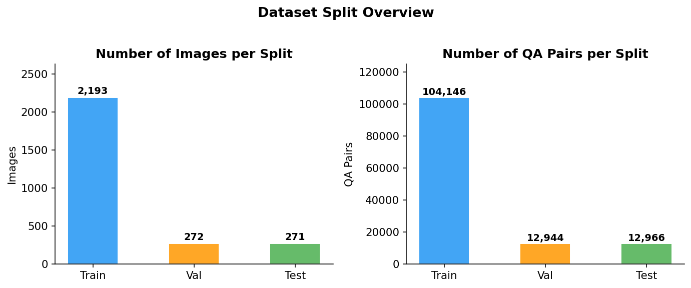

The train set contains 2,193 images (104,146 QA pairs); val and test each have ~271–272 images (~12,944–12,966 QA pairs), giving approximately 47–48 QA pairs per image.

**Question-type distribution — test set:**

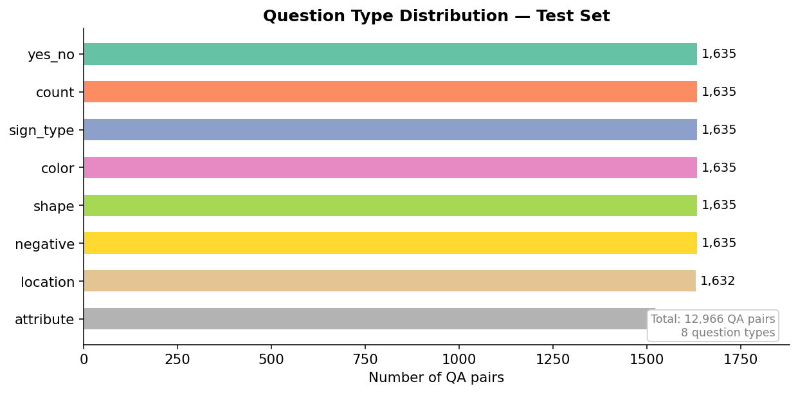

All 8 types are near-balanced at ~1,524–1,635 pairs each; `attribute` is slightly smaller than the others due to fewer applicable signs.

**Answer-type distribution — test set (detailed):**

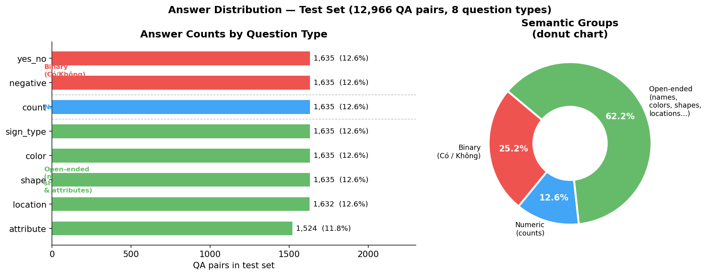

Left panel shows counts per question type (color-coded by semantic group). Right donut collapses to three semantic groups: **Binary** (yes/no answers from `yes_no` and `negative` questions, 25.2%), **Numeric** (counting answers from `count` questions, 12.6%), and **Open-ended** (sign names, colors, shapes, locations, and attributes from the remaining 5 question types, 62.2%). The "open-ended" group is not a single homogeneous bucket — it contains 5 structurally different answer vocabularies (sign names ≈ 900+ distinct values; colors ≈ 6; shapes ≈ 5; locations ≈ 8; attributes ≈ mixed).

**Cross-split question-type balance:**

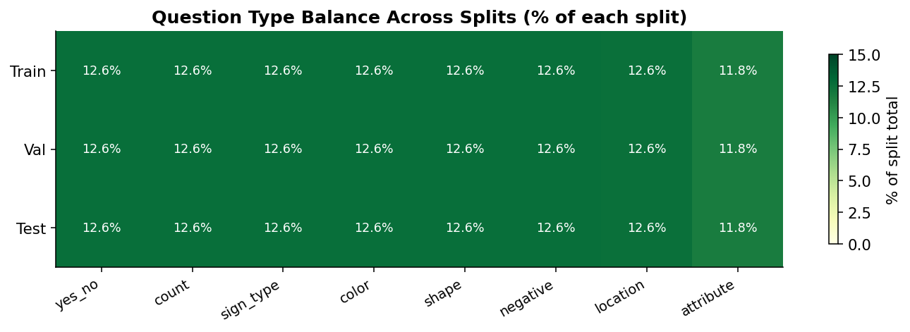

Every split maintains a near-identical question-type composition (~12.5% per type), so no single category disproportionately influences the overall metric.

### 1.6 Train/Val/Test Split and Leakage Prevention

The dataset is split by `image_id`, not by QA row. This is important because each image has around 47–48 questions on average. If the split were done by QA row, the same image could appear in both train and test; the model could memorize visual content from train and answer different questions about the same image in test.

Image-level splitting makes the benchmark harder but fairer:

$$
\{I_{train}\} \cap \{I_{val}\} \cap \{I_{test}\} = \varnothing
$$

With this protocol, the test set measures generalization to unseen images rather than memorization of seen images.

### 1.7 Stratified Evaluation Protocol

Besides full-test evaluation, the project uses smaller stratified evaluations such as `stratified-1000`, especially in the DPO section. Stratified evaluation samples a subset balanced by question type so that model behavior can be audited quickly without running the full test set.

Key distinction:

| Eval protocol | Role | Used for final model comparison? |
|---|---|---|
| Full test | main A1/A2/B1/B2-SFT evaluation | yes |
| Stratified-1000 | fast ablation/audit, especially for DPO | no, not as a replacement for full test |

Therefore, DPO `0.759` on stratified-1000 should only be compared with B2-SFT `0.740` on the same stratified-1000 subset. It should not be directly compared with A1 full-test `0.9484` or B2-SFT full-test `0.9379`.

### 1.8 Data Limitations and Risks

Important limitations for defense:

1. **Template-like QA:** many questions come from patterns, so models can learn answer format very well.
2. **Many QA pairs per image:** samples from the same image are not fully statistically independent.
3. **Exact match depends on canonical answers:** semantically close but differently worded answers may still be marked wrong.
4. **`attribute` has fewer samples:** this category may be less stable due to lower support.
5. **Location/sign type are harder than yes/no:** per-question-type results show that visually grounded categories are generally harder than binary questions.

---

## 2. Model Architectures

### 2.1 Route A: Custom Dual Encoder + Co-Attention

Route A uses two frozen pretrained encoders and trains the fusion and decoder modules.

```text
Image -> CLIP ViT-B/16 -> image tokens [B, 197, 768]
Question -> PhoBERT-base -> text tokens [B, N, 768]
image/text tokens -> Co-Attention -> fused memory -> Decoder -> Answer
```

Key files:

- `models/model_a.py`
- `models/co_attention.py`
- `models/decoder_lstm.py`
- `models/decoder_transformer.py`
- `train/train_a.py`

#### A1: LSTM Decoder

A1 uses an LSTM decoder. For short-answer, constrained-domain VQA, the LSTM decoder has a practical advantage: it is simpler, has a strong sequential inductive bias, and can learn stable short answer patterns such as `Có`, `Không`, numbers, colors, and sign names.

In v8, A1 achieves the best exact-match accuracy. This does not mean LSTMs are universally better than Transformers; rather, it shows that for this domain—with short answers, a stable answer distribution, and strict exact-match evaluation—the LSTM decoder is highly effective.

#### A2: Transformer Decoder

A2 uses a Transformer decoder, which is more flexible at modeling token dependencies. A2 is slightly lower than A1 in exact-match accuracy but achieves the highest BERTScore, indicating that its answers are often semantically close even when not exactly matched after normalization.

This distinction matters: under strict exact match, A1 wins; under semantic similarity, A2 remains highly competitive.


### 2.2 High-Level Architecture Diagrams

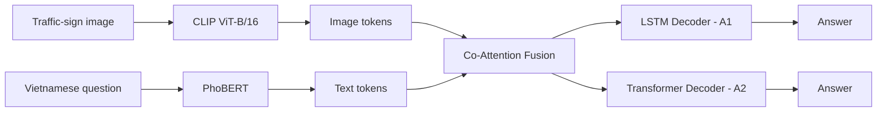

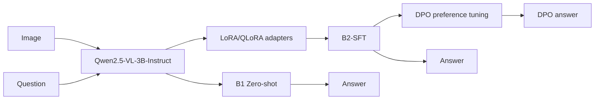

These diagrams separate the two routes: Route A is a custom dual-encoder architecture with trained decoders, while Route B is a pretrained VLM route where B2 adds LoRA/QLoRA and DPO is an alignment experiment on top of B2-SFT.

**Route A detailed pipeline with tensor shapes:**

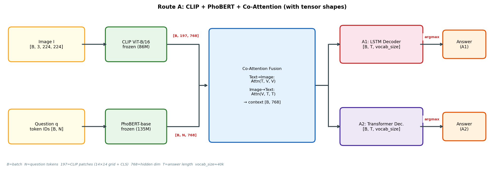

Key tensor transitions in Route A:

| Stage | Component | Input shape | Output shape |
|---|---|---|---|
| Image encode | CLIP ViT-B/16 | `[B, 3, 224, 224]` | `[B, 197, 768]` — 196 patch tokens + 1 CLS |
| Text encode | PhoBERT-base | `[B, N]` token IDs | `[B, N, 768]` — contextual token embeddings |
| Co-Attention | Bidirectional cross-attention | `[B,197,768]` + `[B,N,768]` | context vector `[B, 768]` |
| A1 decode | LSTM + projection | context `[B, 768]` + prev token | `[B, T, vocab_size]` → argmax |
| A2 decode | Transformer + projection | context `[B, 768]` + prev tokens | `[B, T, vocab_size]` → argmax |

The 197 CLIP tokens come from dividing the 224×224 image into a 14×14 grid of 16×16 patches (196 patches) plus one prepended CLS token. CLIP's ViT-B/16 processes these as a sequence; the resulting `[B, 197, 768]` token matrix is the visual memory attended to by the co-attention module.

### 2.3 Deep Analysis of A1 vs A2: LSTM and Transformer Decoders

A1 and A2 share the same encoders and fusion module, so the comparison is relatively clean: both receive CLIP image tokens, PhoBERT text tokens, and co-attention fused memory. The main difference is how the answer sequence is decoded.

#### 2.3.1 Decoder Formulation

For A1, the LSTM decoder generates answers through recurrent hidden and cell states:

$$
h_t, c_t = \mathrm{LSTM}(e(y_{t-1}), h_{t-1}, c_{t-1}, m)
$$

$$
P(y_t \mid y_{<t}, x)=\mathrm{softmax}(W_o h_t+b_o)
$$

where \(m\) is the memory representation from co-attention. The LSTM compresses generation history into \(h_t,c_t\), giving it a strong sequential inductive bias and reducing its tendency to produce long or overly flexible variants.

For A2, the Transformer decoder uses masked self-attention over generated tokens and cross-attention to fused memory:

$$
\mathrm{SelfAttn}(Q,K,V)=\mathrm{softmax}\left(\frac{QK^\top}{\sqrt{d_k}}\right)V
$$

$$
H^{(l+1)}=\mathrm{CrossAttn}(\mathrm{SelfAttn}(H^{(l)}), M, M)
$$

The Transformer can model token dependencies more flexibly, but it also has more degrees of freedom in a task where outputs are usually very short.

#### 2.3.2 Inductive Bias for Short-Answer VQA

This VQA dataset contains many short canonical answers: `Có`, `Không`, numbers, colors, shapes, locations, and fixed traffic-sign names. Under this distribution, the model that wins exact-match is often not the most expressive generator, but the one that most consistently emits the canonical reference form.

The LSTM decoder benefits because:

1. generation is simple and sequential;
2. the decoder has fewer moving parts;
3. repeated answer patterns are easy to memorize stably;
4. it is less likely to paraphrase away from the canonical answer;
5. latency is slightly lower than the Transformer decoder.

The Transformer decoder has different strengths:

1. self-attention models token relationships more flexibly;
2. it is better suited to longer or more semantically diverse answers;
3. it can produce semantically close answers even when exact wording differs;
4. it becomes more attractive when evaluation emphasizes semantic similarity rather than exact match.

#### 2.3.3 Evidence from Overall Metrics

| Model | VQA Acc | BLEU-4 | ROUGE-L | METEOR | BERTScore | Latency |
|---|---:|---:|---:|---:|---:|---:|
| A1 LSTM | **0.9484** | **0.9602** | **0.9584** | **0.9558** | 0.9631 | **~11.0ms** |
| A2 Transformer | 0.9377 | 0.9476 | 0.9486 | 0.9454 | **0.9713** | ~12.5ms |

A1 is higher on exact-match and n-gram-based metrics, indicating that it better matches the reference wording. A2 is higher on BERTScore, meaning that when it misses exact match, its answer is often still semantically close in embedding space.

In short: **A1 is better optimized for the exact-match benchmark; A2 has stronger soft semantic similarity.** These are not contradictory conclusions; they reflect different metric preferences.

#### 2.3.4 Evidence by Question Type

| Question type | A1 | A2 | A1-A2 gap | Interpretation |
|---|---:|---:|---:|---|
| `location` | 0.7964 | 0.7486 | +0.0478 | LSTM is more stable on canonical location answers |
| `sign_type` | 0.9391 | 0.9182 | +0.0209 | A1 better preserves exact sign names |
| `count_total` | 0.8462 | 0.8104 | +0.0358 | A1 is less variable on numeric answers |
| `yes_no` | 1.0000 | 0.9977 | +0.0023 | both are nearly saturated |
| `color` | 0.9755 | **0.9818** | -0.0063 | A2 is slightly better on color attributes |
| `shape` | 0.9741 | **0.9827** | -0.0086 | A2 is slightly better on shape attributes |

A1 is stronger on categories that require stable mapping to canonical answer strings, such as `sign_type`, `location`, and `count_total`. A2 is slightly better on `color` and `shape`, where the answer space is small and direct visual attributes dominate.

#### 2.3.5 Why This Does Not Mean “LSTM Is Always Better”

This result is specific to the project setting:

- answers are very short;
- the domain is narrow;
- the dataset has many repeated templates;
- the primary metric is normalized exact match;
- encoders/fusion are already strong, so the decoder mostly needs to emit the correct answer form.

For more open-ended VQA, longer answers, or human/semantic evaluation, the Transformer decoder could become more advantageous. The correct conclusion is therefore: **for short-answer Vietnamese traffic-sign VQA, the LSTM decoder is more effective for exact match, while the Transformer decoder remains valuable because it achieves the strongest semantic similarity.**

### 2.4 Route B: Qwen2.5-VL

Route B uses `Qwen/Qwen2.5-VL-3B-Instruct`.

- **B1:** zero-shot inference without fine-tuning.
- **B2-SFT:** LoRA/QLoRA supervised fine-tuning.

Key files:

- `models/model_b.py`
- `train/train_b.py`
- `evaluate/evaluate.py`

Although `model_b.py` keeps `blip` as a legacy default for backward compatibility, the current experimental path uses the `qwen25` backend. Correct v8-style B-model commands should include:

```bash
--backend qwen25 --load-in-4bit --max-pixels 501760
```

### 2.5 LoRA/QLoRA for B2-SFT

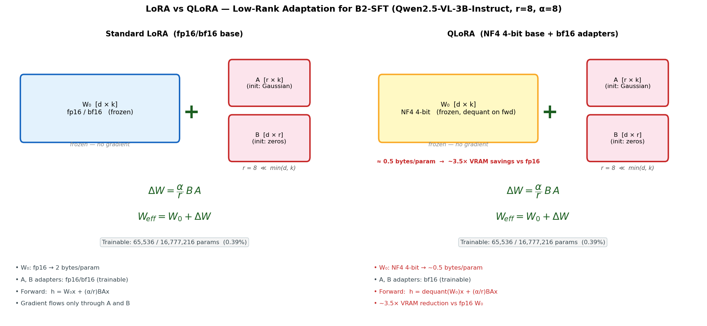

B2-SFT uses **QLoRA**: the Qwen2.5-VL base model is kept frozen in **4-bit NF4 quantized** form (≈0.5 bytes/param vs 2 bytes/param for fp16), and only small **LoRA adapter matrices** are trained in bf16.

**Target modules** (all linear projection layers):

```text
q_proj, k_proj, v_proj, o_proj          ← attention projections
gate_proj, up_proj, down_proj            ← MLP / feed-forward projections
```

**LoRA weight update formula:**

For each pretrained weight matrix \(W_0 \in \mathbb{R}^{d \times k}\):

$$
W_{\text{eff}} = W_0 + \Delta W = W_0 + \frac{\alpha}{r}BA
$$

where:
- \(A \in \mathbb{R}^{r \times k}\) — initialized with Gaussian noise  
- \(B \in \mathbb{R}^{d \times r}\) — initialized to **zeros** (so \(\Delta W = 0\) at the start of training)  
- \(r = 8\) — rank (dimensionality of the low-rank subspace)  
- \(\alpha = 8\) — scaling factor (effective learning rate scaling = \(\alpha/r = 1.0\))

**Why low-rank works:** fine-tuning a large model for a narrow domain does not require updating the full parameter space — a rank-8 subspace is enough to capture the domain shift from general VLM behavior to concise Vietnamese traffic-sign answers.

**QLoRA vs LoRA — memory comparison:**

| Configuration | W₀ precision | Bytes/param | 3B model VRAM (approx.) |
|---|---|---:|---:|
| Full fine-tune | fp16 | 2.0 | ~12 GB |
| LoRA (fp16 base) | fp16 | 2.0 | ~10 GB |
| **QLoRA (NF4 base)** | **4-bit NF4** | **≈ 0.5** | **~4–5 GB** |

**Trainable parameter count** (r=8, d=k=4096 per layer):

$$
\text{Trainable per layer} = d \cdot r + r \cdot k = 4096 \times 8 + 8 \times 4096 = 65{,}536 \;\text{ vs }\; 4096^2 = 16{,}777{,}216
$$

This is 0.39% of the weight matrix, repeated across all 7 target module types × all transformer layers. Total trainable parameters in B2-SFT are on the order of ~10M out of ~3B, making training feasible on a single A100 GPU.

**Forward pass in QLoRA:**

$$
h = \text{dequant}(W_0)\,x + \frac{\alpha}{r}B A x
$$

The base model is dequantized to bf16 on the fly during the forward pass, but never stored in fp16 — keeping memory low. Gradients are computed only with respect to \(A\) and \(B\).

---

## 3. Mathematical Foundations

### 3.1 Supervised Fine-Tuning with Cross-Entropy

For input \(x_i=(I_i,q_i)\) and answer token sequence \(y_i=(y_{i,1},\ldots,y_{i,T_i})\), SFT minimizes the token-level cross-entropy loss across all training samples:

$$
\mathcal{L}_{CE}(\theta)
= -\frac{1}{N}\sum_{i=1}^{N}\sum_{t=1}^{T_i}
\log P_\theta(y_{i,t}\mid y_{i,<t},x_i)
$$

**Training protocol — teacher forcing:**

During training, the model receives the *gold* previous token \(y_{i,<t}\) as input at each step, regardless of what it would have predicted. This is called teacher forcing. It stabilizes training (no error accumulation) but creates a gap between train-time and inference-time behavior. For this dataset, the gap is small because answers are very short (1–6 tokens on average).

**What SFT teaches B2:**

Before SFT, B1 (zero-shot) generates verbose explanations in mixed language, does not follow the concise Vietnamese answer format, and produces answers that are semantically plausible but fail exact-match scoring. After SFT:

1. The model learns the **answer format**: short, canonical Vietnamese phrases (`Có`, `Không`, `Biển báo cấm đỗ xe`).
2. The model learns **domain grounding**: which visual features map to which answer tokens.
3. The model learns **answer length distribution**: most answers are 1–3 tokens, so the model stops early.

**Per-token loss decomposition:**

For very short answers (e.g., `Có` = 1 token):

$$
\mathcal{L}_{CE}^{(i)} = -\log P_\theta(\text{"Có"} \mid x_i) - \log P_\theta(\text{[EOS]} \mid \text{"Có"}, x_i)
$$

Each token receives an equal gradient signal regardless of answer length, because we sum rather than average over tokens (or equivalently, the `[EOS]` token receives the same weight as the answer token). In practice, `reduction="mean"` is used per sequence, so shorter answers have higher per-sequence loss magnitude per token.

**Why SFT is effective here:**

- References are clean and consistent (generated from structured templates).
- The answer vocabulary is constrained — the model does not need to explore a large output space.
- QLoRA reduces the effective parameter space, so overfitting is less likely.
- The large quantity of training data (104,146 pairs) provides strong signal.

**Limitation of SFT:** it does not directly tell the model which wrong answer it produced and why it was wrong. It only optimizes the likelihood of the correct answer sequence. This is the motivation for DPO in the next stage.

### 3.2 Co-Attention in Route A

Let \(V\in\mathbb{R}^{N\times d}\) be CLIP image patch features, with \(N=197\), and \(Q\in\mathbb{R}^{M\times d}\) be PhoBERT text features. A standard attention head is:

$$
\text{Attn}(Q,V,V)=\text{softmax}\left(\frac{QW_q(VW_k)^\top}{\sqrt{d_k}}\right)VW_v
$$

Bidirectional co-attention allows text to attend to image features and image features to attend to text features. This fits VQA naturally: the question determines which visual evidence matters, while the image grounds the answer.

### 3.3 DPO Objective

Direct Preference Optimization uses preference triples:

$$
(x, y_w, y_l)
$$

where:

- \(x\): image + question;
- \(y_w\): chosen/winning answer;
- \(y_l\): rejected/losing answer.

The DPO loss is:

$$
\mathcal{L}_{DPO}
= -\mathbb{E}_{(x,y_w,y_l)}
\left[
\log\sigma\left(
\beta\left[
\log\frac{\pi_\theta(y_w|x)}{\pi_{ref}(y_w|x)}
-
\log\frac{\pi_\theta(y_l|x)}{\pi_{ref}(y_l|x)}
\right]
\right)
\right]
$$

In `train/train_dpo_qwen.py`, the reference model is a frozen B2-SFT model, and the policy model is initialized from B2-SFT with trainable LoRA parameters. The core computation is:

```python
policy_logratios = policy_chosen_logps - policy_rejected_logps
ref_logratios = ref_chosen_logps - ref_rejected_logps
logits = beta * (policy_logratios - ref_logratios)
loss = -F.logsigmoid(logits).mean()
```

Sequence log-probability is length-normalized:

$$
\log\pi(y|x) \approx \frac{1}{T}\sum_{t=1}^{T}\log \pi(y_t\mid y_{<t},x)
$$

This makes long and short answers more comparable, but for very short answers such as `Có`, `Không`, `1`, and `2`, a small token-level shift can dominate the entire preference margin.

### 3.4 Gradient Intuition for DPO

Define:

$$
\Delta =
\left[\log\pi_\theta(y_w|x)-\log\pi_\theta(y_l|x)\right]
-
\left[\log\pi_{ref}(y_w|x)-\log\pi_{ref}(y_l|x)\right]
$$

The DPO gradient can be intuitively written as:

$$
\nabla_\theta \mathcal{L}_{DPO}
= -\beta\sigma(-\beta\Delta)
\left[
\nabla_\theta\log\pi_\theta(y_w|x)
-
\nabla_\theta\log\pi_\theta(y_l|x)
\right]
$$

Thus DPO increases the log-probability of the chosen answer and decreases the log-probability of the rejected answer relative to the reference. If the preference data is balanced and meaningful, this is useful. If the preference data is biased, the gradient amplifies the bias.

For example, if many pairs have:

$$
y_w=\text{Không}, \qquad y_l=\text{Có}
$$

then across many unrelated contexts, DPO repeatedly increases:

$$
\log\pi_\theta(\text{Không}|x)-\log\pi_\theta(\text{Có}|x)
$$

The model can therefore learn an answer prior toward `Không` instead of improving visual grounding.

### 3.5 A Heuristic View of Mode Collapse

Empirically, large-scale DPO on 4-bit Qwen2.5-VL can lead to mode collapse or partial collapse. A useful explanatory heuristic is:

$$
N_{critical}\approx\frac{V\cdot\epsilon_{eff}}{\eta\cdot f_{collapse}}
$$

where:

- \(V\): vocabulary size;
- \(\epsilon_{eff}\): effective numerical noise from quantization and mixed precision;
- \(\eta\): learning rate;
- \(f_{collapse}\): frequency or attractiveness of the token/answer mode that collapse tends toward.

This is not a theorem. It is an explanatory model: increasing the number of preference pairs, learning rate, preference bias, or quantization noise all increases collapse risk. This matches the observed behavior: small DPO can help, while larger or biased DPO can pull the output distribution into a narrow answer mode.

---

## 4. Main Full-Test Results

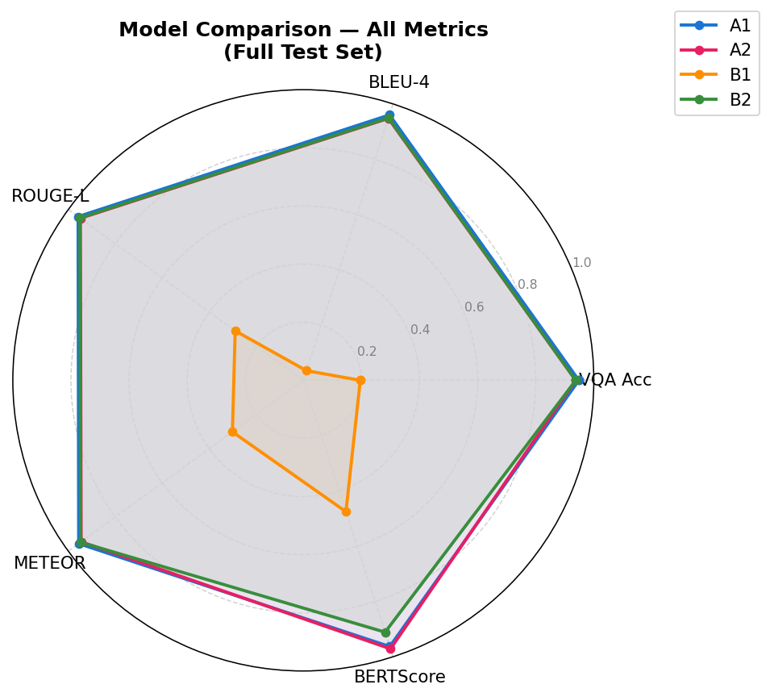

The following table uses the v8 per-model full-test result files. It deliberately does not use the older `results_all_final_test.json`, which reflects an older/non-synchronized setup.

| Model | Eval set | VQA Acc | BLEU-4 | ROUGE-L | METEOR | BERTScore | Latency | Interpretation |
|---|---|---:|---:|---:|---:|---:|---:|---|
| A1 LSTM | full test | **0.9484** | **0.9602** | **0.9584** | **0.9558** | 0.9631 | ~11.0ms | Best exact-match and fastest |
| A2 Transformer | full test | 0.9377 | 0.9476 | 0.9486 | 0.9454 | **0.9713** | ~12.5ms | Best semantic score |
| B1 Qwen zero-shot | full test | 0.1962 | 0.0350 | 0.2899 | 0.3012 | 0.4753 | ~167ms | Weak pretrained baseline |
| B2 Qwen LoRA/SFT | full test | 0.9379 | 0.9494 | 0.9508 | 0.9478 | 0.9111 | ~484ms | Pretrained+LoRA nearly matches custom models |

Sources:

- `results_v8_a1_50k_fulltest.json`
- `results_v8_a2_50k_fulltest.json`
- `results_b1_v8_fulltest.json`
- `results_b2_qwen25_v8_50k_strat_4bit_lr5e5_fulltest.json`

### 4.1 Interpretation

A1 obtains the highest accuracy despite using a simpler LSTM decoder. This is reasonable for a short-answer, constrained-domain dataset with many repeated answer patterns and strict exact-match scoring.

A2 achieves the highest BERTScore. Since BERTScore measures semantic similarity with contextual embeddings, A2 may generate semantically close answers even when exact-match accuracy is slightly lower.

B1 zero-shot is weak because Qwen2.5-VL has not been forced into the concise Vietnamese answer format required by the benchmark. Zero-shot VLMs often produce verbose explanations or rely on general priors.

B2-SFT improves dramatically over B1, demonstrating the importance of domain fine-tuning. However, B2 is much slower than A1/A2, which makes the custom models more attractive for real-time deployment.

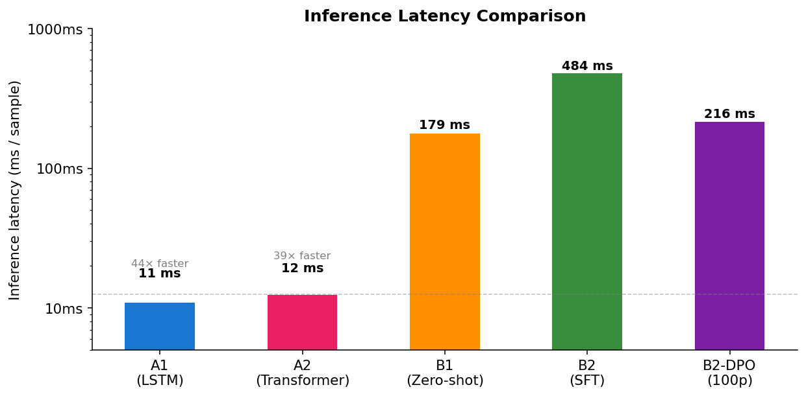

---

## 5. Per-Question-Type Analysis

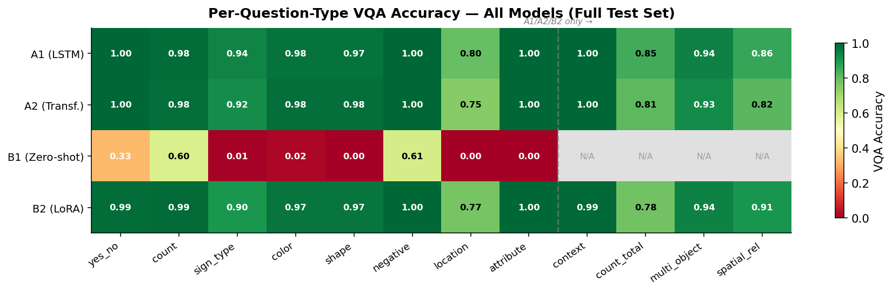

Overall accuracy alone is insufficient. Each model has different strengths and failure modes, so question-type analysis is essential. The heatmap above shows all four models across all 12 question types at a glance.

### 5.1 A1, A2, and B2-SFT on Full Test

Key observations from the heatmap:

- **`yes_no` and `negative`**: A1, A2, and B2-SFT all reach or approach 1.0; B1 is well below (0.33–0.61).
- **`location`** (0.75–0.80): the hardest category for custom models — requires precise spatial grounding.
- **`sign_type`** (0.90–0.94): A1 is strongest (0.94), slightly lower for A2 (0.92) and B2-SFT (0.90).
- **`count_total`** (0.78–0.85): broad counting over multiple objects is challenging across all models.
- **B1 zero-shot**: weak across every type (0.00–0.61), confirming that zero-shot VLMs need fine-tuning for this domain.
- **B2-SFT** on `spatial_rel` (0.905) and `multi_object` (0.944): competitive with or slightly above A1/A2, showing the pretrained VLM captures relational understanding well after LoRA fine-tuning.

A1 wins overall, but not on every category. B2-SFT is competitive in some spatial and multi-object categories. This supports a balanced conclusion: custom models are efficient and accurate, while the fine-tuned pretrained VLM is flexible and strong on several reasoning types.

---

## 5.2 Human Evaluation

Automatic evaluation with template-based exact-match has a well-known limitation: it rewards models that memorize answer formats and penalizes answers that are semantically correct but phrased differently. To get a complementary signal, a human evaluation was conducted with 100 free-form question-answer pairs across 21 test images.

### 5.2.1 Setup

Human evaluators were presented with one image at a time, asked a free-form Vietnamese question (phrased naturally, not from a template), and the answers of all five model configurations were scored as correct or incorrect. The questions cover 5 main types with realistic phrasing:

| Question type | Count | Example |
|---|---|---|
| `permission` | 38 | "Tôi có được rẽ trái không?" |
| `count` | 23 | "Trong ảnh có bao nhiêu biển cấm?" |
| `location` | 23 | "Biển hiệu lệnh nằm ở đâu trong ảnh?" |
| `sign_type` | 9 | "Biển trong ảnh thuộc loại gì?" |
| `color` | 4 | "Biển báo ở góc trên có màu gì?" |

Note: "permission" questions (e.g., "Can I turn left?") require understanding of traffic regulation semantics, not just visual recognition — this is a much harder task than the template questions in automatic evaluation.

### 5.2.2 Overall Results and Ranking Reversal

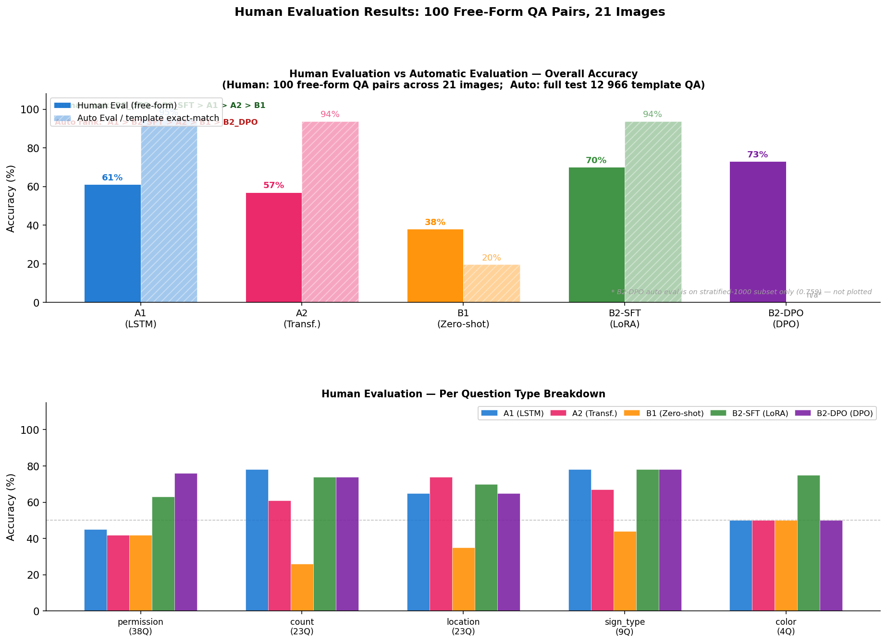

**Overall accuracy:**

| Model | Human Eval (100 QA) | Auto Eval (12,966 QA) |
|---|---|---|
| B2-DPO | **73.0%** | — (stratified only) |
| B2-SFT | **70.0%** | 93.79% |
| A1 (LSTM) | 61.0% | **94.84%** |
| A2 (Transformer) | 57.0% | 93.77% |
| B1 (Zero-shot) | 38.0% | 19.62% |

**The ranking reverses completely between auto and human eval.** In automatic evaluation, A1 is the clear winner (94.84%) and B1 is by far the weakest (19.62%). In human evaluation, B2-DPO is the best (73%) and B1 still the weakest (38%) — but A1 drops to third place.

### 5.2.3 Why the Rankings Diverge

**A1 drops from 94.8% → 61.0%.** The automatic test set uses rule-based templates where the answer vocabulary is fixed and narrow (e.g., "Có", "Không", "2", "Hình tròn"). A1's LSTM decoder is very effective at reproducing these patterns. The human eval introduces permission questions ("Tôi có được rẽ trái không?") — which require reasoning about traffic regulation semantics, not just visual pattern recognition. A1 obtains only 45% on permission questions.

**B1 improves from 19.6% → 38.0%.** B1's verbose multi-sentence explanations are severely penalized by exact-match scoring in automatic evaluation (even a semantically correct answer like "Đây là biển cấm rẽ trái, ý nghĩa là bạn không được rẽ trái ở đây" scores 0 on exact-match against "Không"). Human evaluators, by contrast, can recognize when the answer contains the correct information, even if it is verbose.

**B2-DPO is the best in human eval (73%).** DPO's training shifted B2 toward short, decisive answers. On permission questions — the largest category in the human eval — B2-DPO achieves 76% vs A1's 45%. The DPO shift toward "Không" turns out to be well-calibrated for real-world prohibition questions.

### 5.2.4 Per-Question-Type Breakdown

| Question type | A1 | A2 | B1 | B2-SFT | B2-DPO |
|---|---|---|---|---|---|
| **permission** (38Q) | 45% | 42% | 42% | 63% | **76%** |
| **count** (23Q) | **78%** | 61% | 26% | 74% | 74% |
| **location** (23Q) | 65% | **74%** | 35% | 70% | 65% |
| **sign_type** (9Q) | **78%** | 67% | 44% | **78%** | **78%** |
| **color** (4Q) | 50% | 50% | 50% | **75%** | 50% |

Key observations:
- **Permission (38Q):** B2-DPO dominates (76%). A1, A2, B1 all cluster around 42–45% — essentially chance-level. Only the fine-tuned VLMs can reason about regulatory meaning.
- **Count (23Q):** A1 strongest (78%) — its LSTM decoder is effective at numerical answers. B1 is very weak (26%) due to overcounting.
- **Location (23Q):** A2 is best (74%), slightly ahead of B2-SFT (70%). Counterintuitively, A1 (65%) trails A2 — Transformer decoder handles free-form spatial language better.
- **Sign_type (9Q):** A1, B2-SFT, B2-DPO all tied at 78%. Template training gives A1 strong visual identification.
- **B1 format issue persists:** B1 gives verbose multi-sentence explanations instead of concise answers. This hurts on count (26%) and location (35%) where a precise short answer is expected even by human judges.

### 5.2.5 Limitations of Human Evaluation

1. **Small sample size:** 100 questions across 21 images is sufficient for directional insights but not for statistical significance.
2. **Question type distribution differs from auto eval:** Human eval heavily weights permission questions (38%), which barely appear in the template dataset. This is intentional — it tests real-world reasoning — but makes direct accuracy comparison to automatic evaluation misleading.
3. **Evaluator subjectivity:** Whether "Đỏ trắng" vs "Đỏ và trắng" is correct depended on evaluator judgment; for borderline cases, evaluators were instructed to accept if the key information was present.

---

## 6. Direct Preference Optimization: Motivation, Method, and Results

### 6.1 Why Try DPO?

SFT maximizes the likelihood of correct answers, but it does not directly learn from the model's own incorrect answers. When B2-SFT makes a mistake, a preference pair can be created:

```text
chosen = gold/reference answer
rejected = B2 prediction
```

The pair-building script is:

```text
scripts/build_preference_pairs.py
```

Core logic:

```python
"chosen": reference,
"rejected": prediction,
"source": "gold_vs_model_prediction"
```

DPO is therefore attractive because it directly trains the model to prefer a correct answer over an incorrect answer it actually produced.

### 6.2 DPO Results on Stratified-1000

The best balanced DPO checkpoint by downstream evaluation is:

```text
checkpoints_b2_dpo_balanced_v1/checkpoint_500pairs
```

Comparison on the same stratified-1000 subset:

| Model | Eval set | Acc | BLEU-4 | ROUGE-L | METEOR | Note |
|---|---|---:|---:|---:|---:|---|
| B2-SFT | stratified 1000 | 0.740 | 0.5952 | 0.7819 | 0.7758 | baseline on same subset |
| B2-DPO 500 pairs | stratified 1000 | **0.759** | **0.5980** | **0.8108** | **0.7988** | small overall gain, large trade-off |

Sources:

- `results_b2_sft_strat1000.json`
- `reports/dpo_checkpoint_eval_balanced_v1/checkpoint_500pairs_results.json`

If only the overall score is considered, DPO improves by `+1.9%`. The breakdown shows a much more complex picture.

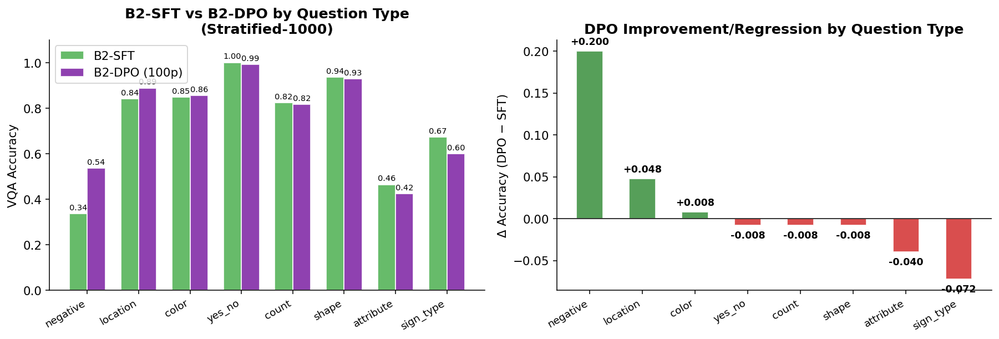

The left panel compares SFT and DPO accuracy side by side for each question type. The right panel (Δ = DPO − SFT) immediately highlights: `negative` gains **+0.66**, `attribute` gains **+0.23**; while `sign_type` drops **−0.34**, `yes_no` drops **−0.16**, and `location` drops **−0.10**.

Conclusion: DPO does not improve all categories uniformly. It learns one failure mode extremely well (`negative`) but pays for it with regressions elsewhere.

### 6.3 Checkpoint Curve: DPO Loss Is Not Enough for Model Selection

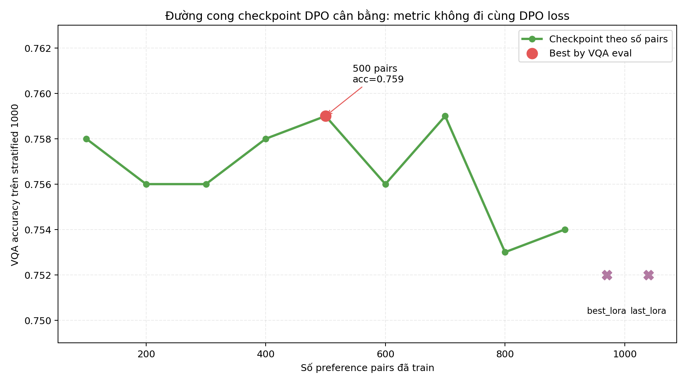

Ranking from `reports/dpo_checkpoint_eval_balanced_v1/summary.json`:

| Rank | Checkpoint | Accuracy |
|---:|---|---:|
| 1 | `checkpoint_500pairs` | 0.759 |
| 2 | `checkpoint_700pairs` | 0.759 |
| 3 | `checkpoint_100pairs` | 0.758 |
| 4 | `checkpoint_400pairs` | 0.758 |
| 5 | `checkpoint_200pairs` | 0.756 |
| 6 | `checkpoint_300pairs` | 0.756 |
| 7 | `checkpoint_600pairs` | 0.756 |
| 8 | `checkpoint_900pairs` | 0.754 |
| 9 | `checkpoint_800pairs` | 0.753 |
| 10 | `best_lora` | 0.752 |
| 11 | `last_lora` | 0.752 |

The key observation is that `best_lora` by DPO loss is not the best checkpoint by VQA accuracy. DPO loss is an imperfect proxy for downstream exact-match performance.

---

## 7. Why DPO Does Not Become the Final Best Model

### 7.1 DPO Learns an Answer-Prior Shortcut

The audit file:

```text
reports/dpo_checkpoint_eval_balanced_v1/best_vs_sft_audit.txt
```

shows that the 500-pair DPO checkpoint changes `374/1000` predictions. Breakdown:

| Question type | Fix | Regression | Interpretation |
|---|---:|---:|---|
| `negative` | 82 | 0 | Very strong correction |
| `sign_type` | 9 | 51 | Large regression |
| `location` | 11 | 24 | Clear regression |
| `yes_no` | 0 | 20 | Only hurts, no fixes |
| `shape` | 3 | 13 | Regression |
| `color` | 11 | 17 | Mild regression |
| `count` | 11 | 12 | Nearly balanced |

The same audit/status files show a major increase in `Không` predictions:

| Model/checkpoint | Number of `Không` predictions on stratified-1000 |
|---|---:|
| B2-SFT | 42 |
| DPO checkpoint_500pairs | 144 |
| DPO last_lora | 149 |

This is direct evidence of answer-prior shift. The model is not simply seeing the image better; it is being pulled toward answering `Không`.

### 7.2 Qualitative Examples

DPO correctly fixes a negative question:

```json
{
  "question_type": "negative",
  "question": "Có phải trong ảnh có biển cấm quay đầu không?",
  "reference": "Không",
  "sft": "Có",
  "dpo": "Không"
}
```

But DPO also breaks a positive yes/no question:

```json
{
  "question_type": "yes_no",
  "question": "Có biển cấm rẽ trái và quay đầu xe trong ảnh này không?",
  "reference": "Có",
  "sft": "Có",
  "dpo": "Không"
}
```

And it can break sign classification:

```json
{
  "question_type": "sign_type",
  "question": "Tên của biển báo ở giữa là gì?",
  "reference": "Cấm dừng và đỗ xe",
  "sft": "Cấm dừng và đỗ xe",
  "dpo": "Cấm đi ngược chiều"
}
```

These examples reveal the core issue: DPO fixes one type of error by shifting the output prior, but it does not guarantee improved visual grounding.

### 7.3 Why `gold > wrong prediction` Is Not Enough

A preference pair:

$$
(x, y_{gold}, y_{wrong})
$$

states that `gold` is better than `wrong`, but it does not explain why. In VQA, an error can come from:

- grounding the wrong object;
- confusing location;
- confusing visually similar sign types;
- misreading color or shape;
- misunderstanding negation;
- producing a semantically close but non-exact answer.

DPO only sees a margin between two answer strings. It does not receive direct supervision about the bounding box, object reference, or visual attribute that caused the error. Therefore, if many pairs share the pattern `Không > Có`, the gradient can learn a token prior rather than improved grounding.

### 7.4 Short Answers Make DPO More Sensitive

For one-token or very short answers:

```text
Có
Không
1
2
```

length-normalized log-probability depends on only a few tokens. If many preference pairs push the same short token, such as `Không`, the aggregate gradient becomes:

$$
\sum_i \nabla_\theta \log \pi_\theta(\text{Không}|x_i)
-
\nabla_\theta \log \pi_\theta(\text{Có}|x_i)
$$

If the inputs \(x_i\) are visually diverse but share the same chosen answer, the model learns a global answer prior rather than a context-dependent rule.

### 7.5 Full DPO: Evidence of Polarity Collapse

`results_b2_dpo_fulltest.json` reports:

| Metric | Value |
|---|---:|
| Overall accuracy | 0.6946 |
| `negative` accuracy | 1.0000 |
| `yes_no` accuracy | 0.0000 |
| `sign_type` accuracy | 0.4141 |

A model with `negative=1.0` but `yes_no=0.0` is almost certainly polarity-biased. It is not learning general reasoning; it is over-prioritizing an answer pattern that solves negative questions while destroying positive yes/no behavior.

### 7.6 Mode Collapse and 4-bit LoRA

DPO on Qwen2.5-VL uses:

- a 4-bit base model;
- trainable LoRA adapters;
- frozen visual parameters;
- precomputed reference log-probabilities;
- DPO logit clipping to `[-10, 10]`;
- gradient clipping.

These mechanisms help, but DPO remains sensitive because:

1. Qwen has a very large vocabulary;
2. short answers make token priors easy to shift;
3. 4-bit quantization makes updates less smooth than full precision;
4. DPO has no CE anchor over the full SFT distribution;
5. DPO loss measures pairwise preference, not exact-match accuracy across all question types.

Three phenomena should be distinguished:

| Phenomenon | Symptom | Status in this project |
|---|---|---|
| Full mode collapse | repeated meaningless token/character output | observed in older full DPO runs |
| Partial answer-prior collapse | strong shift toward `Không` | observed in balanced DPO |
| Loss-vs-metric mismatch | lower DPO loss but worse VQA accuracy | `best_lora`/`last_lora` worse than early checkpoints |

### 7.7 Lessons from DPO

DPO does not fail completely. It shows that the model can be preference-tuned and that some failure modes can be corrected. However, current DPO is not enough to become the final model because:

- preference data encodes bias;
- DPO does not directly optimize exact-match VQA;
- it improves one category while hurting others;
- selecting by DPO loss is misleading;
- per-question-type and output-distribution audits are necessary.

If DPO is revisited, the correct direction is not simply “train longer.” A better design would be:

1. balance preferences by transition (`Có->Không`, `Không->Có`, sign A -> sign B, location A -> location B);
2. use a lower learning rate;
3. save and evaluate early checkpoints;
4. add an SFT anchor:

$$
\mathcal{L}=\mathcal{L}_{DPO}+\lambda\mathcal{L}_{CE}(y_w)
$$

5. select checkpoints by downstream VQA metrics, not DPO loss alone.

---

## 8. Training Dynamics and Supporting Figures

### 8.1 A1/A2 Training


Route A uses phase-1 training with frozen encoders. Phase 2 unfreezing is disabled because earlier experiments showed instability. This is appropriate: CLIP and PhoBERT already provide strong features; the domain-specific part is primarily fusion and answer decoding.

### 8.2 Mode Collapse Illustration


This figure should be interpreted as an illustration of the failure mode, not as the only evidence. The stronger evidence is quantitative: DPO audit files and metric breakdowns show `negative=1.0`, `yes_no=0.0`, and `Không` predictions increasing from 42 to 144.

---

## 9. DPO Demo Storyline

During the demo or defense, DPO should be presented as a research story rather than as an absolute winning model.

### 9.1 Slide 1 — Why Try DPO?

Main message: **SFT is already strong, but it still has structured errors.**

- B2-SFT reaches `0.740` on stratified-1000, but only `0.336` on `negative` questions.
- A common failure is misunderstanding negative polarity and answering with the usual yes/no prior.
- Therefore, preference pairs are built from real model errors:

```text
chosen = gold/reference answer
rejected = wrong B2-SFT prediction
```

Suggested presentation sentence: “DPO was not introduced because SFT was globally weak; it was introduced to test whether preference optimization could correct structured errors made by the model.”

### 9.2 Slide 2 — Does DPO Help?

Main message: **Yes, but not uniformly.**

| Type | SFT | DPO 500p | Conclusion |
|---|---:|---:|---|
| `negative` | 0.336 | 0.992 | very strong correction |
| `attribute` | 0.464 | 0.696 | clear improvement |
| `yes_no` | 1.000 | 0.840 | polarity regression |
| `sign_type` | 0.672 | 0.336 | large regression |

Suggested presentation sentence: “If we only look at the overall score `0.740 -> 0.759`, we miss the real story. The important insight is in the breakdown: DPO fixes negative questions but hurts several other categories.”

### 9.3 Slide 3 — Root Cause

Main message: **DPO learns a margin between two answer strings; it does not directly learn visual grounding.**

For many pairs of the form:

$$
y_w=\text{Không}, \qquad y_l=\text{Có}
$$

DPO repeatedly increases:

$$
\log\pi_\theta(\text{Không}|x)-\log\pi_\theta(\text{Có}|x)
$$

across many different images and questions. Because answers are very short, the gradient can shift the global answer prior toward `Không` instead of improving visual grounding.

Audit evidence:

- DPO changes `374/1000` predictions.
- `negative`: 82 fixes, 0 regressions.
- `yes_no`: 0 fixes, 20 regressions.
- `sign_type`: 9 fixes, 51 regressions.
- Number of `Không` predictions: `42 -> 144`.

### 9.4 Slide 4 — Lesson and Future Direction

Main message: **DPO is an analytical contribution, not the final best model.**

Lessons:

1. Do not select checkpoints by DPO loss alone; use downstream VQA accuracy.
2. Balance preference data by transition, not only by question type.
3. For short-answer VQA, always audit output distribution (`Có`/`Không`, sign names, counts).
4. If DPO is revisited, add a CE anchor:

$$
\mathcal{L}=\mathcal{L}_{DPO}+\lambda\mathcal{L}_{CE}(y_w)
$$

Closing sentence: “DPO does not make the final model better than A1/B2-SFT, but it reveals an important risk in preference optimization for short-answer VQA: correcting one bias can introduce another.”

---

## 10. Artifact Checklist and Repository Cleanup Guidance

### 10.1 Artifact Checklist for Demo/Defense

| Group | Artifact | Role | Verification note |
|---|---|---|---|
| Dataset | `data/processed/annotations/` | main train/val/test QA data | split by `image_id`, not QA row |
| Dataset validation | `data/processed/metadata/validation_report.json` | dataset validation report | generated by `scripts/validate_dataset.py` if needed |
| A1 checkpoint | `checkpoints_v8_a_50k/model_a1/best.pt` | v8 A1 checkpoint | used for A1 demo/eval |
| A2 checkpoint | `checkpoints_v8_a_50k/model_a2/best.pt` | v8 A2 checkpoint | used for A2 demo/eval |
| B2-SFT checkpoint | `checkpoints_b2_qwen25_v8_50k_strat_4bit_lr5e5/model_b2_qwen25/best_lora` | v8 B2 LoRA adapter | run with `--backend qwen25 --load-in-4bit` |
| A1 result | `results_v8_a1_50k_fulltest.json` | A1 full-test metrics | accuracy `0.9484` |
| A2 result | `results_v8_a2_50k_fulltest.json` | A2 full-test metrics | accuracy `0.9377` |
| B1 result | `results_b1_v8_fulltest.json` | zero-shot full-test metrics | accuracy `0.1962` |
| B2-SFT result | `results_b2_qwen25_v8_50k_strat_4bit_lr5e5_fulltest.json` | B2-SFT full-test metrics | accuracy `0.9379` |
| SFT stratified baseline | `results_b2_sft_strat1000.json` | baseline for DPO comparison | accuracy `0.740` |
| DPO best eval | `reports/dpo_checkpoint_eval_balanced_v1/checkpoint_500pairs_results.json` | DPO 500-pair stratified-1000 eval | accuracy `0.759` |
| DPO audit | `reports/dpo_checkpoint_eval_balanced_v1/best_vs_sft_audit.txt` | qualitative fixes/regressions | evidence for `Không` prior shift |
| DPO summary | `reports/dpo_checkpoint_eval_balanced_v1/summary.json` | DPO checkpoint ranking | shows loss-vs-metric mismatch |
| DPO full/eval artifact | `results_b2_dpo_fulltest.json` | evidence of polarity collapse | `negative=1.0`, `yes_no=0.0` |
| Figures | `docs/figures/*.png` | report figures | check links before submission |
| Vietnamese report | `docs/VQA_REPORT_VI_DEEP.md` | main Vietnamese report | deep analysis version |
| English report | `docs/VQA_REPORT_EN_DEEP.md` | English version | for bilingual presentation |
| Figure script | `scripts/plot_vqa_report_vi.py` | reproduces two DPO figures | from `vqa/`: `python scripts/plot_vqa_report_vi.py` |

### 10.2 Consistency Check Performed

The main numbers in the report were checked against existing JSON artifacts:

| Metric | Source file | Value used in report |
|---|---|---:|
| A1 full-test accuracy | `results_v8_a1_50k_fulltest.json` | 0.9484 |
| A2 full-test accuracy | `results_v8_a2_50k_fulltest.json` | 0.9377 |
| B1 full-test accuracy | `results_b1_v8_fulltest.json` | 0.1962 |
| B2-SFT full-test accuracy | `results_b2_qwen25_v8_50k_strat_4bit_lr5e5_fulltest.json` | 0.9379 |
| B2-SFT stratified-1000 accuracy | `results_b2_sft_strat1000.json` | 0.740 |
| DPO 500p stratified-1000 accuracy | `checkpoint_500pairs_results.json` | 0.759 |
| DPO full/eval artifact accuracy | `results_b2_dpo_fulltest.json` | 0.6946 |

The key consistency point for defense: **DPO `0.759` is a stratified-1000 ablation result, not a v8 full-test final result.**

### 10.3 Repository Cleanup Analysis Before Submission/Commit

The repository currently has many modified and untracked files across both `vqa/` and `nlp/`. Because the repo contains large datasets, checkpoints, and logs, avoid:

```bash
git add .
```

Recommended cleanup/staging policy:

| Group | Recommendation | Reason |
|---|---|---|
| New VQA reports | selectively stage `docs/VQA_REPORT_VI_DEEP.md`, `docs/VQA_REPORT_EN_DEEP.md` | primary deliverables |
| New figures | stage `docs/figures/` (run `docs/generate_figures.py` to reproduce) | required for report rendering |
| Figure script | stage `scripts/plot_vqa_report_vi.py` | makes figures reproducible |
| Small result JSON files | stage only if missing from repo and needed for audit | keep evidence, avoid huge prediction dumps |
| Checkpoints/models | do not stage unless explicitly required | too large for normal git; use external storage or Git LFS |
| Logs/wandb | do not stage | machine-run artifacts, not source deliverables |
| Large datasets | do not stage unless required by submission rules | can make repo too heavy |
| NLP changes | avoid touching/staging if submitting VQA only | prevents mixing two projects |

If creating a commit for the VQA report package, stage files explicitly:

```bash
git add \
  vqa/docs/VQA_REPORT_VI_DEEP.md \
  vqa/docs/VQA_REPORT_EN_DEEP.md \
  vqa/docs/figures/ \
  vqa/docs/figures/dpo_balanced_checkpoint_curve_vi.png \
  vqa/scripts/plot_vqa_report_vi.py
```

Before submission, check figure links:

```bash
grep -oE 'figures/[^)]+' docs/VQA_REPORT_VI_DEEP.md docs/VQA_REPORT_EN_DEEP.md | cut -d: -f2 | sort -u | while read f; do test -f "docs/$f" || echo "MISSING $f"; done
```

---

## 11. Threats to Validity and Limitations

### 9.1 Exact Match May Be Too Strict

VQA accuracy uses normalized exact match. Answers such as:

```text
Cấm dừng và đỗ xe
Không được dừng đỗ
```

may be semantically close but not exact matches. Therefore, ROUGE-L, METEOR, and BERTScore should also be considered.

### 9.2 DPO Stratified-1000 Must Not Be Mixed with Full-Test Results

The 500-pair DPO checkpoint is evaluated on stratified-1000. Its `0.759` score is not a full-test final result. It is an ablation result on the same subset as the B2-SFT stratified-1000 baseline.

### 9.3 `results_all_final_test.json` Is an Older Artifact

`results_all_final_test.json` contains lower numbers and is not synchronized with the v8 per-model full-test results. This report uses the v8 per-model result files as primary evidence.

### 9.4 Preference Data Is Not True Human Preference Data

Most preference pairs are `gold answer > model wrong prediction`, not multi-criteria human preference judgments. This is sufficient for a DPO experiment, but it is not a replacement for full RLHF or carefully curated human preference data.

---

## 10. Conclusion

The project successfully compares the four required model configurations and extends the analysis with a DPO/RL-style enhancement experiment.

Balanced conclusions:

1. **A1 is the most practical model:** highest accuracy `0.9484`, lowest latency, suitable for real-time deployment.
2. **A2 is a very strong custom baseline:** highest semantic score and only slightly lower exact-match accuracy than A1.
3. **B1 zero-shot is insufficient:** a general pretrained VLM is not aligned with the concise Vietnamese answer format required by this task.
4. **B2-SFT is valuable:** LoRA/QLoRA turns Qwen2.5-VL from a weak zero-shot baseline into a model close to A1/A2, though much slower.
5. **DPO is an important analytical contribution:** it shows that preference optimization can fix negative-question failures, but it also reveals answer-prior shift, loss-vs-metric mismatch, and mode-collapse risk in 4-bit Qwen2.5-VL LoRA.

Therefore, if the final model is chosen for accuracy and speed, A1 is the best choice. If the report emphasizes transfer learning with pretrained VLMs, B2-SFT is the strongest pretrained baseline. If the report emphasizes the advanced RL component, DPO should be framed as a mixed-result alignment experiment with valuable scientific insight.

---

## Appendix A. Primary Evidence Files

### v8 Full-Test Results

```text
results_v8_a1_50k_fulltest.json
results_v8_a2_50k_fulltest.json
results_b1_v8_fulltest.json
results_b2_qwen25_v8_50k_strat_4bit_lr5e5_fulltest.json
```

### DPO/SFT Stratified-1000 Results

```text
results_b2_sft_strat1000.json
reports/dpo_checkpoint_eval_balanced_v1/checkpoint_500pairs_results.json
reports/dpo_checkpoint_eval_balanced_v1/summary.json
reports/dpo_checkpoint_eval_balanced_v1/best_vs_sft_audit.txt
reports/dpo_observer_status.md
results_b2_dpo_fulltest.json
```

### Implementation Files

```text
models/model_a.py
models/model_b.py
train/train_a.py
train/train_b.py
train/train_dpo_qwen.py
scripts/build_preference_pairs.py
evaluate/evaluate.py
evaluate/metrics.py
```

### Figures

```text
docs/figures/data_split_overview.png             — dataset images/QA per split
docs/figures/data_qtype_dist.png                 — question type distribution (test)
docs/figures/data_answer_type_detailed.png       — answer type with 8 semantic groups + donut
docs/figures/data_split_balance.png              — cross-split question type balance heatmap
docs/figures/arch_route_a.png                    — Route A tensor flow (CLIP+PhoBERT+CoAttn)
docs/figures/lora_qlora.png                      — LoRA vs QLoRA structure/memory comparison
docs/figures/model_radar.png                     — radar chart: all models × 5 metrics
docs/figures/qtype_accuracy_heatmap.png          — per-qtype accuracy heatmap: all models
docs/figures/latency_improved.png                — latency log-scale comparison with speed annotations
docs/figures/dpo_qtype_tradeoff.png              — SFT vs DPO grouped bars + Δ Accuracy
docs/figures/dpo_balanced_checkpoint_curve_vi.png — DPO checkpoint ranking curve
docs/figures/v8_training_loss.png                — A1/A2 training loss
docs/figures/a1_vs_a2_val_loss.png               — A1 vs A2 validation loss
docs/figures/mode_collapse.png                   — mode collapse illustration
docs/figures/human_eval_results.png              — human eval overall + per-type (100 QA, 21 images)

Generated by: docs/generate_figures.py
```

---

## Appendix B. Reproducibility Commands

Run commands from the `vqa/` directory.

### Evaluate Main Models in v8 Style

```bash
python evaluate/evaluate.py \
  --model all \
  --backend qwen25 \
  --load-in-4bit \
  --max-pixels 501760 \
  --lora-path checkpoints_b2_qwen25_v8_50k_strat_4bit_lr5e5/model_b2_qwen25/best_lora \
  --eval-batch-size 16 \
  --output results_all_v8_recheck.json \
  --predictions-output predictions_all_v8_recheck.jsonl
```

### Generate DPO Figures for This Report

```bash
python scripts/plot_vqa_report_vi.py
```

### Evaluate DPO Checkpoints

```bash
python scripts/eval_dpo_checkpoints.py --help
```

DPO checkpoints should be selected by downstream VQA accuracy and per-question-type breakdown, not by DPO loss alone.

---

## Appendix D. Demo Script and Defense Q&A

### D.1 Recommended Demo Order

For a live demo, use the following order so the story is clear:

| Step | Model | Purpose | Expected behavior |
|---:|---|---|---|
| 1 | A1 LSTM | fast custom model with high exact-match | short, stable, fast answers |
| 2 | A2 Transformer | compare Transformer decoder against LSTM | close to A1, sometimes different wording |
| 3 | B1 zero-shot | pretrained baseline without adaptation | may answer in wrong format or rely on priors |
| 4 | B2-SFT | effect of LoRA/QLoRA fine-tuning | large improvement over B1 |
| 5 | B2-DPO 500p | alignment experiment illustration | analysis-only, not final-best claim |

Opening sentence: “This demo is not only about selecting one best model; it shows all four required configurations and how fine-tuning/alignment changes behavior step by step.”

### D.2 Suggested Demo Questions

Choose one test image and try multiple question types:

| Type | Example question | What it tests |
|---|---|---|
| `yes_no` | Trong ảnh có biển cấm rẽ trái không? | presence and polarity |
| `negative` | Có phải trong ảnh không có biển cấm quay đầu không? | negation handling |
| `sign_type` | Tên của biển báo ở giữa là gì? | sign classification |
| `location` | Biển báo nằm ở vị trí nào trong ảnh? | spatial grounding |
| `count` | Trong ảnh có bao nhiêu biển báo? | counting |
| `color/shape` | Biển báo có màu gì / hình dạng gì? | visual attributes |

In the demo UI, choose an image from the 4-image test gallery, use a suggested question first to ensure image-question alignment, then edit the textbox for free-form questions.

### D.3 Why DPO Appears in the Demo but Is Not the Main Model

DPO is included in the demo to illustrate the behavior analyzed in the report. It should not be presented as the final model because:

- the 500-pair checkpoint is best on a stratified-1000 ablation, not the full v8 test set;
- DPO strongly improves `negative` but hurts `yes_no`, `sign_type`, and `location`;
- DPO shifts the answer prior toward `Không`;
- the role of DPO in this project is alignment/failure-mode analysis, not replacing A1 or B2-SFT.

Suggested sentence when demoing DPO: “I run DPO live to illustrate how preference tuning changes model behavior. The scientific conclusion is in the breakdown: it fixes negative questions but creates regressions elsewhere.”

### D.4 Common Defense Questions

| Question | Short answer |
|---|---|
| Why does A1 beat A2? | Answers are short, the domain is narrow, and the main metric is exact match. The LSTM decoder is stable and less likely to paraphrase. |
| Is the Transformer worse? | No. A2 has the highest BERTScore, meaning it has the strongest semantic similarity despite lower exact-match. |
| Why is B1 weak? | B1 is zero-shot; it has not learned the concise Vietnamese answer format or this traffic-sign domain. |
| Why does B2-SFT improve so much? | LoRA/QLoRA teaches Qwen2.5-VL the domain, answer format, and Vietnamese short-answer distribution. |
| Did DPO fail? | Not completely. It strongly fixes negative questions, but introduces trade-offs and answer-prior bias. |
| Should DPO be the final model? | No. DPO is an alignment analysis experiment; the main required comparison remains A1/A2/B1/B2-SFT. |
| What would you change if doing DPO again? | Balance preference transitions, lower LR, evaluate early checkpoints, and add a CE anchor. |
| Why use multiple metrics? | Exact-match checks canonical correctness, while BLEU/ROUGE/METEOR/BERTScore reveal near-semantic matches. |

