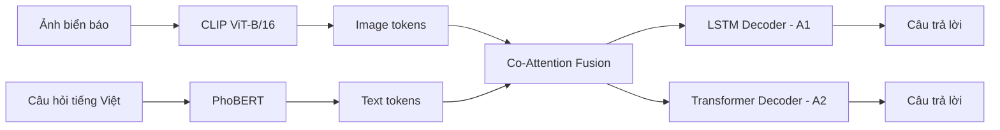
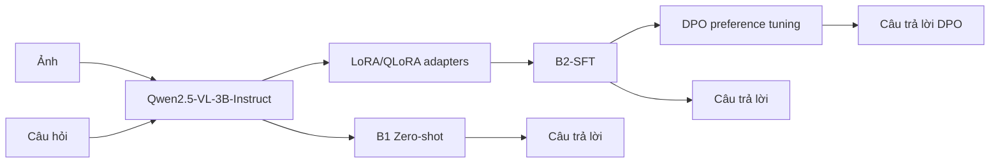

# Báo cáo chuyên sâu VQA tiếng Việt cho biển báo giao thông

## Phân tích cân bằng A1/A2/B1/B2-SFT và Direct Preference Optimization

**Dự án cuối kỳ môn Học Sâu — Vietnamese Traffic Sign Visual Question Answering**  
**Phiên bản báo cáo:** tiếng Việt chuyên sâu, tập trung bằng chứng thực nghiệm và phân tích DPO  
**Ngày:** 2026-05-03

---

## Tóm tắt điều hành

Dự án xây dựng hệ thống Visual Question Answering (VQA) tiếng Việt cho ảnh biển báo giao thông. Mỗi mẫu gồm một ảnh đường phố và một câu hỏi tiếng Việt; mô hình cần sinh một câu trả lời ngắn, đúng ngữ cảnh và đúng định dạng tiếng Việt.

Bốn cấu hình chính được so sánh:

| Ký hiệu | Mô hình | Vai trò |
|---|---|---|
| A1 | CLIP ViT-B/16 + PhoBERT + Co-Attention + LSTM decoder | Custom model với decoder tuần tự |
| A2 | CLIP ViT-B/16 + PhoBERT + Co-Attention + Transformer decoder | Custom model với decoder Transformer |
| B1 | Qwen2.5-VL-3B-Instruct zero-shot | Pretrained VLM không fine-tune |
| B2-SFT | Qwen2.5-VL-3B-Instruct + LoRA/QLoRA | Pretrained VLM fine-tune bằng supervised learning |

Kết quả v8 trên full test cho thấy:

- **A1 đạt VQA Accuracy cao nhất:** `0.9484`, đồng thời có latency thấp nhất khoảng `11 ms/sample`.
- **A2 rất cạnh tranh:** accuracy `0.9377`, BERTScore cao nhất `0.9713`, cho thấy câu trả lời gần nghĩa với đáp án tham chiếu.
- **B1 zero-shot yếu:** accuracy khoảng `0.1962`, chứng minh pretrained VLM tổng quát chưa đủ cho VQA tiếng Việt dạng trả lời ngắn.
- **B2-SFT gần bắt kịp A models:** accuracy `0.9379`, BLEU-4 `0.9494`, ROUGE-L `0.9508`; tuy nhiên latency cao hơn nhiều.
- **DPO không phải mô hình cuối tốt nhất**, nhưng là thí nghiệm rất có giá trị: DPO sửa mạnh nhóm câu hỏi phủ định (`negative`) nhưng gây lệch prior về đáp án `Không`, làm tụt `yes_no`, `sign_type`, `location`, và trong một số run tạo hiện tượng mode collapse.

Kết luận cân bằng: **A1, A2, B1 và B2-SFT đều cần được demo như bốn cấu hình bắt buộc; A1 nổi bật về exact-match/tốc độ, A2 nổi bật về semantic score, B2-SFT chứng minh hiệu quả fine-tuning pretrained VLM, còn DPO nên được trình bày như thí nghiệm alignment/RL phân tích failure mode, không phải final best model.**

Nguồn số liệu chính: `results_v8_a1_50k_fulltest.json`, `results_v8_a2_50k_fulltest.json`, `results_b1_v8_fulltest.json`, `results_b2_qwen25_v8_50k_strat_4bit_lr5e5_fulltest.json`, `reports/dpo_checkpoint_eval_balanced_v1/`, `results_b2_dpo_fulltest.json`.

---

## 1. Bài toán và dữ liệu

### 1.1 Định nghĩa bài toán

Bài toán VQA trong dự án được định nghĩa như sau:

$$
x = (I, q), \qquad y = \text{answer}
$$

trong đó:

- \(I\): ảnh đường phố có chứa một hoặc nhiều biển báo giao thông;
- \(q\): câu hỏi tiếng Việt về ảnh;
- \(y\): câu trả lời ngắn tiếng Việt.

Ví dụ:

```json
{
  "image_id": "vts_000001",
  "question": "Trong ảnh có biển giới hạn tốc độ không?",
  "answer": "Có",
  "question_type": "yes_no"
}
```

Điểm khó của bài toán không chỉ nằm ở nhận diện biển báo, mà còn ở việc nối nhiều năng lực:

1. hiểu ảnh và vị trí vật thể;
2. hiểu câu hỏi tiếng Việt;
3. định vị đúng object được hỏi;
4. sinh câu trả lời ngắn, không giải thích lan man;
5. giữ nhất quán với đáp án exact-match sau chuẩn hóa.

### 1.2 Dataset v8

Dataset được chuyển đổi từ dữ liệu biển báo giao thông Việt Nam có bounding boxes thành QA pairs. Các annotation cuối cùng được lưu ở:

```text
data/processed/annotations/
```

Thống kê tổng quan:

| Split | Số ảnh | Số QA pairs | QA/ảnh trung bình |
|---|---:|---:|---:|
| Train | 2,193 | 104,146 | 47.5 |
| Val | 272 | 12,944 | 47.6 |
| Test | 271 | 12,966 | 47.8 |
| Tổng | 2,736 | 130,056 | 47.5 |

Dataset được split theo `image_id`, không split ngẫu nhiên theo từng QA row. Điều này quan trọng vì một ảnh có nhiều câu hỏi; nếu cùng ảnh xuất hiện ở train và test, mô hình có thể học thuộc nội dung ảnh và làm metric bị leak.

### 1.3 Các loại câu hỏi

Ở bản v8, taxonomy mở rộng lên 12 nhóm câu hỏi:

| Nhóm | Ý nghĩa |
|---|---|
| `yes_no` | Câu hỏi có/không về sự tồn tại hoặc thuộc tính |
| `count` | Đếm số biển thuộc nhóm cụ thể |
| `sign_type` | Nhận diện tên/loại biển |
| `color` | Hỏi màu biển |
| `shape` | Hỏi hình dạng biển |
| `location` | Hỏi vị trí biển trong ảnh |
| `attribute` | Hỏi ý nghĩa/chức năng/thuộc tính |
| `negative` | Câu hỏi phủ định hoặc kiểm tra absence |
| `spatial_rel` | Quan hệ không gian giữa các biển |
| `count_total` | Đếm tổng theo một điều kiện rộng hơn |
| `multi_object` | Câu hỏi liên quan nhiều object |
| `context` | Câu hỏi cần kết hợp ngữ cảnh |

Việc có nhiều loại câu hỏi giúp đánh giá sâu hơn: một mô hình có thể rất tốt ở `yes_no` nhưng kém ở `sign_type` hoặc `location`. Đây cũng là lý do phần DPO cần phân tích theo question type thay vì chỉ nhìn overall accuracy.


### 1.4 Quy trình xây dựng dữ liệu

Dataset được xây dựng từ đầu qua một pipeline nhiều bước, chuyển đổi dataset detection sang VQA tiếng Việt.

**Bước 1 — Nguồn dữ liệu gốc.** Nguồn raw là Kaggle VNTS (Vietnamese Traffic Signs), CC BY-SA 4.0, khoảng 3.200 ảnh. Task gốc là object detection biển báo với bbox và class label. Dự án tận dụng lại bằng cách lấy các biển báo đã detect trong mỗi ảnh làm evidence có cấu trúc để sinh câu hỏi-đáp.

**Bước 2 — Chọn ảnh và trích xuất object metadata** (`scripts/prepare_dataset.py`). Từ toàn bộ corpus, chọn 350 ảnh dựa trên bộ lọc chất lượng (cạnh bbox tối thiểu ≥ 30 px, biển đọc được). Với mỗi ảnh, annotation bbox/class gốc của Kaggle được trích xuất, tên class tiếng Anh được map sang tiếng Việt qua `class_map.csv` thủ công (58 class), và hai trường dẫn xuất được tính: `relative_position` (góc phần tư của biển trong ảnh, ví dụ "Trên bên phải") và `area_ratio` (diện tích biển / diện tích ảnh). Kết quả là `metadata/objects.jsonl` — mỗi dòng một ảnh — chứa evidence ngữ nghĩa dùng để sinh câu hỏi.

**Bước 3 — Sinh VQA bằng rule-based template** (`scripts/generate_vqa_labels.py`, chế độ rule-based). Với mỗi biển báo phát hiện được, pipeline sinh các template câu hỏi cố định bao phủ đủ 8 loại câu hỏi, mỗi loại 3 biến thể bề mặt:

| Loại | Câu hỏi mẫu | Câu trả lời mẫu |
|---|---|---|
| `yes_no` | "Trong ảnh có biển giới hạn tốc độ không?" | "Có" |
| `negative` | "Có biển cấm rẽ phải trong ảnh này không?" | "Không" |
| `count` | "Trong ảnh có bao nhiêu biển cấm?" | "2" |
| `sign_type` | "Biển báo phía trên bên phải là gì?" | "Giới hạn tốc độ 50 km/h" |
| `color` | "Màu chủ đạo của biển báo phía trên là gì?" | "Đỏ và trắng" |
| `shape` | "Biển báo trên bên phải thuộc dạng hình gì?" | "Hình tròn" |
| `location` | "Biển giới hạn tốc độ nằm ở đâu trong ảnh?" | "Trên phải" |
| `attribute` | "Biển báo phía trên có chức năng gì?" | "Giới hạn tốc độ tối đa 50 km/h" |

Với ảnh có ≥ 2 biển, pipeline sinh thêm câu hỏi `multi_object`, `spatial_rel` và so sánh. Câu hỏi `negative` dùng pool cố định tên class vắng mặt trong ảnh hiện tại, nên ground-truth luôn là "Không".

**Bước 4 — Chuẩn hóa câu trả lời.** Tất cả đáp án được chuẩn hóa canonical trước khi lưu: yes_no/negative chỉ là "Có" hoặc "Không"; count dùng chữ số Ả-rập ("1", "2"); tốc độ dùng định dạng "X km/h"; màu sắc và hình dạng rút gọn ≤ 2 từ qua `shorten_color()` và `shorten_shape()`. Chuẩn hóa này rất quan trọng vì evaluation dùng exact-match và VQA Accuracy.

**Bước 5 — Loại trùng và lọc** (`scripts/filter_vqa.py`). Câu hỏi gần trùng được loại bằng Jaccard-similarity trên signature. QA bị loại nếu: đáp án vượt 10 token; `question_type` và `answer_type` mâu thuẫn; hoặc evidence object ID tham chiếu object không tồn tại.

**Bước 6 — Tổng hợp dataset cuối** (`scripts/build_final_jsonl.py`). QA sau lọc được gộp thành `train.jsonl`, `val.jsonl`, `test.jsonl` với phân chia theo image_id. Mỗi bản ghi gồm `question_id`, `image_id`, `image_path`, `question`, `answer`, `question_type`, `answer_type`, `evidence_object_ids`, `split`, `label_source`.

**Bước 7 — Kiểm tra tự động** (`scripts/validate_dataset.py`). Các kiểm tra tự động xác nhận: không có ảnh nào xuất hiện ở nhiều split; tất cả file ảnh tồn tại trên đĩa; mọi đáp án ≤ 10 từ; mỗi `image_id` có ≥ 3 câu hỏi khác nhau; phân phối question type cân bằng xấp xỉ qua các split.

Kết quả là dataset cuối được mô tả ở mục 1.5 (130.056 cặp QA, 2.736 ảnh, ~47,5 QA/ảnh).

### 1.5 Thống kê phân phối dataset cuối cùng

Bảng thống kê từ ba file annotation cuối:

```text
data/processed/annotations/train.jsonl
data/processed/annotations/val.jsonl
data/processed/annotations/test.jsonl
```


Tập train có 2.193 ảnh (104.146 QA pairs); val và test mỗi tập có ~271–272 ảnh (~12.944–12.966 QA pairs), tương đương khoảng 47–48 câu hỏi trên mỗi ảnh.

**Phân phối question type — tập test:**


Cả 8 nhóm gần cân bằng ở mức ~1.524–1.635 cặp; nhóm `attribute` hơi ít hơn do ít biển báo áp dụng được.

**Phân phối answer type — tập test (chi tiết theo từng question type):**


Cột trái hiển thị số lượng theo từng question type (màu theo nhóm ngữ nghĩa). Donut bên phải gộp thành 3 nhóm lớn: **Binary** (câu trả lời Có/Không từ `yes_no` và `negative`, 25,2%), **Numeric** (câu trả lời đếm từ `count`, 12,6%), và **Open-ended** (tên biển, màu, hình, vị trí, thuộc tính từ 5 question type còn lại, 62,2%). Nhóm "open-ended" không phải một bucket đồng nhất — nó chứa 5 không gian đáp án khác nhau (tên biển ≈ 900+ giá trị; màu ≈ 6; hình ≈ 5; vị trí ≈ 8; thuộc tính ≈ đa dạng).

**Cân bằng question type qua các split:**


Mỗi split duy trì thành phần question type gần như đồng nhất (~12,5% mỗi nhóm), nên không có nhóm nào chi phối quá mức metric tổng thể.

### 1.6 Train/val/test split và chống leakage

Dataset được split theo `image_id`, không split theo từng QA row. Đây là quyết định quan trọng vì mỗi ảnh có trung bình khoảng 47–48 câu hỏi. Nếu split theo QA row, cùng một ảnh có thể xuất hiện ở cả train và test; khi đó model có thể học thuộc nội dung ảnh ở train rồi trả lời các câu hỏi khác của cùng ảnh ở test.

Split theo ảnh làm bài toán khó hơn nhưng công bằng hơn:

$$
\{I_{train}\} \cap \{I_{val}\} \cap \{I_{test}\} = \varnothing
$$

Với cách split này, test set kiểm tra khả năng tổng quát hóa sang ảnh mới, không chỉ khả năng nhớ ảnh đã thấy.

### 1.7 Stratified evaluation protocol

Ngoài full-test evaluation, dự án dùng một số đánh giá nhỏ hơn kiểu `stratified-1000`, đặc biệt trong phần DPO. Stratified evaluation lấy một subset có cân bằng theo question type để audit nhanh model mà không cần chạy full test tốn thời gian.

Điểm cần phân biệt:

| Eval protocol | Vai trò | Có dùng để so final model không? |
|---|---|---|
| Full test | đánh giá chính A1/A2/B1/B2-SFT | có |
| Stratified-1000 | ablation/audit nhanh, đặc biệt cho DPO | không dùng thay full test |

Vì vậy, DPO `0.759` trên stratified-1000 chỉ được so với B2-SFT `0.740` trên cùng stratified-1000. Không được so trực tiếp DPO `0.759` với A1 full-test `0.9484` hoặc B2-SFT full-test `0.9379`.

### 1.8 Giới hạn và rủi ro của dữ liệu

Một số giới hạn cần nêu rõ khi bảo vệ:

1. **QA có tính template:** nhiều câu hỏi được sinh từ pattern nên model có thể học format rất tốt.
2. **Nhiều QA trên cùng ảnh:** các sample trong cùng ảnh không hoàn toàn độc lập thống kê.
3. **Exact-match phụ thuộc answer canonical:** nếu model trả lời gần nghĩa nhưng khác wording, VQA accuracy vẫn tính sai.
4. **`attribute` ít hơn các nhóm khác:** nhóm này có thể kém ổn định hơn vì ít mẫu hơn.
5. **Location/sign type khó hơn yes/no:** kết quả theo question type cho thấy các nhóm cần grounding cụ thể thường khó hơn nhóm binary.

---

## 2. Kiến trúc mô hình

### 2.1 Route A: Custom dual-encoder + co-attention

Route A dùng hai encoder pretrained nhưng đóng băng, sau đó train phần fusion và decoder.

```text
Image -> CLIP ViT-B/16 -> image tokens [B, 197, 768]
Question -> PhoBERT-base -> text tokens [B, N, 768]
image/text tokens -> Co-Attention -> fused memory -> Decoder -> Answer
```

Các file chính:

- `models/model_a.py`
- `models/co_attention.py`
- `models/decoder_lstm.py`
- `models/decoder_transformer.py`
- `train/train_a.py`

#### A1: LSTM decoder

A1 dùng LSTM decoder. Với bài toán trả lời ngắn, constrained-domain, LSTM có một lợi thế thực tế: decoder đơn giản, ít tham số hơn, bias tuần tự mạnh, và dễ học các mẫu answer ngắn như `Có`, `Không`, số lượng, màu sắc, tên biển.

Trong v8, A1 đạt exact-match tốt nhất. Điều này không có nghĩa LSTM luôn tốt hơn Transformer trong mọi bài toán; nó cho thấy trong domain này, với dữ liệu rule-based có câu trả lời ngắn và cấu trúc ổn định, LSTM decoder đủ mạnh và ít over-flexible hơn.

#### A2: Transformer decoder

A2 dùng Transformer decoder, có khả năng mô hình hóa phụ thuộc token linh hoạt hơn. A2 thấp hơn A1 về exact-match nhưng có BERTScore cao nhất, cho thấy các câu trả lời của A2 thường gần nghĩa với đáp án dù đôi khi không khớp chính xác sau normalize.

Điểm này rất quan trọng khi diễn giải kết quả: nếu metric ưu tiên exact-match, A1 thắng; nếu ưu tiên semantic similarity, A2 vẫn rất cạnh tranh.


### 2.2 Sơ đồ kiến trúc tổng quan





Hai sơ đồ trên tách rõ hai route: Route A là custom dual-encoder với decoder tự huấn luyện; Route B là pretrained VLM, trong đó B2 thêm LoRA/QLoRA và DPO là thí nghiệm alignment trên B2-SFT.

**Pipeline Route A chi tiết với tensor shape ở từng bước:**


Bảng biến đổi tensor trong Route A:

| Giai đoạn | Component | Input shape | Output shape |
|---|---|---|---|
| Encode ảnh | CLIP ViT-B/16 | `[B, 3, 224, 224]` | `[B, 197, 768]` — 196 patch + 1 CLS |
| Encode câu hỏi | PhoBERT-base | `[B, N]` token IDs | `[B, N, 768]` — contextual embeddings |
| Co-Attention | Cross-attention 2 chiều | `[B,197,768]` + `[B,N,768]` | context vector `[B, 768]` |
| Decode A1 | LSTM + projection | context + prev token | `[B, T, vocab_size]` → argmax |
| Decode A2 | Transformer + projection | context + prev tokens | `[B, T, vocab_size]` → argmax |

197 CLIP tokens được tạo ra bằng cách chia ảnh 224×224 thành lưới 14×14 patch kích thước 16×16 (196 patches) cộng thêm 1 token CLS. CLIP ViT-B/16 xử lý 197 token này như một sequence; ma trận `[B, 197, 768]` thu được chính là visual memory để co-attention attend vào.

### 2.3 Phân tích chuyên sâu A1 vs A2: LSTM decoder và Transformer decoder

A1 và A2 dùng cùng encoder/fusion, nên khác biệt chính nằm ở decoder. Điều này làm so sánh A1/A2 tương đối sạch: cả hai cùng nhận image tokens từ CLIP, text tokens từ PhoBERT và fused memory từ co-attention; phần thay đổi là cách sinh chuỗi answer.

#### 2.3.1 Công thức decoder

Với A1, decoder LSTM sinh answer theo trạng thái ẩn tuần tự:

$$
h_t, c_t = \mathrm{LSTM}(e(y_{t-1}), h_{t-1}, c_{t-1}, m)
$$

$$
P(y_t \mid y_{<t}, x)=\mathrm{softmax}(W_o h_t+b_o)
$$

trong đó \(m\) là vector/memory từ co-attention. LSTM nén lịch sử sinh vào \(h_t,c_t\), do đó có inductive bias mạnh về thứ tự token và ít xu hướng sinh biến thể dài phức tạp.

Với A2, decoder Transformer dùng masked self-attention trên các token đã sinh và cross-attention tới fused memory:

$$
\mathrm{SelfAttn}(Q,K,V)=\mathrm{softmax}\left(\frac{QK^\top}{\sqrt{d_k}}\right)V
$$

$$
H^{(l+1)}=\mathrm{CrossAttn}(\mathrm{SelfAttn}(H^{(l)}), M, M)
$$

Transformer có khả năng nhìn lại toàn bộ prefix answer linh hoạt hơn, nhưng cũng có nhiều bậc tự do hơn trong một bài toán mà output thường rất ngắn.

#### 2.3.2 Inductive bias và độ phù hợp với VQA trả lời ngắn

Dataset VQA này có nhiều answer canonical ngắn: `Có`, `Không`, số lượng, màu sắc, hình dạng, vị trí, hoặc tên biển báo cố định. Với phân phối như vậy, mô hình thắng exact-match thường không phải mô hình sinh “phong phú” nhất, mà là mô hình sinh ổn định nhất theo format đáp án.

LSTM có lợi thế ở điểm này vì:

1. quá trình sinh tuần tự đơn giản;
2. ít tham số decoder hơn;
3. bias mạnh về các pattern answer lặp lại;
4. ít khả năng paraphrase ngoài canonical answer;
5. latency thấp hơn Transformer decoder.

Transformer có lợi thế khác:

1. self-attention mô hình hóa quan hệ token linh hoạt hơn;
2. tốt hơn khi answer dài hoặc có cấu trúc ngữ nghĩa đa dạng;
3. có thể sinh câu gần nghĩa hơn đáp án tham chiếu;
4. phù hợp hơn nếu metric đánh giá semantic similarity thay vì exact-match.

#### 2.3.3 Bằng chứng từ metric tổng thể

| Model | VQA Acc | BLEU-4 | ROUGE-L | METEOR | BERTScore | Latency |
|---|---:|---:|---:|---:|---:|---:|
| A1 LSTM | **0.9484** | **0.9602** | **0.9584** | **0.9558** | 0.9631 | **~11.0ms** |
| A2 Transformer | 0.9377 | 0.9476 | 0.9486 | 0.9454 | **0.9713** | ~12.5ms |

A1 cao hơn A2 ở exact-match và các metric n-gram. Điều này cho thấy A1 bám sát wording/reference tốt hơn. A2 lại cao hơn ở BERTScore, nghĩa là khi A2 sai exact-match, câu trả lời vẫn thường gần nghĩa trong không gian embedding.

Nói cách khác: **A1 tối ưu hơn cho benchmark exact-match; A2 biểu diễn ngữ nghĩa mềm tốt hơn.** Đây không phải mâu thuẫn mà là sự khác biệt giữa hai loại metric.

#### 2.3.4 Bằng chứng theo question type

| Question type | A1 | A2 | Chênh lệch A1-A2 | Diễn giải |
|---|---:|---:|---:|---|
| `location` | 0.7964 | 0.7486 | +0.0478 | LSTM ổn định hơn với các mẫu vị trí canonical |
| `sign_type` | 0.9391 | 0.9182 | +0.0209 | A1 bám tên biển chuẩn tốt hơn |
| `count_total` | 0.8462 | 0.8104 | +0.0358 | A1 ít dao động hơn ở answer số |
| `yes_no` | 1.0000 | 0.9977 | +0.0023 | cả hai gần bão hòa |
| `color` | 0.9755 | **0.9818** | -0.0063 | A2 nhỉnh hơn nhẹ ở màu sắc |
| `shape` | 0.9741 | **0.9827** | -0.0086 | A2 nhỉnh hơn nhẹ ở hình dạng |

A1 thắng rõ ở các nhóm cần mapping về đáp án canonical như `sign_type`, `location`, `count_total`. A2 nhỉnh hơn ở `color` và `shape`, có thể vì các nhóm này có không gian đáp án nhỏ và phụ thuộc attribute visual trực tiếp, nơi attention linh hoạt không gây nhiều rủi ro paraphrase.

#### 2.3.5 Vì sao không kết luận “LSTM luôn tốt hơn Transformer”?

Kết quả này chỉ đúng trong điều kiện của dự án:

- answer rất ngắn;
- domain hẹp;
- split theo ảnh nhưng dữ liệu vẫn có nhiều template lặp;
- metric chính là normalized exact-match;
- encoder/fusion đã đủ mạnh, decoder chủ yếu cần sinh đúng form.

Nếu chuyển sang VQA mở hơn, answer dài hơn, hoặc đánh giá bằng human/semantic judge, Transformer decoder có thể có lợi thế lớn hơn. Vì vậy kết luận đúng là: **trong bài toán VQA biển báo tiếng Việt trả lời ngắn, LSTM decoder là lựa chọn hiệu quả hơn cho exact-match, còn Transformer decoder vẫn có giá trị vì đạt semantic similarity cao nhất.**

### 2.4 Route B: Qwen2.5-VL

Route B dùng `Qwen/Qwen2.5-VL-3B-Instruct`.

- **B1:** zero-shot, không fine-tune.
- **B2-SFT:** fine-tune bằng LoRA/QLoRA.

File chính:

- `models/model_b.py`
- `train/train_b.py`
- `evaluate/evaluate.py`

Trong `model_b.py`, code vẫn giữ backend `blip` để tương thích cũ, nhưng trạng thái thực nghiệm hiện tại dùng backend `qwen25`. Khi chạy B1/B2 đúng trạng thái v8, cần truyền:

```bash
--backend qwen25 --load-in-4bit --max-pixels 501760
```

### 2.5 LoRA/QLoRA cho B2-SFT


B2-SFT dùng **QLoRA**: base Qwen2.5-VL được giữ đóng băng ở dạng **4-bit NF4** (≈0,5 byte/param so với 2 byte/param ở fp16), chỉ train các **LoRA adapter matrix** nhỏ ở dạng bf16.

**Các module được adapt** (tất cả các linear projection):

```text
q_proj, k_proj, v_proj, o_proj          ← attention projections
gate_proj, up_proj, down_proj            ← MLP / feed-forward projections
```

**Công thức cập nhật trọng số LoRA:**

Với mỗi ma trận pretrained \(W_0 \in \mathbb{R}^{d \times k}\):

$$
W_{\text{eff}} = W_0 + \Delta W = W_0 + \frac{\alpha}{r}BA
$$

trong đó:
- \(A \in \mathbb{R}^{r \times k}\) — khởi tạo bằng Gaussian noise  
- \(B \in \mathbb{R}^{d \times r}\) — khởi tạo bằng **zeros** (nên \(\Delta W = 0\) ở đầu training)  
- \(r = 8\) — rank (chiều của low-rank subspace)  
- \(\alpha = 8\) — hệ số scaling (\(\alpha/r = 1.0\))

**Vì sao low-rank hoạt động được:** fine-tune model lớn cho domain hẹp không cần cập nhật toàn bộ parameter space — một rank-8 subspace đủ để capture sự dịch chuyển domain từ VLM tổng quát sang format trả lời ngắn tiếng Việt.

**So sánh bộ nhớ QLoRA vs LoRA:**

| Cấu hình | Độ chính xác W₀ | Byte/param | VRAM xấp xỉ (3B model) |
|---|---|---:|---:|
| Full fine-tune | fp16 | 2,0 | ~12 GB |
| LoRA (base fp16) | fp16 | 2,0 | ~10 GB |
| **QLoRA (NF4 base)** | **4-bit NF4** | **≈ 0,5** | **~4–5 GB** |

**Số tham số trainable** (r=8, d=k=4096 mỗi layer):

$$
\text{Trainable/layer} = d \cdot r + r \cdot k = 4096 \times 8 + 8 \times 4096 = 65{,}536 \;\text{ so với }\; 4096^2 = 16{,}777{,}216
$$

Chiếm 0,39% ma trận trọng số, áp dụng trên toàn bộ 7 loại module × tất cả transformer layers. Tổng tham số trainable của B2-SFT khoảng ~10M trong số ~3B — có thể train trên một GPU A100.

**Forward pass trong QLoRA:**

$$
h = \text{dequant}(W_0)\,x + \frac{\alpha}{r}B A x
$$

Base model được dequantize lên bf16 trong quá trình forward, nhưng không lưu ở fp16 — giữ VRAM thấp. Gradient chỉ tính cho \(A\) và \(B\).

---

## 3. Cơ sở toán học

### 3.1 Supervised fine-tuning bằng cross-entropy

Với input \(x_i=(I_i,q_i)\) và answer token sequence \(y_i=(y_{i,1},\ldots,y_{i,T_i})\), SFT tối thiểu hóa cross-entropy loss ở cấp độ token trên toàn bộ tập train:

$$
\mathcal{L}_{CE}(\theta)
= -\frac{1}{N}\sum_{i=1}^{N}\sum_{t=1}^{T_i}
\log P_\theta(y_{i,t}\mid y_{i,<t},x_i)
$$

**Teacher forcing trong quá trình training:**

Ở mỗi bước \(t\), model nhận token *gold* \(y_{i,t-1}\) làm input, không phụ thuộc vào dự đoán của chính nó. Đây gọi là teacher forcing. Nó ổn định quá trình train (không có lỗi tích lũy) nhưng tạo ra khoảng cách giữa train-time và inference-time. Với dataset này, khoảng cách nhỏ vì answer rất ngắn (trung bình 1–6 token).

**SFT dạy B2 những gì:**

Trước SFT, B1 (zero-shot) sinh ra giải thích dài, không theo format tiếng Việt ngắn gọn, và thường sai exact-match. Sau SFT:

1. Model học **format câu trả lời**: ngắn, canonical (`Có`, `Không`, `Biển cấm đỗ xe`).
2. Model học **domain grounding**: feature visual nào map sang token answer nào.
3. Model học **độ dài câu trả lời**: hầu hết answer 1–3 token, nên model dừng sớm.

**Phân tích loss theo token:**

Với câu trả lời cực ngắn (ví dụ `Có` = 1 token):

$$
\mathcal{L}_{CE}^{(i)} = -\log P_\theta(\text{"Có"} \mid x_i) - \log P_\theta(\text{[EOS]} \mid \text{"Có"}, x_i)
$$

Mỗi token nhận gradient signal bằng nhau bất kể độ dài answer. Trong thực tế dùng `reduction="mean"` theo sequence, nên answer ngắn có loss/token cao hơn.

**Vì sao SFT hiệu quả trong dự án này:**

- Đáp án reference sạch và nhất quán (sinh từ template có cấu trúc).
- Không gian đáp án hạn chế — model không cần explore output space rộng.
- QLoRA thu hẹp không gian tham số, giảm overfitting.
- Dữ liệu nhiều (104.146 cặp) cho signal mạnh.

**Giới hạn của SFT:** chỉ tối ưu likelihood của đáp án đúng; không trực tiếp cho model biết đáp án sai nào nó đã tạo ra và tại sao sai. Đây là lý do để thử DPO.

### 3.2 Co-attention trong Route A

Gọi \(V\in\mathbb{R}^{N\times d}\) là image patch features từ CLIP, với \(N=197\), và \(Q\in\mathbb{R}^{M\times d}\) là text token features từ PhoBERT. Với một attention head:

$$
\text{Attn}(Q,V,V)=\text{softmax}\left(\frac{QW_q(VW_k)^\top}{\sqrt{d_k}}\right)VW_v
$$

Co-attention hai chiều cho phép text attend vào image và image attend vào text. Điều này phù hợp với VQA vì câu hỏi quyết định vùng ảnh nào quan trọng, trong khi ảnh cung cấp bằng chứng để giải nghĩa câu hỏi.

### 3.3 DPO objective

Direct Preference Optimization dùng preference triples:

$$
(x, y_w, y_l)
$$

trong đó:

- \(x\): ảnh + câu hỏi;
- \(y_w\): chosen/winning answer;
- \(y_l\): rejected/losing answer.

DPO loss:

$$
\mathcal{L}_{DPO}
= -\mathbb{E}_{(x,y_w,y_l)}
\left[
\log\sigma\left(
\beta\left[
\log\frac{\pi_\theta(y_w|x)}{\pi_{ref}(y_w|x)}
-
\log\frac{\pi_\theta(y_l|x)}{\pi_{ref}(y_l|x)}
\right]
\right)
\right]
$$

Trong implementation `train/train_dpo_qwen.py`, reference model là B2-SFT frozen, policy model cũng khởi tạo từ B2-SFT nhưng LoRA trainable. Code tính:

```python
policy_logratios = policy_chosen_logps - policy_rejected_logps
ref_logratios = ref_chosen_logps - ref_rejected_logps
logits = beta * (policy_logratios - ref_logratios)
loss = -F.logsigmoid(logits).mean()
```

Sequence logprob được length-normalize:

$$
\log\pi(y|x) \approx \frac{1}{T}\sum_{t=1}^{T}\log \pi(y_t\mid y_{<t},x)
$$

Điều này giúp so sánh answer dài/ngắn công bằng hơn, nhưng với answer cực ngắn như `Có`, `Không`, `1`, `2`, chỉ một vài token đã quyết định toàn bộ margin.

### 3.4 Gradient intuition của DPO

Đặt:

$$
\Delta =
\left[\log\pi_\theta(y_w|x)-\log\pi_\theta(y_l|x)\right]
-
\left[\log\pi_{ref}(y_w|x)-\log\pi_{ref}(y_l|x)\right]
$$

Gradient của DPO có dạng trực giác:

$$
\nabla_\theta \mathcal{L}_{DPO}
= -\beta\sigma(-\beta\Delta)
\left[
\nabla_\theta\log\pi_\theta(y_w|x)
-
\nabla_\theta\log\pi_\theta(y_l|x)
\right]
$$

Tức là DPO tăng log-prob của chosen answer và giảm log-prob của rejected answer so với reference. Nếu preference data cân bằng và chứa đúng thông tin mong muốn, đây là cơ chế hữu ích. Nhưng nếu preference data lệch, gradient sẽ khuếch đại lệch đó.

Ví dụ nếu nhiều pair có dạng:

$$
y_w=\text{Không}, \qquad y_l=\text{Có}
$$

thì trên nhiều context khác nhau, DPO sẽ liên tục tăng:

$$
\log\pi_\theta(\text{Không}|x)-\log\pi_\theta(\text{Có}|x)
$$

Hệ quả: mô hình có thể học prior “trả lời Không” thay vì học grounding tốt hơn.

### 3.5 Heuristic về mode collapse

Quan sát trong dự án cho thấy DPO lớn với Qwen2.5-VL 4-bit có thể gây mode collapse hoặc partial collapse. Một mô hình giải thích xấp xỉ là:

$$
N_{critical}\approx\frac{V\cdot\epsilon_{eff}}{\eta\cdot f_{collapse}}
$$

trong đó:

- \(V\): kích thước vocabulary;
- \(\epsilon_{eff}\): nhiễu/độ không chính xác hiệu dụng do quantization và mixed precision;
- \(\eta\): learning rate;
- \(f_{collapse}\): tần suất/độ hấp dẫn của token hoặc answer mode dễ collapse.

Công thức này không phải định lý tuyệt đối. Nó là mô hình giải thích: tăng số preference pairs, tăng learning rate, tăng bias dữ liệu, hoặc tăng nhiễu lượng tử hóa đều làm tăng rủi ro collapse. Điều quan trọng là nó khớp với quan sát thực nghiệm: DPO nhỏ có thể hữu ích, còn DPO lớn hoặc preference lệch làm output distribution bị kéo mạnh sang một mode.

---

## 4. Kết quả chính trên full test


Bảng sau dùng các result file v8 riêng lẻ, không dùng `results_all_final_test.json` cũ vì file đó phản ánh setup cũ và không đồng bộ với v8.

| Model | Eval set | VQA Acc | BLEU-4 | ROUGE-L | METEOR | BERTScore | Latency | Diễn giải |
|---|---|---:|---:|---:|---:|---:|---:|---|
| A1 LSTM | full test | **0.9484** | **0.9602** | **0.9584** | **0.9558** | 0.9631 | ~11.0ms | Exact-match tốt nhất, nhanh nhất |
| A2 Transformer | full test | 0.9377 | 0.9476 | 0.9486 | 0.9454 | **0.9713** | ~12.5ms | Semantic score tốt nhất |
| B1 Qwen zero-shot | full test | 0.1962 | 0.0350 | 0.2899 | 0.3012 | 0.4753 | ~167ms | Baseline pretrained yếu |
| B2 Qwen LoRA/SFT | full test | 0.9379 | 0.9494 | 0.9508 | 0.9478 | 0.9111 | ~484ms | Pretrained+LoRA gần bắt kịp A models |

Nguồn:

- `results_v8_a1_50k_fulltest.json`
- `results_v8_a2_50k_fulltest.json`
- `results_b1_v8_fulltest.json`
- `results_b2_qwen25_v8_50k_strat_4bit_lr5e5_fulltest.json`

### 4.1 Diễn giải

A1 đạt accuracy cao nhất, dù LSTM decoder đơn giản hơn Transformer. Đây là kết quả hợp lý với một dataset có câu trả lời ngắn, domain hẹp, nhiều mẫu lặp lại và metric exact-match nghiêm ngặt.

A2 có BERTScore cao nhất. Vì BERTScore đo tương đồng ngữ nghĩa bằng embedding, A2 có thể sinh câu gần nghĩa hơn dù exact-match thấp hơn A1.

B1 zero-shot thấp vì Qwen2.5-VL chưa được ép format trả lời ngắn tiếng Việt cho domain biển báo. Zero-shot VLM thường trả lời dài, giải thích hoặc dùng prior chung, trong khi benchmark yêu cầu đáp án ngắn chính xác.

B2-SFT cải thiện rất mạnh so với B1. Điều này chứng minh fine-tuning theo domain quan trọng hơn chỉ dùng pretrained VLM. Tuy nhiên B2 vẫn chậm hơn A1/A2 rất nhiều, nên nếu triển khai real-time, A1/A2 có lợi thế lớn.


---

## 5. Phân tích theo loại câu hỏi


Chỉ nhìn overall accuracy là chưa đủ. Dự án cần phân tích theo question type vì mỗi mô hình có kiểu lỗi khác nhau. Heatmap trên hiển thị toàn bộ 4 mô hình qua 12 loại câu hỏi cùng một lúc.

### 5.1 A1, A2 và B2-SFT trên full test

Các điểm nổi bật từ heatmap:

- **`yes_no` và `negative`**: A1, A2 và B2-SFT đều đạt gần hoặc bằng 1.0; B1 thấp hơn nhiều (0.33–0.61).
- **`location`** (0.75–0.80): nhóm khó nhất với custom models — cần grounding vị trí chính xác.
- **`sign_type`** (0.90–0.94): A1 mạnh nhất (0.94), A2 (0.92) và B2-SFT (0.90) thấp hơn nhẹ.
- **`count_total`** (0.78–0.85): đếm tổng nhiều object khó với mọi mô hình.
- **B1 zero-shot**: yếu đều trên tất cả các nhóm (0.00–0.61), khẳng định VLM zero-shot cần fine-tune để phù hợp domain.
- **B2-SFT** ở `spatial_rel` (0.905) và `multi_object` (0.944): cạnh tranh hoặc hơn A1/A2, cho thấy VLM pretrained nắm bắt tốt quan hệ không gian sau LoRA fine-tuning.

A1 thắng overall, nhưng không phải thắng tuyệt đối mọi nhóm. B2-SFT có một số nhóm không gian/nhiều object rất cạnh tranh. Điều này ủng hộ kết luận cân bằng: custom models hiệu quả và nhanh, pretrained VLM fine-tuned linh hoạt và mạnh ở một số dạng reasoning.

---

## 5.2 Đánh giá con người (Human Evaluation)

Đánh giá tự động bằng exact-match trên template có giới hạn nổi tiếng: nó thưởng model ghi nhớ định dạng đáp án và phạt đáp án đúng ngữ nghĩa nhưng diễn đạt khác. Để có tín hiệu bổ sung, một vòng đánh giá con người được thực hiện với 100 cặp câu hỏi-đáp tự nhiên trên 21 ảnh test.

### 5.2.1 Thiết lập

Người đánh giá được xem một ảnh, hỏi bằng câu hỏi tiếng Việt tự nhiên (không phải template), và chấm đáp án của cả 5 cấu hình mô hình là đúng hoặc sai. Câu hỏi bao phủ 5 loại chính theo cách diễn đạt thực tế:

| Loại câu hỏi | Số lượng | Ví dụ |
|---|---|---|
| `permission` | 38 | "Tôi có được rẽ trái không?" |
| `count` | 23 | "Trong ảnh có bao nhiêu biển cấm?" |
| `location` | 23 | "Biển hiệu lệnh nằm ở đâu trong ảnh?" |
| `sign_type` | 9 | "Biển trong ảnh thuộc loại gì?" |
| `color` | 4 | "Biển báo ở góc trên có màu gì?" |

Lưu ý: câu hỏi `permission` ("Tôi có được rẽ trái không?") đòi hỏi hiểu ngữ nghĩa quy định giao thông, không chỉ nhận diện hình ảnh — đây là bài toán khó hơn nhiều so với câu hỏi template trong đánh giá tự động.

### 5.2.2 Kết quả tổng thể và sự đảo chiều thứ hạng


**Accuracy tổng thể:**

| Mô hình | Human Eval (100 QA) | Auto Eval (12.966 QA) |
|---|---|---|
| B2-DPO | **73,0%** | — (chỉ stratified) |
| B2-SFT | **70,0%** | 93,79% |
| A1 (LSTM) | 61,0% | **94,84%** |
| A2 (Transformer) | 57,0% | 93,77% |
| B1 (Zero-shot) | 38,0% | 19,62% |

**Thứ hạng đảo chiều hoàn toàn giữa auto eval và human eval.** Trong đánh giá tự động, A1 dẫn đầu rõ rệt (94,84%) và B1 yếu nhất (19,62%). Trong đánh giá con người, B2-DPO dẫn đầu (73%) và B1 vẫn yếu nhất (38%) — nhưng A1 rớt xuống vị trí thứ ba.

### 5.2.3 Nguyên nhân thứ hạng phân kỳ

**A1 rớt từ 94,8% → 61,0%.** Test set tự động dùng template rule-based với bộ từ vựng đáp án hẹp và cố định ("Có", "Không", "2", "Hình tròn"). LSTM decoder của A1 rất hiệu quả trong việc tái tạo các pattern này. Human eval đưa vào câu hỏi permission ("Tôi có được rẽ trái không?") — đòi hỏi lý luận về ngữ nghĩa quy định giao thông, không chỉ nhận diện visual pattern. A1 chỉ đạt 45% trên nhóm câu hỏi permission.

**B1 tăng từ 19,6% → 38,0%.** Đáp án dài nhiều câu của B1 bị phạt nặng bởi exact-match trong đánh giá tự động (đáp án đúng ngữ nghĩa như "Đây là biển cấm rẽ trái, nghĩa là bạn không được rẽ trái ở đây" vẫn bị tính là 0 điểm khi so với đáp án chuẩn "Không"). Người đánh giá con người ngược lại có thể nhận ra khi đáp án chứa thông tin đúng, dù diễn đạt dài hơn.

**B2-DPO là tốt nhất trong human eval (73%).** Quá trình DPO đã dịch chuyển B2 về phía đáp án ngắn gọn và dứt khoát. Với câu hỏi permission — nhóm lớn nhất trong human eval — B2-DPO đạt 76% so với A1 chỉ 45%. Xu hướng dịch sang "Không" của DPO hóa ra được hiệu chỉnh tốt cho câu hỏi cấm đoán thực tế.

### 5.2.4 Phân tích theo loại câu hỏi

| Loại câu hỏi | A1 | A2 | B1 | B2-SFT | B2-DPO |
|---|---|---|---|---|---|
| **permission** (38Q) | 45% | 42% | 42% | 63% | **76%** |
| **count** (23Q) | **78%** | 61% | 26% | 74% | 74% |
| **location** (23Q) | 65% | **74%** | 35% | 70% | 65% |
| **sign_type** (9Q) | **78%** | 67% | 44% | **78%** | **78%** |
| **color** (4Q) | 50% | 50% | 50% | **75%** | 50% |

Các điểm đáng chú ý:
- **Permission (38Q):** B2-DPO áp đảo (76%). A1, A2, B1 đều quanh 42–45% — gần như ngẫu nhiên. Chỉ các VLM fine-tuned mới có thể lý luận về ý nghĩa quy định.
- **Count (23Q):** A1 mạnh nhất (78%) — LSTM decoder hiệu quả với đáp án số. B1 rất yếu (26%) do có xu hướng đếm quá nhiều.
- **Location (23Q):** A2 dẫn đầu (74%), hơn một chút so với B2-SFT (70%). A1 (65%) bất ngờ kém A2 — Transformer decoder xử lý ngôn ngữ vị trí tự nhiên tốt hơn.
- **Sign_type (9Q):** A1, B2-SFT, B2-DPO đều đồng hạng 78%. Training trên template giúp A1 nhận diện biển tốt.
- **Vấn đề định dạng B1:** B1 trả lời bằng giải thích nhiều câu thay vì đáp án ngắn gọn. Điều này làm giảm điểm trên count (26%) và location (35%) nơi người chấm điểm cũng kỳ vọng câu trả lời súc tích.

### 5.2.5 Giới hạn của Human Evaluation

1. **Cỡ mẫu nhỏ:** 100 câu hỏi trên 21 ảnh đủ để nhận định định hướng nhưng không đủ cho kết luận thống kê có ý nghĩa.
2. **Phân phối loại câu hỏi khác với auto eval:** Human eval tập trung nhiều vào câu hỏi permission (38%), vốn gần như không xuất hiện trong dataset template. Điều này có chủ ý — kiểm tra reasoning thực tế — nhưng khiến so sánh accuracy trực tiếp với auto eval dễ gây hiểu lầm.
3. **Chủ quan của người chấm:** Liệu "Đỏ trắng" có bằng "Đỏ và trắng" hay không phụ thuộc vào phán đoán của người chấm; với trường hợp biên, người chấm được hướng dẫn chấp nhận nếu thông tin chính xác.

---

## 6. Direct Preference Optimization: động lực, cách làm và kết quả

### 6.1 Vì sao thử DPO?

SFT tối đa hóa likelihood của đáp án đúng, nhưng không trực tiếp học từ đáp án sai của chính model. Khi B2-SFT sai, ta có thể tạo một pair:

```text
chosen = gold/reference answer
rejected = B2 prediction
```

Script tạo pair nằm ở:

```text
scripts/build_preference_pairs.py
```

Logic cốt lõi:

```python
"chosen": reference,
"rejected": prediction,
"source": "gold_vs_model_prediction"
```

DPO vì vậy hấp dẫn: nó trực tiếp dạy model thích đáp án đúng hơn đáp án sai từng xuất hiện.

### 6.2 Kết quả DPO trên stratified-1000

DPO balanced tốt nhất theo evaluation là:

```text
checkpoints_b2_dpo_balanced_v1/checkpoint_500pairs
```

So sánh cùng subset stratified-1000:

| Model | Eval set | Acc | BLEU-4 | ROUGE-L | METEOR | Ghi chú |
|---|---|---:|---:|---:|---:|---|
| B2-SFT | stratified 1000 | 0.740 | 0.5952 | 0.7819 | 0.7758 | baseline cùng subset |
| B2-DPO 500 pairs | stratified 1000 | **0.759** | **0.5980** | **0.8108** | **0.7988** | tăng nhẹ overall, trade-off lớn |

Nguồn:

- `results_b2_sft_strat1000.json`
- `reports/dpo_checkpoint_eval_balanced_v1/checkpoint_500pairs_results.json`

Nếu chỉ nhìn overall, DPO tăng `+1.9%`. Nhưng breakdown cho thấy bản chất phức tạp hơn.


Cột trái so sánh accuracy của SFT và DPO cạnh nhau cho từng loại câu hỏi. Cột phải (Δ = DPO − SFT) làm rõ ngay: `negative` tăng **+0.66**, `attribute` tăng **+0.23**; trong khi `sign_type` giảm **−0.34**, `yes_no` giảm **−0.16**, và `location` giảm **−0.10**.

Kết luận: DPO không cải thiện đều. Nó học rất tốt một failure mode cụ thể (`negative`) nhưng trả giá bằng regression ở nhiều nhóm khác.

### 6.3 Checkpoint curve: DPO loss không đủ để chọn model


Ranking từ `reports/dpo_checkpoint_eval_balanced_v1/summary.json`:

| Rank | Checkpoint | Accuracy |
|---:|---|---:|
| 1 | `checkpoint_500pairs` | 0.759 |
| 2 | `checkpoint_700pairs` | 0.759 |
| 3 | `checkpoint_100pairs` | 0.758 |
| 4 | `checkpoint_400pairs` | 0.758 |
| 5 | `checkpoint_200pairs` | 0.756 |
| 6 | `checkpoint_300pairs` | 0.756 |
| 7 | `checkpoint_600pairs` | 0.756 |
| 8 | `checkpoint_900pairs` | 0.754 |
| 9 | `checkpoint_800pairs` | 0.753 |
| 10 | `best_lora` | 0.752 |
| 11 | `last_lora` | 0.752 |

Điểm quan trọng: `best_lora` theo DPO loss không phải checkpoint tốt nhất theo VQA accuracy. Điều này cho thấy DPO loss là proxy không hoàn hảo cho downstream exact-match.

---

## 7. Phân tích sâu nguyên nhân DPO không thành final best model

### 7.1 DPO đang học shortcut answer prior

Audit file:

```text
reports/dpo_checkpoint_eval_balanced_v1/best_vs_sft_audit.txt
```

cho thấy DPO checkpoint 500 pairs đổi `374/1000` prediction. Breakdown:

| Question type | Fix | Regression | Nhận xét |
|---|---:|---:|---|
| `negative` | 82 | 0 | Sửa cực mạnh |
| `sign_type` | 9 | 51 | Regression lớn |
| `location` | 11 | 24 | Regression rõ |
| `yes_no` | 0 | 20 | Chỉ làm hỏng, không fix |
| `shape` | 3 | 13 | Regression |
| `color` | 11 | 17 | Regression nhẹ |
| `count` | 11 | 12 | Gần cân bằng |

Cùng audit/status cho biết tần suất dự đoán `Không` tăng mạnh:

| Model/checkpoint | Số lần dự đoán `Không` trên stratified-1000 |
|---|---:|
| B2-SFT | 42 |
| DPO checkpoint_500pairs | 144 |
| DPO last_lora | 149 |

Đây là bằng chứng trực tiếp cho answer-prior shift. Model không chỉ nhìn ảnh tốt hơn; nó đang bị kéo sang mode trả lời `Không`.

### 7.2 Ví dụ định tính

DPO sửa đúng câu phủ định:

```json
{
  "question_type": "negative",
  "question": "Có phải trong ảnh có biển cấm quay đầu không?",
  "reference": "Không",
  "sft": "Có",
  "dpo": "Không"
}
```

Nhưng DPO cũng làm hỏng câu yes/no dương:

```json
{
  "question_type": "yes_no",
  "question": "Có biển cấm rẽ trái và quay đầu xe trong ảnh này không?",
  "reference": "Có",
  "sft": "Có",
  "dpo": "Không"
}
```

Và làm hỏng sign classification:

```json
{
  "question_type": "sign_type",
  "question": "Tên của biển báo ở giữa là gì?",
  "reference": "Cấm dừng và đỗ xe",
  "sft": "Cấm dừng và đỗ xe",
  "dpo": "Cấm đi ngược chiều"
}
```

Ba ví dụ này cho thấy bản chất: DPO sửa một dạng lỗi bằng cách dịch output prior, nhưng không đảm bảo cải thiện grounding.

### 7.3 Vì sao preference `gold > wrong prediction` chưa đủ?

Cặp preference dạng:

$$
(x, y_{gold}, y_{wrong})
$$

nói rằng `gold` tốt hơn `wrong`. Nhưng nó không nói vì sao. Với VQA, nguyên nhân sai có thể là:

- nhầm object trong ảnh;
- nhầm vị trí;
- nhầm loại biển có icon tương tự;
- nhầm màu/hình;
- câu hỏi phủ định bị hiểu sai polarity;
- answer đúng nhưng wording không exact-match.

DPO chỉ nhìn margin giữa hai string answer. Nó không có supervision trực tiếp về bounding box, object reference, hoặc visual attribute nào cần sửa. Vì vậy nếu nhiều pair có cùng pattern `Không > Có`, gradient dễ học token prior hơn là học lại visual grounding.

### 7.4 Answer ngắn làm DPO nhạy hơn

Với answer một token hoặc rất ngắn:

```text
Có
Không
1
2
```

length-normalized logprob gần như phụ thuộc vào một vài token. Khi nhiều cặp preference cùng đẩy một token ngắn, ví dụ `Không`, tổng gradient trở thành:

$$
\sum_i \nabla_\theta \log \pi_\theta(\text{Không}|x_i)
-
\nabla_\theta \log \pi_\theta(\text{Có}|x_i)
$$

Nếu các \(x_i\) rất khác nhau nhưng cùng có chosen `Không`, mô hình học một prior toàn cục hơn là rule theo context.

### 7.5 Full DPO: bằng chứng polarity collapse

File `results_b2_dpo_fulltest.json` cho kết quả:

| Metric | Giá trị |
|---|---:|
| Overall accuracy | 0.6946 |
| `negative` accuracy | 1.0000 |
| `yes_no` accuracy | 0.0000 |
| `sign_type` accuracy | 0.4141 |

Một mô hình đạt `negative=1.0` nhưng `yes_no=0.0` gần như chắc chắn đã học lệch polarity. Nó không phải cải thiện reasoning tổng quát; nó ưu tiên một kiểu đáp án làm đúng negative nhưng phá yes/no dương.

### 7.6 Mode collapse và 4-bit LoRA

DPO trên Qwen2.5-VL được thực hiện với:

- base model 4-bit;
- LoRA adapters trainable;
- visual parameters frozen;
- reference logprobs precomputed;
- DPO logits clamp `[-10, 10]`;
- gradient clipping.

Dù các biện pháp này giúp ổn định, DPO vẫn nhạy vì:

1. Vocabulary Qwen rất lớn;
2. Output answer ngắn làm token prior dễ bị kéo;
3. 4-bit quantization làm update kém mịn hơn full precision;
4. DPO không có CE anchor giữ model gần phân phối SFT theo toàn bộ dataset;
5. Loss chỉ đo pairwise preference, không đo exact-match trên mọi question type.

Do đó có ba mức hiện tượng:

| Hiện tượng | Biểu hiện | Trạng thái trong dự án |
|---|---|---|
| Full mode collapse | output lặp token/ký tự vô nghĩa | từng xuất hiện ở DPO full cũ |
| Partial answer-prior collapse | output lệch mạnh về `Không` | thấy ở balanced DPO |
| Loss-vs-metric mismatch | DPO loss tốt nhưng VQA accuracy kém | `best_lora`/`last_lora` kém checkpoint sớm |

### 7.7 Bài học từ DPO

DPO không thất bại hoàn toàn. Nó chứng minh mô hình có thể được điều chỉnh theo preference và sửa failure mode cụ thể. Nhưng DPO hiện tại chưa đủ để làm final model vì:

- preference data còn encode bias;
- DPO objective không trực tiếp tối ưu exact-match VQA;
- DPO cải thiện một nhóm nhưng làm hỏng nhóm khác;
- chọn checkpoint theo loss là sai;
- cần audit theo question type và output distribution.

Nếu làm DPO tiếp, hướng đúng không phải “train lâu hơn”, mà là:

1. cân bằng preference theo transition (`Có->Không`, `Không->Có`, sign A -> sign B, location A -> location B);
2. dùng low learning rate;
3. lưu/eval checkpoint sớm;
4. thêm SFT anchor:

$$
\mathcal{L}=\mathcal{L}_{DPO}+\lambda\mathcal{L}_{CE}(y_w)
$$

5. chọn checkpoint bằng downstream VQA metric, không bằng DPO loss.

---

## 8. Training dynamics và hình ảnh hỗ trợ

### 8.1 A1/A2 training


Route A dùng phase 1 frozen encoders. Phase 2 unfreezing bị tắt vì từng gây instability. Điều này phù hợp với mục tiêu: CLIP và PhoBERT đã cung cấp feature tốt; phần cần học chủ yếu là fusion và decoder theo domain.

### 8.2 Mode collapse minh họa


Hình này nên được hiểu như minh họa cho failure mode, không phải bằng chứng duy nhất. Bằng chứng định lượng quan trọng hơn là các file DPO audit và breakdown: `negative=1.0`, `yes_no=0.0`, số lần `Không` tăng từ 42 lên 144.

---

## 9. Storyline demo cho phần DPO

Khi demo hoặc bảo vệ, phần DPO nên được trình bày như một câu chuyện nghiên cứu thay vì như một mô hình thắng tuyệt đối.

### 9.1 Slide 1 — Vì sao cần DPO?

Thông điệp chính: **SFT đã mạnh, nhưng vẫn có lỗi có cấu trúc.**

- B2-SFT trên stratified-1000 đạt `0.740`, nhưng nhóm `negative` chỉ đạt `0.336`.
- Lỗi thường gặp là câu hỏi phủ định bị trả lời theo prior yes/no thông thường.
- Vì vậy ta tạo preference pair từ lỗi thật của model:

```text
chosen = đáp án gold
rejected = dự đoán sai của B2-SFT
```

Câu nói khi trình bày: “DPO được thử không phải vì SFT yếu toàn diện, mà vì ta muốn sửa các lỗi có cấu trúc mà model đã mắc.”

### 9.2 Slide 2 — DPO có giúp không?

Thông điệp chính: **Có, nhưng không đều.**

| Nhóm | SFT | DPO 500p | Kết luận |
|---|---:|---:|---|
| `negative` | 0.336 | 0.992 | sửa rất mạnh |
| `attribute` | 0.464 | 0.696 | cải thiện tốt |
| `yes_no` | 1.000 | 0.840 | bị kéo lệch polarity |
| `sign_type` | 0.672 | 0.336 | regression lớn |

Câu nói khi trình bày: “Nếu chỉ nhìn overall `0.740 -> 0.759`, ta sẽ hiểu sai. Insight chính nằm ở breakdown: DPO sửa negative nhưng làm hỏng một số nhóm khác.”

### 9.3 Slide 3 — Nguyên nhân bản chất

Thông điệp chính: **DPO học margin giữa hai câu trả lời, không trực tiếp học visual grounding.**

Với nhiều cặp dạng:

$$
y_w=\text{Không}, \qquad y_l=\text{Có}
$$

DPO liên tục tăng:

$$
\log\pi_\theta(\text{Không}|x)-\log\pi_\theta(\text{Có}|x)
$$

trên nhiều ảnh/câu hỏi khác nhau. Vì answer rất ngắn, gradient dễ dịch prior toàn cục sang `Không` thay vì học “nhìn ảnh tốt hơn”.

Bằng chứng audit:

- DPO đổi `374/1000` predictions.
- `negative`: 82 fixes, 0 regressions.
- `yes_no`: 0 fixes, 20 regressions.
- `sign_type`: 9 fixes, 51 regressions.
- Số lần dự đoán `Không`: `42 -> 144`.

### 9.4 Slide 4 — Bài học và hướng cải tiến

Thông điệp chính: **DPO là đóng góp phân tích, không phải final best model.**

Bài học:

1. Không chọn checkpoint bằng DPO loss đơn thuần; phải chọn bằng downstream VQA accuracy.
2. Preference data phải cân bằng theo transition, không chỉ theo question type.
3. Với short-answer VQA, cần kiểm tra output distribution (`Có`/`Không`, sign names, counts).
4. Nếu làm tiếp, nên thêm CE anchor:

$$
\mathcal{L}=\mathcal{L}_{DPO}+\lambda\mathcal{L}_{CE}(y_w)
$$

Câu kết khi trình bày: “DPO không làm model cuối tốt hơn A1/B2-SFT, nhưng nó giúp phát hiện rõ ràng rủi ro preference optimization trong VQA trả lời ngắn: sửa một bias có thể tạo ra bias khác.”

---

## 10. Artifact checklist và hướng dọn repo

### 10.1 Artifact checklist cho demo/bảo vệ

| Nhóm | Artifact | Vai trò | Ghi chú kiểm chứng |
|---|---|---|---|
| Dataset | `data/processed/annotations/` | train/val/test QA chính | split theo `image_id`, không theo QA row |
| Dataset validation | `data/processed/metadata/validation_report.json` | báo cáo validate dataset | tạo bằng `scripts/validate_dataset.py` nếu cần |
| A1 checkpoint | `checkpoints_v8_a_50k/model_a1/best.pt` | checkpoint A1 v8 | dùng cho demo/eval A1 |
| A2 checkpoint | `checkpoints_v8_a_50k/model_a2/best.pt` | checkpoint A2 v8 | dùng cho demo/eval A2 |
| B2-SFT checkpoint | `checkpoints_b2_qwen25_v8_50k_strat_4bit_lr5e5/model_b2_qwen25/best_lora` | LoRA adapter B2 v8 | chạy với `--backend qwen25 --load-in-4bit` |
| A1 result | `results_v8_a1_50k_fulltest.json` | full-test metric A1 | accuracy `0.9484` |
| A2 result | `results_v8_a2_50k_fulltest.json` | full-test metric A2 | accuracy `0.9377` |
| B1 result | `results_b1_v8_fulltest.json` | full-test metric zero-shot | accuracy `0.1962` |
| B2-SFT result | `results_b2_qwen25_v8_50k_strat_4bit_lr5e5_fulltest.json` | full-test metric B2-SFT | accuracy `0.9379` |
| SFT stratified baseline | `results_b2_sft_strat1000.json` | baseline cho DPO | accuracy `0.740` |
| DPO best eval | `reports/dpo_checkpoint_eval_balanced_v1/checkpoint_500pairs_results.json` | DPO 500 pairs trên stratified-1000 | accuracy `0.759` |
| DPO audit | `reports/dpo_checkpoint_eval_balanced_v1/best_vs_sft_audit.txt` | fixes/regressions định tính | bằng chứng `Không` prior shift |
| DPO summary | `reports/dpo_checkpoint_eval_balanced_v1/summary.json` | ranking checkpoint DPO | cho thấy loss-vs-metric mismatch |
| DPO full/eval artifact | `results_b2_dpo_fulltest.json` | bằng chứng polarity collapse | `negative=1.0`, `yes_no=0.0` |
| Figures | `docs/figures/*.png` | hình trong báo cáo | kiểm tra link trước khi nộp |
| Vietnamese report | `docs/VQA_REPORT_VI_DEEP.md` | báo cáo chính tiếng Việt | bản phân tích sâu |
| English report | `docs/VQA_REPORT_EN_DEEP.md` | bản tiếng Anh | dùng khi cần trình bày song ngữ |
| Figure script | `scripts/plot_vqa_report_vi.py` | tái tạo 2 biểu đồ DPO | chạy từ `vqa/`: `python scripts/plot_vqa_report_vi.py` |

### 10.2 Consistency check đã thực hiện

Các số chính trong báo cáo đã được đối chiếu với JSON hiện có:

| Metric | File nguồn | Giá trị dùng trong báo cáo |
|---|---|---:|
| A1 full-test accuracy | `results_v8_a1_50k_fulltest.json` | 0.9484 |
| A2 full-test accuracy | `results_v8_a2_50k_fulltest.json` | 0.9377 |
| B1 full-test accuracy | `results_b1_v8_fulltest.json` | 0.1962 |
| B2-SFT full-test accuracy | `results_b2_qwen25_v8_50k_strat_4bit_lr5e5_fulltest.json` | 0.9379 |
| B2-SFT stratified-1000 accuracy | `results_b2_sft_strat1000.json` | 0.740 |
| DPO 500p stratified-1000 accuracy | `checkpoint_500pairs_results.json` | 0.759 |
| DPO full/eval artifact accuracy | `results_b2_dpo_fulltest.json` | 0.6946 |

Điểm cần giữ nhất quán khi nói/bảo vệ: **DPO `0.759` là stratified-1000 ablation, không phải full-test v8 final result.**

### 10.3 Phân tích dọn repo trước khi nộp/commit

Trạng thái repo hiện có nhiều modified/untracked file ở cả `vqa/` và `nlp/`. Vì repo chứa dữ liệu/checkpoint/log lớn, không nên dùng:

```bash
git add .
```

Khuyến nghị dọn theo nhóm:

| Nhóm | Nên làm | Lý do |
|---|---|---|
| Báo cáo VQA mới | stage có chọn lọc `docs/VQA_REPORT_VI_DEEP.md`, `docs/VQA_REPORT_EN_DEEP.md` | đây là deliverable chính |
| Hình mới | stage `docs/figures/` (chạy `docs/generate_figures.py` để tái tạo) | cần để báo cáo render đúng |
| Script tạo hình | stage `scripts/plot_vqa_report_vi.py` | giúp tái lập biểu đồ |
| JSON kết quả nhỏ | stage nếu chưa có trong repo và cần audit | chỉ chọn file result/report nhỏ, không chọn predictions lớn |
| Checkpoints/models | không stage trừ khi được yêu cầu | thường quá lớn, nên lưu ngoài git hoặc Git LFS |
| Logs/wandb | không stage | artifact chạy máy, không cần cho source repo |
| Dataset lớn | không stage trừ khi đề bài yêu cầu nộp kèm | dễ làm repo quá nặng |
| NLP changes | không đụng nếu chỉ nộp VQA | tránh trộn hai project |

Nếu cần tạo commit cho phần VQA report, nên stage cụ thể:

```bash
git add \
  vqa/docs/VQA_REPORT_VI_DEEP.md \
  vqa/docs/VQA_REPORT_EN_DEEP.md \
  vqa/docs/figures/ \
  vqa/docs/figures/dpo_balanced_checkpoint_curve_vi.png \
  vqa/scripts/plot_vqa_report_vi.py
```

Trước khi nộp, nên chạy một lệnh kiểm tra link hình:

```bash
grep -oE 'figures/[^)]+' docs/VQA_REPORT_VI_DEEP.md docs/VQA_REPORT_EN_DEEP.md | cut -d: -f2 | sort -u | while read f; do test -f "docs/$f" || echo "MISSING $f"; done
```

---

## 11. Threats to validity và giới hạn

### 9.1 Exact-match có thể quá nghiêm

VQA accuracy dùng normalized exact-match. Các câu như:

```text
Cấm dừng và đỗ xe
Không được dừng đỗ
```

có thể gần nghĩa nhưng không exact-match. Vì vậy cần nhìn thêm ROUGE-L, METEOR, BERTScore.

### 9.2 DPO stratified-1000 không được trộn với full-test

DPO checkpoint 500 pairs được đánh giá trên stratified-1000. Không nên nói `0.759` là full-test final result. Nó là kết quả ablation cùng subset với B2-SFT stratified-1000.

### 9.3 `results_all_final_test.json` là artifact cũ

File `results_all_final_test.json` có số thấp hơn v8 và không đồng bộ với các result full-test riêng. Báo cáo này dùng các file v8 riêng lẻ làm nguồn chính.

### 9.4 Preference data chưa có human preference thật

Preference pair chủ yếu là `gold answer > model wrong prediction`, không phải human preference đa tiêu chí. Điều này đủ cho DPO thử nghiệm, nhưng không thay thế RLHF/human preference thật.

---

## 10. Kết luận

Dự án đã hoàn thành so sánh bốn cấu hình chính và có thêm thí nghiệm DPO/RL-style enhancement.

Kết luận cân bằng:

1. **A1 là mô hình thực dụng nhất**: accuracy cao nhất `0.9484`, latency thấp nhất, phù hợp triển khai real-time.
2. **A2 là custom baseline rất mạnh**: semantic score cao nhất, chỉ kém A1 nhẹ về exact-match.
3. **B1 zero-shot không đủ**: pretrained VLM tổng quát chưa phù hợp format trả lời ngắn tiếng Việt trong domain biển báo.
4. **B2-SFT rất đáng giá**: LoRA/QLoRA biến Qwen2.5-VL từ baseline yếu thành mô hình gần ngang A1/A2, nhưng chậm hơn nhiều.
5. **DPO là đóng góp phân tích quan trọng**: nó cho thấy preference optimization có thể sửa lỗi phủ định, nhưng cũng phơi bày rủi ro answer-prior shift, loss-vs-metric mismatch và mode collapse trong Qwen2.5-VL 4-bit LoRA.

Do đó, nếu chọn final model cho accuracy/tốc độ, nên chọn A1. Nếu nhấn mạnh transfer learning với pretrained VLM, chọn B2-SFT. Nếu trình bày phần nâng cao/RL, DPO nên được mô tả như một thí nghiệm alignment có kết quả hỗn hợp nhưng giàu insight khoa học.

---

## Phụ lục A. Nguồn số liệu chính

### Full-test v8

```text
results_v8_a1_50k_fulltest.json
results_v8_a2_50k_fulltest.json
results_b1_v8_fulltest.json
results_b2_qwen25_v8_50k_strat_4bit_lr5e5_fulltest.json
```

### DPO/SFT stratified-1000

```text
results_b2_sft_strat1000.json
reports/dpo_checkpoint_eval_balanced_v1/checkpoint_500pairs_results.json
reports/dpo_checkpoint_eval_balanced_v1/summary.json
reports/dpo_checkpoint_eval_balanced_v1/best_vs_sft_audit.txt
reports/dpo_observer_status.md
results_b2_dpo_fulltest.json
```

### Code implementation

```text
models/model_a.py
models/model_b.py
train/train_a.py
train/train_b.py
train/train_dpo_qwen.py
scripts/build_preference_pairs.py
evaluate/evaluate.py
evaluate/metrics.py
```

### Hình ảnh

```text
docs/figures/data_split_overview.png             — số ảnh/QA pairs theo split
docs/figures/data_qtype_dist.png                 — phân phối loại câu hỏi (tập test)
docs/figures/data_answer_type_detailed.png       — phân phối loại câu trả lời (8 nhóm + donut)
docs/figures/data_split_balance.png              — heatmap cân bằng question type qua các split
docs/figures/arch_route_a.png                    — luồng tensor Route A (CLIP+PhoBERT+CoAttn)
docs/figures/lora_qlora.png                      — so sánh cấu trúc/bộ nhớ LoRA vs QLoRA
docs/figures/model_radar.png                     — radar chart: tất cả mô hình × 5 metrics
docs/figures/qtype_accuracy_heatmap.png          — heatmap độ chính xác theo question type
docs/figures/latency_improved.png                — so sánh latency thang log với chú thích tốc độ
docs/figures/dpo_qtype_tradeoff.png              — SFT vs DPO grouped bars + Δ Accuracy
docs/figures/dpo_balanced_checkpoint_curve_vi.png — đường cong ranking checkpoint DPO
docs/figures/v8_training_loss.png                — training loss A1/A2
docs/figures/a1_vs_a2_val_loss.png               — val loss A1 vs A2
docs/figures/mode_collapse.png                   — minh họa mode collapse
docs/figures/human_eval_results.png              — human eval tổng thể + theo loại (100 QA, 21 ảnh)

Sinh bởi: docs/generate_figures.py
```

---

## Phụ lục B. Lệnh tái tạo một số artifact

Các lệnh chạy từ thư mục `vqa/`.

### Eval all main models v8-style

```bash
python evaluate/evaluate.py \
  --model all \
  --backend qwen25 \
  --load-in-4bit \
  --max-pixels 501760 \
  --lora-path checkpoints_b2_qwen25_v8_50k_strat_4bit_lr5e5/model_b2_qwen25/best_lora \
  --eval-batch-size 16 \
  --output results_all_v8_recheck.json \
  --predictions-output predictions_all_v8_recheck.jsonl
```

### Sinh biểu đồ DPO cho báo cáo này

```bash
python scripts/plot_vqa_report_vi.py
```

### Eval DPO checkpoints

```bash
python scripts/eval_dpo_checkpoints.py --help
```

Nên chọn checkpoint bằng downstream VQA accuracy và breakdown theo question type, không chọn bằng DPO loss đơn thuần.

---

## Phụ lục D. Kịch bản demo và câu hỏi bảo vệ nhanh

### D.1 Thứ tự demo khuyến nghị

Khi demo live, nên chạy theo thứ tự sau để câu chuyện rõ ràng:

| Bước | Model | Mục tiêu trình bày | Kỳ vọng |
|---:|---|---|---|
| 1 | A1 LSTM | custom model nhanh, exact-match cao | trả lời ngắn, nhanh, ổn định |
| 2 | A2 Transformer | so sánh decoder Transformer với LSTM | gần A1, có thể khác wording |
| 3 | B1 zero-shot | baseline pretrained chưa fine-tune | dễ trả lời sai format hoặc sai domain |
| 4 | B2-SFT | hiệu quả của LoRA/QLoRA fine-tuning | cải thiện rất lớn so với B1 |
| 5 | B2-DPO 500p | minh họa thí nghiệm alignment | chỉ dùng để phân tích, không claim final best |

Câu nói mở đầu: “Demo này không chỉ chọn một model tốt nhất, mà cho thấy đủ bốn cấu hình bắt buộc và tác động của fine-tuning/alignment qua từng bước.”

### D.2 Bộ câu hỏi mẫu nên dùng

Nên chọn một ảnh test rồi thử nhiều loại câu hỏi:

| Loại | Câu hỏi mẫu | Mục tiêu kiểm tra |
|---|---|---|
| `yes_no` | Trong ảnh có biển cấm rẽ trái không? | kiểm tra presence/polarity |
| `negative` | Có phải trong ảnh không có biển cấm quay đầu không? | kiểm tra phủ định |
| `sign_type` | Tên của biển báo ở giữa là gì? | kiểm tra nhận diện loại biển |
| `location` | Biển báo nằm ở vị trí nào trong ảnh? | kiểm tra grounding vị trí |
| `count` | Trong ảnh có bao nhiêu biển báo? | kiểm tra đếm |
| `color/shape` | Biển báo có màu gì / hình dạng gì? | kiểm tra attribute trực quan |

Khi dùng UI demo, nên chọn ảnh từ gallery 4 ảnh test, chọn câu hỏi gợi ý trước để đảm bảo câu hỏi khớp ảnh, sau đó sửa textbox để tạo câu hỏi tự do.

### D.3 Vì sao demo có DPO nhưng không xem DPO là model chính?

DPO được thêm vào demo để minh họa hiện tượng đã phân tích trong báo cáo. Tuy nhiên, DPO không nên được trình bày như final model vì:

- checkpoint 500 pairs chỉ tốt nhất trên stratified-1000 ablation;
- DPO cải thiện `negative` rất mạnh nhưng làm giảm `yes_no`, `sign_type`, `location`;
- DPO có answer-prior shift sang `Không`;
- mục tiêu của DPO trong dự án là phân tích alignment/failure mode, không phải thay thế A1 hoặc B2-SFT.

Câu nói khi demo DPO: “Tôi chạy DPO live để minh họa preference tuning có thể đổi hành vi model. Nhưng kết luận khoa học nằm ở breakdown: nó sửa negative, đồng thời tạo regression ở nhóm khác.”

### D.4 Câu hỏi bảo vệ thường gặp

| Câu hỏi | Trả lời ngắn nên dùng |
|---|---|
| Vì sao A1 hơn A2? | Vì answer ngắn, domain hẹp và metric exact-match. LSTM decoder có bias tuần tự ổn định, ít paraphrase hơn Transformer. |
| Vậy Transformer có kém không? | Không. A2 có BERTScore cao nhất, tức là semantic similarity tốt nhất; chỉ thấp hơn exact-match. |
| Vì sao B1 yếu? | B1 là zero-shot pretrained VLM, chưa được ép format trả lời ngắn tiếng Việt và chưa thích nghi domain biển báo Việt Nam. |
| Vì sao B2-SFT mạnh hơn B1 nhiều? | LoRA/QLoRA dạy Qwen2.5-VL cách trả lời đúng domain, đúng format, đúng tiếng Việt. |
| DPO có thất bại không? | Không thất bại hoàn toàn. Nó sửa rất mạnh negative questions, nhưng tạo trade-off và answer-prior bias. |
| Có nên chọn DPO làm final model không? | Không. DPO là thí nghiệm phân tích alignment; final comparison chính vẫn là A1/A2/B1/B2-SFT. |
| Nếu làm tiếp DPO thì làm gì? | Cân bằng preference theo transition, giảm learning rate, eval checkpoint sớm, thêm CE anchor. |
| Vì sao dùng nhiều metric? | Exact-match đo đúng format, còn BLEU/ROUGE/METEOR/BERTScore giúp phát hiện câu trả lời gần nghĩa nhưng không trùng tuyệt đối. |

