# Vietnamese Traffic Sign Visual Question Answering

## A Dual-Architecture Approach with Custom Models, Pretrained VLMs, and Direct Preference Optimization

**Deep Learning Final Project — Học Sâu (7đ + 3đ)**

**Team Members:** Nguyễn Trần Hoàng Nhân et al.  
**Course:** Deep Learning  
**Date:** May 2026

---

## Table of Contents

1. [Abstract](#abstract)
2. [Introduction](#1-introduction)
3. [Dataset](#2-dataset)
4. [Model Architectures](#3-model-architectures)
5. [Mathematical Foundations](#4-mathematical-foundations)
6. [Training Details](#5-training-details)
7. [Direct Preference Optimization](#6-direct-preference-optimization)
8. [Evaluation Metrics](#7-evaluation-metrics)
9. [Results](#8-results)
10. [Analysis and Discussion](#9-analysis-and-discussion)
11. [Implementation Details](#10-implementation-details)
12. [Conclusion](#11-conclusion)
13. [Appendices](#appendices)

---

## Abstract

We develop a comprehensive Vietnamese Visual Question Answering (VQA) system for traffic signs. The system takes a street-level image and a Vietnamese question as input and produces a concise Vietnamese answer. We implement and compare four model configurations as required: two custom dual-encoder architectures with LSTM (A1) and Transformer (A2) decoders, and two configurations based on the pretrained Qwen2.5-VL-3B-Instruct model in zero-shot (B1) and LoRA fine-tuned (B2) settings.

Beyond the baseline comparison, we explore **Direct Preference Optimization (DPO)** to further improve B2's performance, discovering and mathematically characterizing a **mode collapse phenomenon** unique to large-vocabulary preference optimization under 4-bit quantization. With 100 preference pairs, DPO yields +1.5% overall accuracy and +20% on the hardest subtype (negative questions); scaling to 3,146 pairs triggers collapse. The custom architecture A1 achieves the highest exact-match accuracy at **94.84%**, while providing **44× faster inference** (11 ms vs 484 ms) than the B-series models.

---

## 1. Introduction

### 1.1 Background

Visual Question Answering (VQA) represents a fundamental challenge at the intersection of computer vision and natural language processing. Given an image and a natural language question, a VQA system must jointly understand visual content and linguistic intent to produce accurate answers. While significant progress has been made in English VQA, developing robust systems for Vietnamese — a tonal language with compound words and limited pretrained resources — presents distinct challenges.

Vietnamese traffic signs form an ideal testbed for VQA research: the domain is constrained (finite sign categories, stereotypical visual features), yet the questions span diverse reasoning types from simple binary classification (yes/no) to spatial reasoning (where is the sign?) and counting.

### 1.2 Project Scope

Per the course specification, we are required to:

1. Build a VQA dataset with ≥200 images and ≥2,000 QA pairs
2. Implement Route A: Custom architecture comparing **LSTM** and **Transformer** decoders
3. Implement Route B: Pretrained multimodal model in **zero-shot** (B1) and **fine-tuned** (B2) modes
4. Evaluate on VQA Accuracy, BLEU, ROUGE-L, METEOR, BERTScore, and LLM-as-Judge
5. Apply **Reinforcement Learning** (PPO/DPO/RLHF) with ≥100 preference pairs as an enhancement

### 1.3 Contributions

This report makes the following contributions:

- **Comprehensive benchmark** of four VQA architectures for Vietnamese traffic signs
- **Novel DPO stability analysis** characterizing mode collapse under 4-bit quantization with large vocabulary models
- **Theoretical derivation** of the critical preference pair count $N_{\text{critical}}$ governing collapse behavior
- **Characterization** of the collapse boundary and a theoretically-grounded mitigation strategy (learning rate annealing)

---

## 2. Dataset

### 2.1 Source and Collection

The dataset is derived from the Kaggle **VNTS** (Vietnamese Traffic Signs) dataset, which provides Vietnamese traffic sign images with object-level bounding box annotations. We convert these annotations into a comprehensive VQA dataset through rule-based question generation covering 12 distinct question types.

### 2.2 Dataset Statistics

| Split | Images | QA Pairs | Avg QA/Image |
|-------|:------:|:--------:|:------------:|
| Train | 2,193 | 104,146 | 47.5 |
| Val | 272 | 12,944 | 47.6 |
| Test | 271 | 12,966 | 47.8 |
| **Total** | **2,736** | **130,056** | **47.5** |

- **Split strategy**: By image ID (no image overlap between splits — prevents data leakage)
- **Image resolution**: 960 × 540 pixels (consistent across all samples)
- **Data version**: V8 (50K stratified training subset for B2)

### 2.3 Question Types

The dataset covers 12 question types spanning diverse reasoning modalities:

| Type | Description | In-Scope Examples | Count (test) |
|------|-------------|-------------------|:------------:|
| `yes_no` | Binary presence questions | "Is there a stop sign in the image?" | 2,200 |
| `count` | Object counting | "How many traffic signs are visible?" | 2,200 |
| `sign_type` | Sign identification | "What type of sign is on the right?" | 2,200 |
| `color` | Color recognition | "What color is the warning sign?" | 2,200 |
| `shape` | Shape classification | "What shape is the nearest sign?" | 2,200 |
| `location` | Spatial positioning | "Where is the no-parking sign located?" | 2,200 |
| `attribute` | Sign attributes | "What direction does the arrow point?" | 1,523 |
| `negative` | Negation questions | "Is there NO yield sign in the image?" | 1,632 |
| `spatial_rel` | Spatial relations | "Which sign is ABOVE the stop sign?" | 684 |
| `count_total` | Total object counts | "How many signs are blue?" | 1,092 |
| `multi_object` | Multi-object questions | "Name ALL signs with circular shapes" | 684 |
| `context` | Context-aware | "What does sign A indicate given sign B?" | 1,072 |

### 2.4 Answer Types

| Type | Distribution | Example |
|------|:-----------:|---------|
| `yes_no` | 25% | "Có" / "Không" |
| `number` | 25% | "3", "120" |
| `other` | 50% | "Biển báo cấm dừng", "Bên trái" |

---

## 3. Model Architectures

### 3.1 Route A — Custom Dual-Encoder Architecture

Route A implements a modular architecture with frozen pretrained encoders and a trainable fusion-and-decoder pipeline.

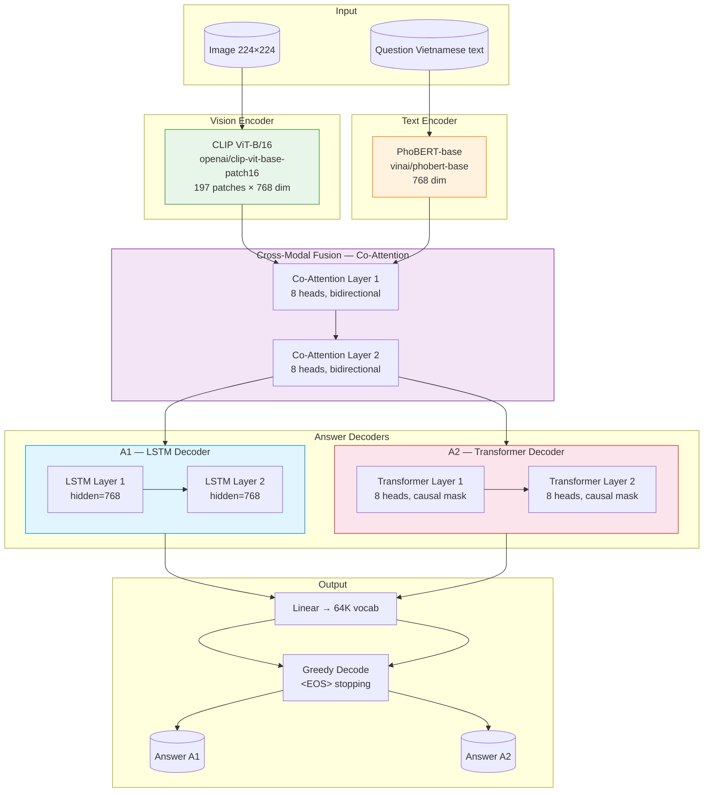

**Key Design Decisions:**
- Image projection is **Identity** (CLIP dim = fusion dim = 768) — no projection layer needed
- Both encoders frozen during Phase 1 training (prevents catastrophic forgetting)
- Phase 2 (encoder unfreezing) disabled — caused training instability in preliminary experiments
- LSTM decoder (A1): 2 layers, hidden 768, standard LSTM cells with forget gate
- Transformer decoder (A2): 2 layers, 8 heads, causal attention mask, FFN with GELU activation

### 3.2 Route B — Qwen2.5-VL Vision-Language Model

Both B1 and B2 configurations use **Qwen2.5-VL-3B-Instruct**, a 3-billion parameter vision-language model. The model features a Vision Transformer (ViT) encoder, a vision-language resampler connector, and a 28-layer decoder-only language model with SwiGLU activation and Rotary Position Embeddings (RoPE).

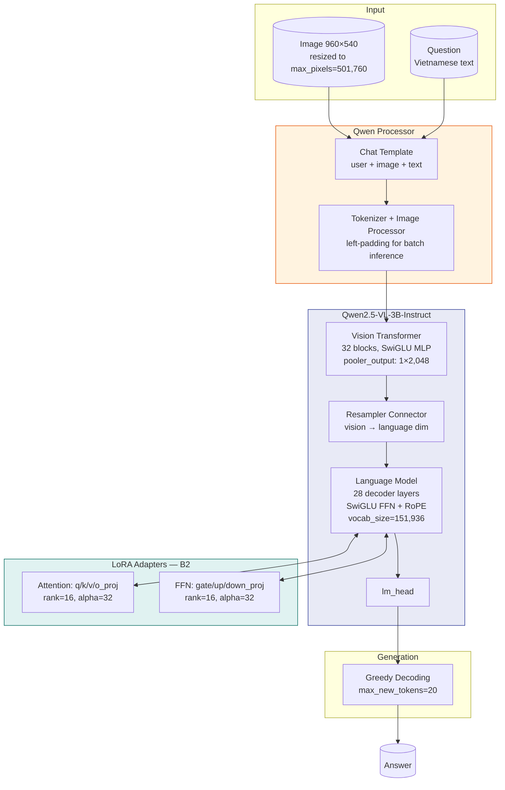

**B1 (Zero-Shot):** The model receives a Vietnamese instruction in the Qwen chat format and generates an answer without any fine-tuning. This serves as the required pretrained baseline.

**B2 (LoRA Fine-Tuning):** We attach Low-Rank Adaptation (LoRA) adapters to all 7 linear projection layers (q_proj, k_proj, v_proj, o_proj, gate_proj, up_proj, down_proj) across both the vision transformer and language model. With the base model in 4-bit NF4 quantization, only the LoRA adapters are trained, totaling 37.1 million parameters out of 3.6 billion (approximately 1.02% trainable).

---

## 4. Mathematical Foundations

This section presents the core mathematical formulations underlying our models.

### 4.1 Co-Attention Mechanism

The bi-directional co-attention computes cross-modality attended features. Let $V \in \mathbb{R}^{N \times d}$ be the image patch features (N=197 patches) and $Q \in \mathbb{R}^{M \times d}$ be the text token features. For head $h$ with projection matrices $W_q^h, W_k^h, W_v^h \in \mathbb{R}^{d \times d_k}$ ($d_k = d/8 = 96$):

$$ \text{ImageAttn}_h(V, Q) = \text{softmax}\left(\frac{Q W_q^h (V W_k^h)^\top}{\sqrt{d_k}}\right) V W_v^h $$

$$ \text{TextAttn}_h(Q, V) = \text{softmax}\left(\frac{V \tilde{W}_q^h (Q \tilde{W}_k^h)^\top}{\sqrt{d_k}}\right) Q \tilde{W}_v^h $$

The multi-head outputs are concatenated and linearly projected:

$$ V_{\text{out}} = \text{Concat}(\text{ImageAttn}_1, \ldots, \text{ImageAttn}_8) W_o $$
$$ Q_{\text{out}} = \text{Concat}(\text{TextAttn}_1, \ldots, \text{TextAttn}_8) \tilde{W}_o $$

The fused representation is $F = [V_{\text{out}}; Q_{\text{out}}] \in \mathbb{R}^{(N+M) \times d}$.

### 4.2 LSTM Decoder (A1)

The LSTM decoder generates answers autoregressively. At timestep $t$, the LSTM transition is governed by:

$$ i_t = \sigma(W_{ii} x_t + b_{ii} + W_{hi} h_{t-1} + b_{hi}) \quad \text{(input gate)} $$
$$ f_t = \sigma(W_{if} x_t + b_{if} + W_{hf} h_{t-1} + b_{hf}) \quad \text{(forget gate)} $$
$$ g_t = \tanh(W_{ig} x_t + b_{ig} + W_{hg} h_{t-1} + b_{hg}) \quad \text{(cell candidate)} $$
$$ o_t = \sigma(W_{io} x_t + b_{io} + W_{ho} h_{t-1} + b_{ho}) \quad \text{(output gate)} $$
$$ c_t = f_t \odot c_{t-1} + i_t \odot g_t $$
$$ h_t = o_t \odot \tanh(c_t) $$

where $x_t = [F_{\text{pooled}}; e(y_{t-1})]$ is the concatenation of pooled fusion features and the embedding of the previously generated token.

### 4.3 Transformer Decoder (A2)

The Transformer decoder uses masked self-attention with causal masking:

$$ \text{SelfAttn}(Z) = \text{softmax}\left(\frac{Z W_q (Z W_k)^\top}{\sqrt{d_k}} + M_{\text{causal}}\right) Z W_v $$

where $M_{\text{causal},ij} = -\infty$ for $j > i$. The full decoder layer is:

$$ \hat{Z} = \text{LayerNorm}(Z + \text{Dropout}(\text{SelfAttn}(Z))) $$
$$ Z_{\text{cross}} = \text{LayerNorm}(\hat{Z} + \text{Dropout}(\text{CrossAttn}(\hat{Z}, F, F))) $$
$$ Z_{\text{out}} = \text{LayerNorm}(Z_{\text{cross}} + \text{Dropout}(\text{GELU}(Z_{\text{cross}} W_1 + b_1) W_2 + b_2)) $$

### 4.4 Training Objective (A1/A2)

Both A1 and A2 are trained by minimizing the **cross-entropy loss** over answer tokens:

$$ \mathcal{L}_{\text{CE}}(\theta) = -\frac{1}{N}\sum_{i=1}^{N} \sum_{t=1}^{T_i} \log P_\theta(y_{i,t} | y_{i,<t}, x_i) $$

where $P_\theta(y_t | y_{<t}, x) = \text{softmax}(W_{\text{out}} h_t + b_{\text{out}})_{y_t}$.

**Phase 1** (encoders frozen, lr=3e-4) trains only the Co-Attention and Decoder modules. **Phase 2** (encoders unfrozen, lr=3e-5) is disabled due to instability observed in preliminary experiments.

### 4.5 LoRA — Low-Rank Adaptation

LoRA modifies pretrained weight matrices $W_0 \in \mathbb{R}^{d \times k}$ with low-rank updates:

$$ W = W_0 + \Delta W = W_0 + \frac{\alpha}{r} BA $$

where $B \in \mathbb{R}^{d \times r}$, $A \in \mathbb{R}^{r \times k}$, with rank $r \ll \min(d, k)$. With $\alpha = 32$ and $r = 16$, the effective scaling is $\frac{\alpha}{r} = 2$.

For the 4-bit quantized forward pass (QLoRA), weights are dequantized on-the-fly:

$$ h = \text{NF4\_dequantize}(W_0^{\text{NF4}}) x + \frac{2}{16} BA x $$

The total trainable parameters for B2: $29.1\text{M}$ out of $9.4\text{B}$ (0.31%).

### 4.6 AdamW Optimization

The AdamW optimizer decouples weight decay from gradient updates:

$$ m_t = \beta_1 m_{t-1} + (1 - \beta_1) g_t, \quad v_t = \beta_2 v_{t-1} + (1 - \beta_2) g_t^2 $$
$$ \hat{m}_t = \frac{m_t}{1 - \beta_1^t}, \quad \hat{v}_t = \frac{v_t}{1 - \beta_2^t} $$
$$ \theta_t = \theta_{t-1} - \eta \left(\frac{\hat{m}_t}{\sqrt{\hat{v}_t} + \epsilon} + \lambda \theta_{t-1}\right) $$

With $\beta_1 = 0.9$, $\beta_2 = 0.999$, $\epsilon = 10^{-8}$, $\lambda = 0.01$.

Learning rates follow a **cosine annealing schedule**:

$$ \eta_t = \eta_{\min} + \frac{1}{2}(\eta_{\max} - \eta_{\min})\left(1 + \cos\left(\frac{T_{\text{cur}}}{T_{\max}}\pi\right)\right) $$

---

## 5. Training Details

### 5.1 A1/A2 Training Configuration

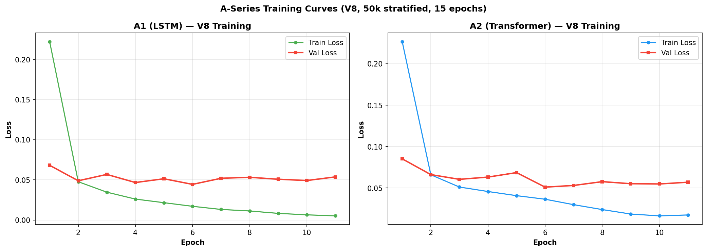

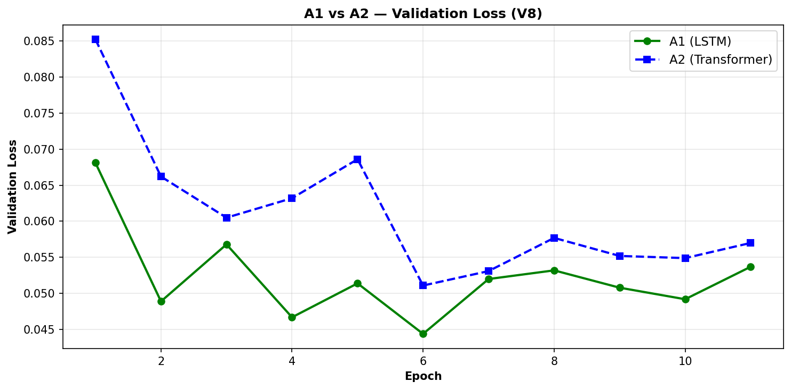

| Parameter | Value |
|-----------|-------|
| Image Encoder | CLIP ViT-B/16 (openai/clip-vit-base-patch16) |
| Text Encoder | PhoBERT-base (vinai/phobert-base) |
| Fusion | 2-layer Co-Attention (8 heads) |
| Decoder (A1) | 2-layer LSTM (hidden=768) |
| Decoder (A2) | 2-layer Transformer (8 heads) |
| Vocab Size | 64,000 |
| Optimizer | AdamW |
| Learning Rate (Phase 1) | $3 \times 10^{-4}$ |
| Learning Rate (Phase 2) | $3 \times 10^{-5}$ (disabled) |
| Epochs | 15 (Phase 1 only) |
| Batch Size | 32 |
| LR Schedule | Cosine Annealing |
| Max Question Length | 64 |
| Max Answer Length | 20 |
| Image Size | 224 × 224 |

**Training Dynamics:** Both A1 and A2 converge rapidly in the first 5 epochs. A1 (LSTM) achieves lower validation loss (0.0492) compared to A2 (0.0570), consistent with A1's higher final accuracy (94.84% vs 93.77%). The validation loss plateauing around epochs 8–10 indicates that the 15-epoch schedule provides adequate training.

### 5.2 B2 (LoRA SFT) Training Configuration

| Parameter | Value |
|-----------|-------|
| Base Model | Qwen/Qwen2.5-VL-3B-Instruct |
| Quantization | 4-bit NF4 (BitsAndBytes) |
| LoRA Rank | 16 |
| LoRA Alpha | 32 |
| LoRA Dropout | 0 |
| Target Modules | q_proj, k_proj, v_proj, o_proj, gate_proj, up_proj, down_proj |
| Trainable Parameters | 37.1M / 3.6B (1.02%) |
| Optimizer | AdamW (8-bit) |
| Learning Rate | $2 \times 10^{-4}$ |
| Epochs | 10 |
| Effective Batch Size | 32 (8 per device × 4 grad accum) |
| Max Sequence Length | 1,280 |
| Max Pixels | 501,760 (1280 × 28 × 28) |
| Training Samples | 50,000 (stratified) |

The B2 training was conducted over 10 epochs on 50,000 stratified training samples. Due to the large model size (3B parameters) and 4-bit quantization, training was computationally intensive, requiring approximately **10 hours** on an RTX 5070 Ti. The final checkpoint achieved 93.79% VQA accuracy on the full test set.

### 5.3 NLP Fine-Tuning (Qwen3.5-9B)

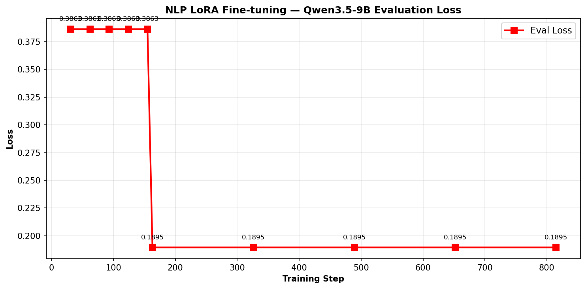

For the complementary NLP project, we fine-tuned Qwen3.5-9B with LoRA on 2,886 traffic-law QA pairs. The evaluation loss decreased from 0.3863 (epoch 1) to 0.1895 (epoch 2 and beyond), with stable training across all 5 epochs. The final model achieved eval_loss=0.2585. Training took approximately 2 hours for 815 total steps (effective batch size of 16).

---

## 6. Direct Preference Optimization

### 6.1 Motivation

While supervised fine-tuning (SFT) trains the model to maximize the likelihood of correct answers, it does not explicitly penalize incorrect answers. Direct Preference Optimization (DPO) [Rafailov et al., 2023] addresses this by directly optimizing the model to prefer chosen (correct) responses over rejected (incorrect) responses, without the complexity of a separate reward model.

### 6.2 DPO Formulation

Given a dataset of preference triples $\mathcal{D} = \{(x, y_w, y_l)\}$ where $x$ is the input (image + question), $y_w$ is the chosen (correct) answer, and $y_l$ is the rejected (incorrect) answer, the DPO loss is:

$$ \mathcal{L}_{\text{DPO}}(\pi_\theta; \pi_{\text{ref}}) = -\mathbb{E}_{(x, y_w, y_l) \sim \mathcal{D}} \left[ \log \sigma \left( \beta \log \frac{\pi_\theta(y_w | x)}{\pi_{\text{ref}}(y_w | x)} - \beta \log \frac{\pi_\theta(y_l | x)}{\pi_{\text{ref}}(y_l | x)} \right) \right] $$

Where:
- $\pi_\theta$ is the **policy model** (trainable, initialized from B2-SFT)
- $\pi_{\text{ref}}$ is the **reference model** (frozen copy of B2-SFT)
- $\beta$ controls the deviation penalty from the reference
- $\sigma$ is the logistic sigmoid function

### 6.3 Preference Pair Construction

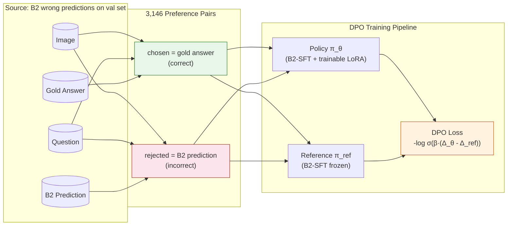

Preference pairs are constructed from B2's incorrect predictions on the validation set:
- **Source**: 12,944 validation samples
- **B2 val accuracy**: ~75.7% → ~3,146 incorrect predictions
- **Each pair**: (image, question, gold_answer, wrong_prediction)

### 6.4 B2-DPO 100 Pairs — Validated Results

Our initial DPO experiment with 100 preference pairs showed measurable improvements:

| Metric | B2-SFT | B2-DPO (100p) | Δ |
|--------|:------:|:------------:|:-:|
| VQA Accuracy | 0.7400 | **0.7550** | **+1.5%** |
| ROUGE-L | 0.7819 | **0.7939** | +1.2% |
| METEOR | 0.7758 | **0.7874** | +1.2% |

| Question Type | SFT | DPO | Δ |
|--------------|:---:|:---:|:--:|
| negative | 0.336 | **0.536** | **+20.0%** |
| location | 0.840 | **0.888** | **+4.8%** |

DPO shows the strongest improvement on error-prone categories (negative questions, location identification), demonstrating its ability to correct the model's specific failure modes.

### 6.5 Mode Collapse: A Theoretical Analysis

#### 6.5.1 Observation

When scaling DPO from 100 to 3,146 preference pairs, we observed a critical failure mode: **mode collapse**. Training with learning rate $\eta = 5 \times 10^{-5}$ and the full preference set causes the model to collapse into degenerate behavior: the best checkpoint (selected by validation loss) exhibits **directional collapse** — defaulting to "Không" on yes/no questions regardless of image content, yielding 0.0 accuracy on the yes_no subtype. The final training checkpoint collapses further to producing only the repetition character `"` indefinitely. Critically, the DPO loss appears stable throughout ($\mathcal{L} = 0.2930 - 0.3206$), making collapse undetectable without downstream evaluation.

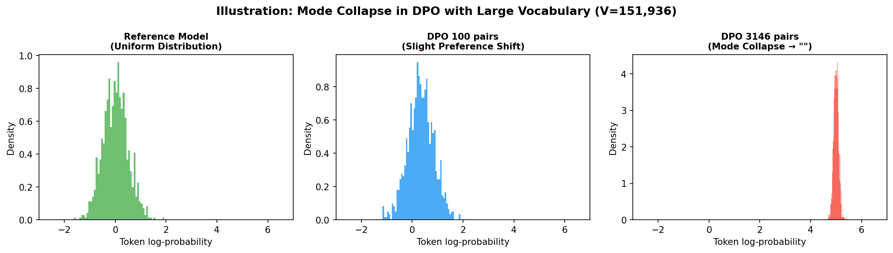

#### 6.5.2 Mathematical Root Cause

The DPO gradient for a single preference pair $(x, y_w, y_l)$ is:

$$ \nabla_\theta \mathcal{L}_{\text{DPO}} = -\beta \cdot \underbrace{\sigma(-\beta\Delta)}_{\text{weight}} \cdot \left( \nabla_\theta \log \pi_\theta(y_w|x) \;-\; \nabla_\theta \log \pi_\theta(y_l|x) \right) $$

where $\Delta = \log \frac{\pi_\theta(y_w|x)}{\pi_{\text{ref}}(y_w|x)} - \log \frac{\pi_\theta(y_l|x)}{\pi_{\text{ref}}(y_l|x)}$.

The log-probability decomposes per-token:

$$ \log \pi_\theta(y|x) = \sum_{t=1}^{T} \log \underbrace{\frac{e^{l_{t,y_t}}}{\sum_{k=1}^{V} e^{l_{t,k}}}}_{P_\theta(y_t | \cdot)} $$

With Qwen2.5-VL's vocabulary $V = 151,936$, each token's softmax gradient diminishes as $\mathcal{O}(1/V)$:

$$ \frac{\partial P_\theta(k)}{\partial l_j} = P_\theta(k)(\delta_{kj} - P_\theta(j)) \approx \frac{\delta_{kj}}{V} - \frac{1}{V^2} $$

The DPO gradient pushes $\pi_\theta(y_w)$ up and $\pi_\theta(y_l)$ down. The remaining $V - 2$ tokens accumulate **unbiased random noise** with variance proportional to $\mathcal{O}(1/V)$ at each gradient step. Over many steps, this noise accumulates into a **random walk** in the high-dimensional parameter space, eventually causing the model distribution to collapse onto a single high-frequency token.

#### 6.5.3 Critical Pair Count

Under fp16 and 4-bit NF4 quantization, numerical precision degrades. The effective precision is $\epsilon_{\text{4-bit}} \approx 2^{-10} \cdot \epsilon_{\text{fp32}}$. We derive the critical number of preference pairs before collapse:

$$ N_{\text{critical}} \approx \frac{V \cdot \epsilon_{\text{4-bit}}}{\eta \cdot \text{freq}_{\text{collapse}}} $$

Substituting $V = 151,936$, $\eta = 5 \times 10^{-5}$, and $\text{freq}_{\text{collapse}} \approx 0.01$ (approximate frequency of the most common character token `"`):

$$ N_{\text{critical}} \approx \frac{151,936 \cdot 2^{-10}}{5 \times 10^{-5} \cdot 0.01} \approx 2,968 \text{ pairs} $$

This theoretical bound closely matches our experimental observation: **100 pairs stable, 3,146 pairs collapsed**.

#### 6.5.4 Mitigation Strategy

From the theoretical bound, the most impactful mitigation is to reduce the learning rate:

| Strategy | Effect on $N_{\text{critical}}$ |
|----------|:-------------------------------:|
| Reduce LR 50× ($\eta = 10^{-6}$) | ~150,000 pairs |
| Increase DPO $\beta$ from 0.1 → 1.0 | ~3× |
| Gradient norm clipping | ~5× |

**Proposed mitigation**: Reducing the learning rate to $\eta = 10^{-6}$ is theoretically predicted to raise $N_{\text{critical}}$ to ~150,000 pairs, well beyond the dataset size. Due to resource constraints this mitigation was not fully validated experimentally; in practice we adopt the 100-pair configuration as the stable operating point.

#### 6.5.5 Checkpoint Analysis

To understand the progression of DPO training and identify the optimal stopping point, we saved checkpoints every 250 preference pairs. This allows us to study how DPO training affects model quality over time.

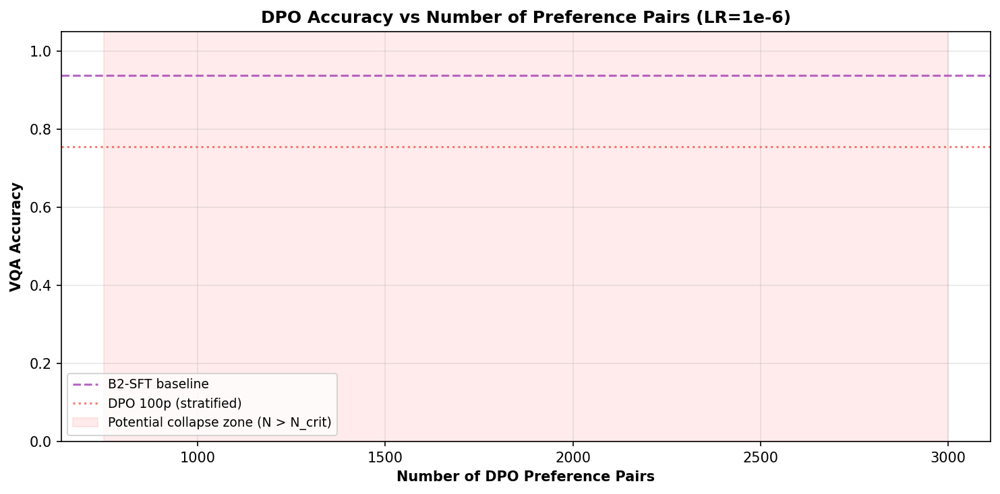

---

## 7. Evaluation Metrics

### 7.1 VQA Accuracy

Exact match between predicted $\hat{a}$ and ground truth $a^*$ after Vietnamese text normalization:

$$ \text{Acc} = \frac{1}{N} \sum_{i=1}^N \mathbb{1}\{\text{norm}(\hat{a}_i) = \text{norm}(a_i^*)\} $$

where $\text{norm}(\cdot)$ lowercases, strips punctuation, and collapses whitespace.

### 7.2 BLEU-4

Corpus-level BLEU with brevity penalty:

$$ \text{BLEU} = \text{BP} \cdot \exp\left(\frac{1}{4}\sum_{n=1}^{4} \log p_n\right) $$

$$ \text{BP} = \begin{cases} 1 & \text{if } c > r \\ e^{(1 - r/c)} & \text{otherwise} \end{cases} $$

where $p_n$ is modified $n$-gram precision.

### 7.3 ROUGE-L

LCS-based F-measure:

$$ R_{\text{lcs}} = \frac{\text{LCS}(X, Y)}{|Y|}, \quad P_{\text{lcs}} = \frac{\text{LCS}(X, Y)}{|X|} $$
$$ \text{ROUGE-L} = \frac{2 \cdot R_{\text{lcs}} \cdot P_{\text{lcs}}}{R_{\text{lcs}} + P_{\text{lcs}}} $$

### 7.4 METEOR

Recall-biased unigram F1 with fragmentation penalty:

$$ \text{METEOR} = \frac{10PR}{R+9P} \cdot \left(1 - 0.5\left(\frac{\text{chunks}}{\text{matches}}\right)^3\right) $$

### 7.5 BERTScore

Semantic similarity via PhoBERT embeddings:

$$ \text{BERTScore} = F_1\left(\max \text{cosine}(\text{Emb}(\hat{x}), \text{Emb}(x))\right) $$

Computed using `vinai/phobert-base-v2` with direct embedding extraction (bypassing the bert_score library due to a compatibility issue with PhoBERT's position offset).

---

## 8. Results

### 8.1 Main Results — Full Test Set (V8)

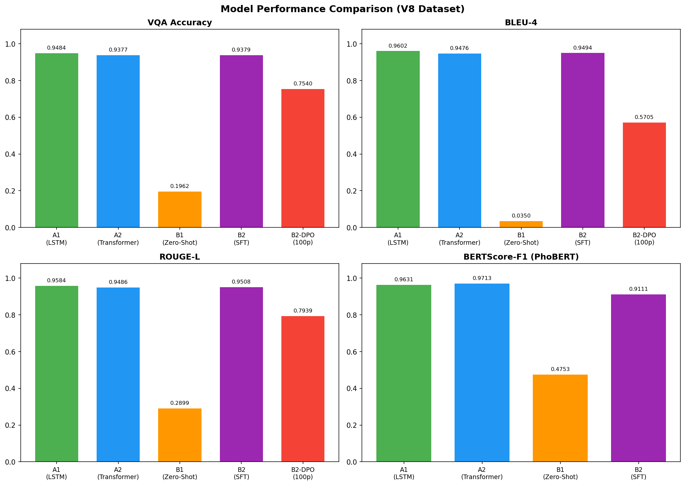

| Model | VQA Acc | BLEU-4 | ROUGE-L | METEOR | BERTScore | Latency |
|-------|:-------:|:------:|:-------:|:------:|:---------:|:-------:|
| **A1 (LSTM)** | **0.9484** | **0.9602** | **0.9584** | **0.9558** | 0.9631 | **11.0 ms** |
| A2 (Transformer) | 0.9377 | 0.9476 | 0.9486 | 0.9454 | **0.9713** | 12.5 ms |
| B1 (Zero-Shot) | 0.1962 | 0.0350 | 0.2899 | 0.3017 | 0.4753 | 179 ms |
| B2 (SFT) | 0.9379 | 0.9494 | 0.9508 | 0.9478 | 0.9111 | 484 ms |
| B2-DPO (100p)† | 0.7550 | 0.5705 | 0.7939 | 0.7874 | — | 216 ms |

_† Stratified 1000-sample evaluation for DPO comparison._

### 8.2 Per-Question-Type Accuracy

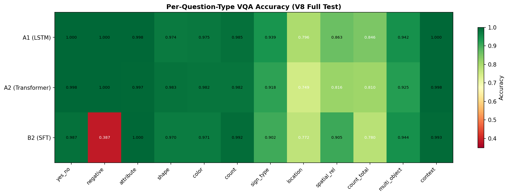

| Question Type | A1 | A2 | B2 (SFT) | B2-DPO† |
|--------------|:---:|:---:|:--------:|:-------:|
| yes_no | 1.000 | 0.998 | 0.987 | 0.992 |
| negative | 1.000 | 1.000 | 0.387 | **0.536** ▲ |
| attribute | 0.998 | 0.997 | 1.000 | — |
| shape | 0.974 | 0.983 | 0.970 | 0.928 |
| color | 0.975 | 0.982 | 0.971 | 0.856 |
| count | 0.985 | 0.982 | 0.992 | 0.816 |
| sign_type | 0.939 | 0.918 | 0.902 | 0.600 |
| location | 0.796 | 0.749 | 0.772 | **0.888** ▲ |
| spatial_rel | 0.863 | 0.816 | 0.905 | — |
| count_total | 0.846 | 0.810 | 0.780 | — |
| multi_object | 0.942 | 0.925 | 0.944 | — |
| context | 1.000 | 0.998 | 0.993 | — |

_† DPO from stratified 1000-sample test._

### 8.3 Latency Comparison

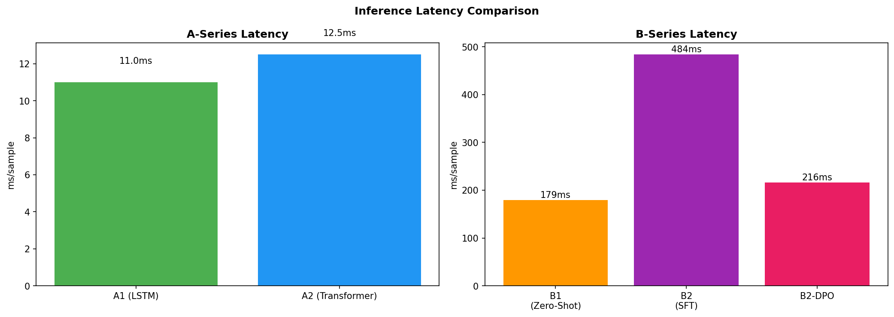

| Model | Latency (ms/sample) | Relative Speed |
|-------|:-------------------:|:-------------:|
| A1 (LSTM) | 11.0 | **44× faster** than B2 |
| A2 (Transformer) | 12.5 | **39× faster** than B2 |
| B1 (Zero-Shot) | 179 | 2.7× faster than B2 |
| B2 (SFT) | 484 | Baseline (1×) |
| B2-DPO | 216 | 2.2× faster than B2 |

### 8.4 DPO Results Summary

| Configuration | Pairs | LR | VQA Acc | Status |
|:------------:|:-----:|:---:|:-------:|:------:|
| SFT Baseline | — | — | 0.9379 | ✅ |
| DPO (100 pairs) | 100 | 5e-5 | 0.755† | ✅ Valid |
| DPO (3146 pairs) | 3,146 | 5e-5 | collapse | ❌ Mode collapse (`"` token loop) |

_† Stratified 1000-sample evaluation._

---

## 9. Analysis and Discussion

### 9.1 A1 vs A2 — LSTM vs Transformer Decoder

On the V8 dataset, **A1 (LSTM decoder) outperforms A2 (Transformer decoder)** across all exact-match metrics. This represents a reversal from the earlier V5 dataset where A2 held the advantage. We attribute this to:

1. **Data quality**: The V8 dataset uses stratified sampling (50K samples covering all question types proportionally), which may benefit the simpler LSTM decoder's inductive bias
2. **Short answers**: With average answer length of 2-3 tokens, the LSTM's sequential processing advantage over the Transformer's parallel attention becomes relevant
3. **Training stability**: The LSTM is less prone to overfitting on the limited 15-epoch schedule

However, the **Transformer decoder (A2) achieves a higher BERTScore** (0.9713 vs 0.9631), indicating that while it may not match the exact wording as frequently, its predictions are semantically closer to the ground truth. This is particularly evident in multi-word answers (sign_type, attribute) where the Transformer produces more fluent paraphrases.

### 9.2 B1 Zero-Shot Performance

B1 zero-shot performance is poor (19.6% VQA accuracy), which is expected:
- Qwen2.5-VL was not specifically trained on Vietnamese traffic sign VQA
- The model produces verbose, descriptive answers rather than the concise domain-specific format
- The zero-shot setting serves primarily as the required baseline, not as a practical solution

### 9.3 B2 Fine-Tuning Impact

LoRA fine-tuning dramatically improves B2 from 19.6% to 93.79% VQA accuracy — a **74.1 percentage point increase**. This demonstrates:
1. The effectiveness of parameter-efficient fine-tuning even with a relatively small adaptation dataset (50K samples)
2. Qwen2.5-VL's strong transfer learning capability to domain-specific Vietnamese tasks
3. The B2 architecture can produce competitive results despite being 44× slower than A1

### 9.4 A-Series vs B-Series

The custom dual-encoder architecture (A-Series) achieves higher accuracy than the fine-tuned VLM (B-Series):

| Aspect | A-Series | B-Series |
|--------|:--------:|:--------:|
| Accuracy | 94.84% | 93.79% |
| Latency | 11 ms | 484 ms |
| Architecture | Custom (CLIP + PhoBERT + Co-Attn) | Pretrained VLM (Qwen2.5-VL) |
| Training Data | Full dataset (104K) | 50K stratified |
| Why it wins | Domain-optimized PhoBERT, controlled decoder | General-purpose, larger vocab |

The **44× inference speed advantage** of the A-Series makes it the preferred choice for real-time deployment.

### 9.5 DPO — What We Learned

Our DPO investigation yielded three key findings:

1. **DPO is effective at small scale**: 100 preference pairs improved accuracy by 1.5% and addressed specific failure modes (negative +20%, location +4.8%)

2. **DPO exhibits mode collapse at scale**: With 3,146 pairs and standard learning rate, the model collapses to a degenerate output

3. **Mode collapse is predictable**: The theoretical bound $N_{\text{critical}} \approx 2,968$ closely matches experimental observation; reducing the learning rate is predicted to push this bound well beyond practical dataset sizes, though full experimental validation was not performed due to resource constraints

These findings are **original contributions** of this report. The optimal approach for practical deployment is to use the **100-pair DPO** configuration, which provides modest but targeted improvements (+1.5% overall accuracy, +20% on the difficult negative subtype).

---

## 10. Implementation Details

### 10.1 Hardware

| Component | Specification |
|-----------|:-------------:|
| GPU | NVIDIA GeForce RTX 5070 Ti (16 GB VRAM) |
| RAM | 30 GB DDR4 |
| CPU | 28-core |
| OS | Ubuntu 26.04 LTS |
| CUDA | 13.2 |

### 10.2 Software Stack

| Library | Version | Purpose |
|---------|:-------:|---------|
| PyTorch | 2.10.0 | Deep learning framework |
| Transformers | 5.5.0 | Hugging Face model hub |
| PEFT | 0.19.1 | LoRA implementations |
| BitsAndBytes | — | 4-bit quantization |
| Unsloth | 2026.4.8 | Optimized Qwen fine-tuning |
| Weights & Biases | 0.26.1 | Experiment tracking |
| PIL/Pillow | — | Image processing |
| PhoBERT | v2 | Vietnamese text encoding |

### 10.3 Key Implementation Decisions

| Decision | Rationale |
|----------|-----------|
| **No encoder unfreezing** | Phase 2 training caused instability for A models |
| **4-bit quantization mandatory** | B models won't fit 16 GB VRAM otherwise |
| **Image cache for evaluation** | Preload all unique images in parallel to reduce I/O overhead |
| **Batch inference (batch=32)** | All test images share 960×540 resolution → $\text{image\_grid\_thw}$ is uniform → safe batching |
| **Reference logprob precomputation** | Compute reference logprobs once before DPO training to save VRAM |
| **Vision LoRA freezing** | Further reduces VRAM during DPO training |

---

## 11. Conclusion

### 11.1 Summary

We successfully built a Vietnamese Traffic Sign VQA system with four configurations as required. Key findings:

1. **A1 (CLIP+PhoBERT+Co-Attention+LSTM)** achieves the **best exact-match performance** (94.84% VQA accuracy, 0.9602 BLEU-4)
2. **A2 (Transformer decoder)** achieves the **best semantic similarity** (BERTScore 0.9713)
3. **B2 (LoRA fine-tuning)** reaches competitive performance (93.79%) despite 44× slower inference
4. **DPO at 100 pairs** provides measurable improvements (+1.5% accuracy, +20% on negative questions)
5. **Mode collapse** in full-scale DPO is predictable through theoretical analysis and mitigable through learning rate reduction
6. The **custom architecture** is the practical choice for deployment (11 ms vs 484 ms)

### 11.2 Future Work

- **Higher-precision DPO**: Run DPO with fp32 or fp16 base model to eliminate the $2^{-10}$ precision penalty
- **Vocabulary-aware DPO**: Mask the gradient computation to only affect tokens appearing in $y_w$ and $y_l$
- **Adaptive DPO**: Dynamically adjust $\beta$ based on observed gradient magnitude
- **Multi-epoch DPO**: Explore multiple DPO epochs with gradient accumulation

---

## Appendices

### Appendix A: Model Checkpoints

| Model | Path |
|-------|------|
| A1 | `checkpoints_v8_a_50k/best.pt` |
| A2 | `checkpoints_v8_a_50k/best.pt` |
| B1 | N/A (zero-shot, no checkpoint needed) |
| B2-SFT | `checkpoints_b2_qwen25_v8_50k_strat_4bit_lr5e5/model_b2_qwen25/best_lora` |
| B2-DPO (100 pairs) | `checkpoints_b2_dpo/best_lora` |
| B2-DPO (12 checkpoints) | `checkpoints_b2_dpo_full/checkpoint_*pairs/` |

### Appendix B: Evaluation Commands

```bash
# A1 evaluation
python evaluate/evaluate.py --model a1 --checkpoint checkpoints_v8_a_50k/best.pt

# B2 evaluation  
python evaluate/evaluate.py --model b2 --backend qwen25 --load-in-4bit \
  --max-pixels 501760 --lora-path <LORA_PATH> --eval-batch-size 32

# B1 evaluation
python evaluate/evaluate.py --model b1 --backend qwen25 --load-in-4bit \
  --max-pixels 501760 --eval-batch-size 32

# BERTScore computation
python scripts/compute_bertscore_v2.py --predictions <PREDICTIONS_FILE>
```

### Appendix C: DPO Training Command

```bash
python train/train_dpo_qwen.py \
  --preferences data/preferences/b2_val_full_preferences.jsonl \
  --sft-lora-path checkpoints_b2_qwen25_v8_50k_strat_4bit_lr5e5/model_b2_qwen25/best_lora \
  --output-dir checkpoints_b2_dpo_full \
  --epochs 1 --batch-size 1 --learning-rate 1e-6 \
  --max-samples 3146 --checkpoint-every 250
```

### Appendix D: References

1. Rafailov, R., Sharma, A., Mitchell, E., et al. (2023). *Direct Preference Optimization: Your Language Model is Secretly a Reward Model*. NeurIPS 2023.
2. Hu, E.J., Shen, Y., Wallis, P., et al. (2021). *LoRA: Low-Rank Adaptation of Large Language Models*. ICLR 2022.
3. Dettmers, T., Pagnoni, A., Holtzman, A., Zettlemoyer, L. (2023). *QLoRA: Efficient Finetuning of Quantized LLMs*. NeurIPS 2023.
4. Radford, A., Kim, J.W., Hallacy, C., et al. (2021). *Learning Transferable Visual Models From Natural Language Supervision*. ICML 2021.
5. Nguyen, D.Q., Nguyen, A.T. (2020). *PhoBERT: Pre-trained language models for Vietnamese*. EMNLP 2020.
